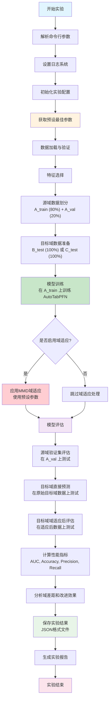
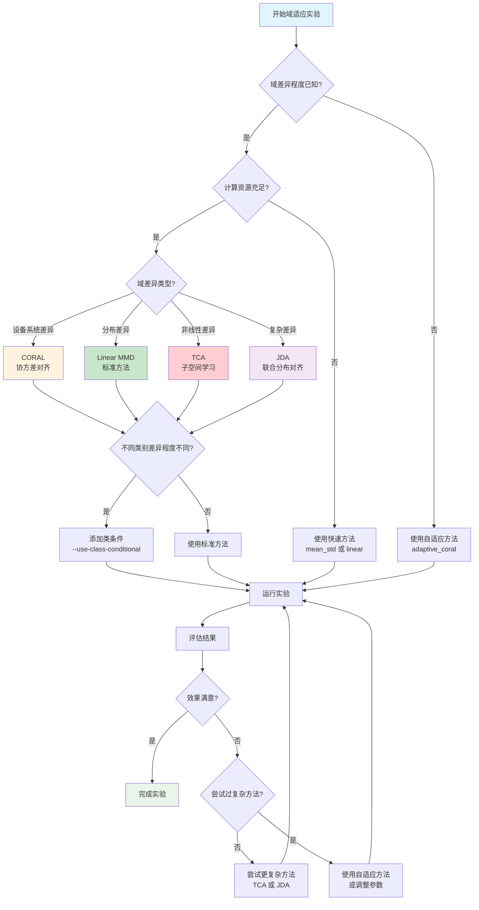

# 固定参数域适应实验指南

## 概述

`run_fixed_params_domain_adaptation.py` 是一个专门用于**固定参数域适应实验**的脚本。与标准的贝叶斯优化实验不同，该脚本使用预设的最佳参数组合，跳过参数搜索过程，直接进行模型训练和评估。这种方法适用于快速验证、对比实验和生产环境部署。

### 🔧 支持的域适应方法

该脚本支持多种先进的域适应算法：

- **📊 统计对齐方法**：Mean-Std标准化、CORAL协方差对齐
- **🎯 MMD方法**：Linear MMD、KPCA MMD  
- **🧠 子空间学习**：TCA（Transfer Component Analysis）
- **🔄 联合分布对齐**：JDA（Joint Distribution Adaptation）
- **⚡ 自适应方法**：所有方法的自动参数调优版本
- **🏷️ 类条件方法**：针对不同类别的精细化域适应

### 🎯 适用场景

- **快速验证**：研究初期的方法有效性验证
- **生产部署**：稳定可重复的模型性能
- **方法对比**：公平比较不同域适应算法
- **资源受限**：计算资源有限的环境

## 实验设计原理

### 核心思想

固定参数域适应实验的核心思想是使用经过验证的最佳参数组合，避免耗时的参数搜索过程，直接进行域适应实验。这种方法在保证实验效率的同时，提供了稳定可重复的结果。

### 实验流程图

下图展示了固定参数域适应实验的完整流程：



### 与标准域适应的区别

| 特性 | 标准域适应实验 | 固定参数域适应实验 |
|------|----------------|-------------------|
| **参数来源** | 贝叶斯优化搜索 | 预设最佳参数 |
| **实验时间** | 30分钟-2小时 | 5-15分钟 |
| **适用场景** | 参数探索、研究 | 快速验证、生产 |
| **结果稳定性** | 依赖搜索质量 | 高度稳定 |
| **计算资源** | 高 | 低 |

## 数据集划分策略

### 数据集定义

- **数据集A (AI4Health)**：源域，包含标注数据，用于模型训练
- **数据集B (河南癌症医院)**：目标域选项1，用于A→B域适应实验
- **数据集C (广州医科大学)**：目标域选项2，用于A→C域适应实验

### 数据集特点

| 数据集 | 医院类型 | 数据特点 | 样本规模 | 特征数量 |
|--------|----------|----------|----------|----------|
| A (AI4Health) | 综合医院 | 标准化程度高，数据质量好 | ~1500 | 58个原始特征 |
| B (河南癌症医院) | 专科医院 | 癌症专科特色，分布有差异 | ~800 | 58个原始特征 |
| C (广州医科大学) | 教学医院 | 教学医院特点，数据规范 | ~600 | 58个原始特征 |

### 特征选择策略

实验支持两种特征选择策略：

#### 1. Best7 特征（推荐）
- **特征数量**：7个
- **选择方法**：基于RFE（递归特征消除）和跨数据集稳定性分析
- **优势**：特征数量少，模型简洁，泛化能力强
- **适用场景**：生产环境、快速部署

#### 2. All 特征
- **特征数量**：58个
- **选择方法**：使用所有可用特征
- **优势**：信息完整，可能获得更高性能
- **适用场景**：研究分析、性能上界探索

### 划分方案

#### 方案1：A→B 域适应
```python
# 源域数据划分
A_train (80%) + A_val (20%) = A_total
# 目标域数据
B_test (100%) = B_total

# 实验流程
1. 在 A_train 上训练模型
2. 在 A_val 上验证模型性能
3. 使用 A_train 和 B_test 进行域适应
4. 在 B_test 上评估最终性能
```

#### 方案2：A→C 域适应
```python
# 源域数据划分
A_train (80%) + A_val (20%) = A_total
# 目标域数据
C_test (100%) = C_total

# 实验流程同上，目标域换为C
```

### 数据划分的具体实现

```python
def load_and_prepare_data(self):
    """数据加载和预处理"""
    
    # 1. 加载原始数据
    data_A = load_ai4health_data()      # 源域
    data_B = load_henan_data()          # 目标域B
    data_C = load_guangzhou_data()      # 目标域C
    
    # 2. 特征选择
    if self.feature_type == 'best7':
        features = get_best_7_features()
    else:
        features = get_all_features()
    
    # 3. 源域数据划分
    X_source, y_source = data_A[features], data_A['label']
    self.X_source_train, self.X_source_val, \
    self.y_source_train, self.y_source_val = train_test_split(
        X_source, y_source, 
        test_size=self.source_val_split,  # 默认0.2
        random_state=self.random_state,
        stratify=y_source
    )
    
    # 4. 目标域数据准备
    if self.target_domain == 'B':
        target_data = data_B
    else:  # target_domain == 'C'
        target_data = data_C
    
    self.X_target_test = target_data[features]
    self.y_target_test = target_data['label']
```

## 预设参数配置

### AutoTabPFN 模型参数

```python
best_model_params = {
    'max_time': 30,              # 训练时间限制（秒）
    'preset': 'default',         # 预设配置
    'ges_scoring': 'f1',         # 评分方法
    'max_models': 10,            # 最大模型数量
    'validation_method': 'cv',   # 验证方法
    'n_repeats': 150,            # 重复次数
    'n_folds': 5,                # 交叉验证折数
    'ges_n_iterations': 20,      # GES迭代次数
    'ignore_limits': False       # 是否忽略限制
}
```

### MMD 域适应参数

```python
best_mmd_params = {
    'lr': 0.01,                  # 学习率
    'n_epochs': 100,             # 训练轮数
    'batch_size': 32,            # 批大小
    'lambda_reg': 1e-3,          # 正则化系数
    'gamma': 1.0,                # MMD权重
    'staged_training': False,    # 分阶段训练
    'dynamic_gamma': False       # 动态gamma调整
}
```

### 参数来源说明

这些参数是通过以下方式确定的：
1. **文献调研**：参考相关论文的最佳实践
2. **先前实验**：基于贝叶斯优化实验的结果
3. **经验调优**：结合医疗数据特点的经验设置
4. **稳定性考虑**：选择在多个数据集上表现稳定的参数

## 实验流程详解

### 第1步：环境初始化

```python
def __init__(self, args: argparse.Namespace):
    """初始化实验配置"""
    self.args = args
    self.best_params = get_best_params(use_mmd=not args.no_mmd)
    
    # 生成保存路径
    self.save_path = generate_output_dir(args)
    
    # 创建优化器（但不进行优化）
    self.optimizer = StandardDomainAdaptationOptimizer(
        model_type='auto',
        feature_type=args.feature_type,
        mmd_method=args.domain_adapt_method,
        use_class_conditional=args.use_class_conditional,
        target_domain=args.target_domain,
        save_path=self.save_path,
        use_source_cv_for_mmd_tuning=False  # 关键：不调优MMD参数
    )
```

### 第2步：数据加载与预处理

数据加载和预处理是实验的基础步骤，包括数据文件验证、原始数据加载、特征工程、数据划分和数据预处理等子步骤。

### 第3步：模型训练

```python
def train_final_model(self):
    """训练最终模型"""
    
    # 3.1 使用预设参数初始化模型
    model = AutoTabPFNClassifier(**self.best_params['model_params'])
    
    # 3.2 在源域训练集上训练
    model.fit(self.X_source_train, self.y_source_train)
    
    # 3.3 保存训练好的模型
    self.final_model = model
    
    logging.info("模型训练完成")
```

### 第4步：域适应处理

```python
def apply_domain_adaptation(self):
    """应用域适应方法"""
    
    if self.args.no_mmd:
        # 不进行域适应，直接使用原始目标域数据
        self.X_target_adapted = self.X_target_test
        logging.info("跳过域适应处理")
    else:
        # 应用MMD域适应
        mmd_transformer = self._create_mmd_transformer()
        
        # 使用预设参数进行域适应
        self.X_target_adapted = mmd_transformer.fit_transform(
            self.X_source_train, 
            self.X_target_test,
            **self.best_params['mmd_params']
        )
        
        logging.info(f"域适应完成，使用方法: {self.args.domain_adapt_method}")
```

### 第5步：模型评估

模型评估包括三个层面：源域验证集评估、目标域直接预测评估和目标域域适应后评估。通过对比这三个结果，可以分析域差距和域适应效果。

### 第6步：结果保存与分析

实验结果会保存为JSON格式的文件，包括实验配置、评估结果和优化结果（占位符）。

## 使用方法

### 基本使用

```bash
# 最简单的使用方式（A→B）
python scripts/run_fixed_params_domain_adaptation.py --target-domain B

# 指定目标域为C（A→C）
python scripts/run_fixed_params_domain_adaptation.py --target-domain C
```

### 高级配置

```bash
# 使用类条件MMD
python scripts/run_fixed_params_domain_adaptation.py \
    --target-domain B \
    --use-class-conditional

# 使用不同的域适应方法
python scripts/run_fixed_params_domain_adaptation.py \
    --target-domain B \
    --domain-adapt-method coral

# 禁用MMD域适应（只测试模型性能）
python scripts/run_fixed_params_domain_adaptation.py \
    --target-domain B \
    --no-mmd

# 完整配置示例
python scripts/run_fixed_params_domain_adaptation.py \
    --target-domain B \
    --feature-type best7 \
    --domain-adapt-method linear \
    --use-class-conditional \
    --source-val-split 0.2 \
    --random-state 42 \
    --output-dir ./results_my_fixed_experiment
```

### 参数说明

| 参数 | 说明 | 可选值 | 默认值 |
|------|------|--------|--------|
| `--target-domain` | 目标域选择 | B, C | B |
| `--feature-type` | 特征类型 | best7, all | best7 |
| `--domain-adapt-method` | 域适应方法 | linear, kpca, mean_std, coral, tca, jda, adaptive_* | linear |
| `--use-class-conditional` | 使用类条件MMD | 标志参数 | False |
| `--no-categorical` | 禁用类别特征 | 标志参数 | False |
| `--no-mmd` | 禁用MMD域适应 | 标志参数 | False |
| `--source-val-split` | 源域验证集比例 | 0-1之间的浮点数 | 0.2 |
| `--output-dir` | 结果保存目录 | 字符串路径 | 自动生成 |
| `--random-state` | 随机种子 | 整数 | 42 |

## 支持的域适应方法

### 1. Linear MMD
```bash
--domain-adapt-method linear
```
- **原理**：线性核的最大均值差异
- **适用**：大多数场景，计算效率高
- **参数**：学习率、训练轮数、正则化系数

### 2. KPCA MMD
```bash
--domain-adapt-method kpca
```
- **原理**：核主成分分析结合MMD
- **适用**：非线性域差异较大的场景
- **参数**：核参数、主成分数量

### 3. Mean-Std Normalization
```bash
--domain-adapt-method mean_std
```
- **原理**：均值-标准差标准化
- **适用**：分布差异主要体现在统计量上
- **参数**：数值稳定性参数

### 4. CORAL (Correlation Alignment)
```bash
--domain-adapt-method coral
```
- **原理**：通过对齐源域和目标域的二阶统计量（协方差矩阵）来减少域差距
- **适用场景**：特征相关性差异较大的场景，医疗数据中不同医院的检测设备差异
- **技术特点**：
  - 计算简单，无需迭代优化
  - 保持特征的线性关系
  - 对协方差矩阵奇异性有良好的正则化处理
- **预设参数**：
  - `regularization`: 1e-6（防止协方差矩阵奇异）
  - `standardize`: True（特征标准化）
- **优势**：计算效率高，理论基础扎实
- **局限性**：仅考虑二阶统计量，可能忽略高阶特征关系

### 5. 类条件CORAL (Class-Conditional CORAL)
```bash
--domain-adapt-method coral --use-class-conditional
```
- **原理**：分别对每个类别进行CORAL对齐，更精细的域适应
- **适用场景**：不同类别的域差异程度不同的情况
- **技术特点**：
  - 使用伪标签进行类别划分
  - 分别计算每个类别的协方差矩阵对齐
  - 按样本数量加权合并结果
- **预设参数**：与标准CORAL相同，额外需要伪标签生成
- **优势**：更精确的类别级别对齐
- **局限性**：依赖伪标签质量，计算复杂度稍高

### 6. TCA (Transfer Component Analysis)
```bash
--domain-adapt-method tca
```
- **原理**：通过核方法学习域不变的低维表示，最小化域间的MMD距离
- **适用场景**：需要降维的高维特征空间，非线性域差异
- **技术特点**：
  - 使用RBF核进行非线性映射
  - 学习低维子空间投影
  - 同时保持数据结构和减少域差异
- **预设参数**：
  - `subspace_dim`: 10（子空间维度）
  - `gamma`: 自动计算（RBF核参数）
  - `regularization`: 1e-3（正则化系数）
- **优势**：理论完备，适用于复杂的非线性域差异
- **局限性**：计算复杂度较高，参数敏感

### 7. JDA (Joint Distribution Adaptation)
```bash
--domain-adapt-method jda
```
- **原理**：TCA的扩展，同时对齐边缘分布和条件分布（类条件），通过迭代优化实现联合分布对齐
- **适用场景**：域差异既体现在特征分布上，也体现在类别条件分布上
- **技术特点**：
  - 迭代更新伪标签和投影矩阵
  - 联合优化边缘分布MMD和条件分布MMD
  - 使用置信度阈值控制伪标签质量
- **预设参数**：
  - `subspace_dim`: 10（子空间维度）
  - `mu`: 0.5（边缘分布和条件分布权重平衡）
  - `max_iterations`: 10（最大迭代次数）
  - `confidence_threshold`: 0.7（伪标签置信度阈值）
- **优势**：最全面的分布对齐，理论上效果最好
- **局限性**：计算复杂度最高，收敛性依赖初始化

### 8. 自适应方法
```bash
--domain-adapt-method adaptive_coral
--domain-adapt-method adaptive_mean_variance
--domain-adapt-method adaptive_tca
--domain-adapt-method adaptive_jda
```
- **原理**：自动搜索最佳参数，适应不同的域差异程度
- **适用场景**：域差异程度未知，需要自动调优的场景
- **技术特点**：
  - 在预定义参数空间中搜索最优组合
  - 使用网格搜索或随机搜索策略
  - 以目标域性能为优化目标
- **预设参数**：各方法的参数搜索范围
- **优势**：自动化程度高，适应性强
- **局限性**：计算时间较长，可能过拟合到特定数据集

## 域适应方法选择指南

### 方法选择决策流程

下图展示了如何根据实际情况选择合适的域适应方法：



### 方法复杂度对比

| 方法 | 计算复杂度 | 参数数量 | 理论完备性 | 实用性 | 推荐场景 |
|------|------------|----------|------------|--------|----------|
| **Mean-Std** | ⭐ | 1 | ⭐⭐ | ⭐⭐⭐⭐⭐ | 快速基线，分布差异简单 |
| **Linear MMD** | ⭐⭐ | 3-4 | ⭐⭐⭐ | ⭐⭐⭐⭐ | 通用场景，平衡效果和效率 |
| **CORAL** | ⭐⭐ | 2 | ⭐⭐⭐ | ⭐⭐⭐⭐ | 特征相关性差异明显 |
| **KPCA MMD** | ⭐⭐⭐ | 4-5 | ⭐⭐⭐⭐ | ⭐⭐⭐ | 非线性域差异 |
| **TCA** | ⭐⭐⭐⭐ | 5-6 | ⭐⭐⭐⭐ | ⭐⭐⭐ | 高维数据，需要降维 |
| **JDA** | ⭐⭐⭐⭐⭐ | 7-8 | ⭐⭐⭐⭐⭐ | ⭐⭐ | 复杂域差异，研究用途 |

### 医疗数据场景推荐

#### 🏥 不同医院间的设备差异
```bash
# 推荐：CORAL - 主要是检测设备的系统性差异
python scripts/run_fixed_params_domain_adaptation.py \
    --target-domain B --domain-adapt-method coral
```

#### 🔬 不同检测方法的数据差异
```bash
# 推荐：Linear MMD - 平衡效果和稳定性
python scripts/run_fixed_params_domain_adaptation.py \
    --target-domain B --domain-adapt-method linear
```

#### 🏥 专科医院 vs 综合医院
```bash
# 推荐：类条件CORAL - 不同疾病类型的差异程度不同
python scripts/run_fixed_params_domain_adaptation.py \
    --target-domain B --domain-adapt-method coral --use-class-conditional
```

#### 📊 高维特征数据
```bash
# 推荐：TCA - 降维同时进行域适应
python scripts/run_fixed_params_domain_adaptation.py \
    --target-domain B --domain-adapt-method tca --feature-type all
```

#### 🔍 复杂域差异（研究场景）
```bash
# 推荐：JDA - 最全面的分布对齐
python scripts/run_fixed_params_domain_adaptation.py \
    --target-domain B --domain-adapt-method jda
```

#### ⚡ 快速验证和生产部署
```bash
# 推荐：Mean-Std - 最快速的基线方法
python scripts/run_fixed_params_domain_adaptation.py \
    --target-domain B --domain-adapt-method mean_std
```

### 方法组合策略

#### 渐进式验证策略
```bash
# 第1步：快速基线
python scripts/run_fixed_params_domain_adaptation.py \
    --target-domain B --domain-adapt-method mean_std

# 第2步：标准方法
python scripts/run_fixed_params_domain_adaptation.py \
    --target-domain B --domain-adapt-method linear

# 第3步：高级方法
python scripts/run_fixed_params_domain_adaptation.py \
    --target-domain B --domain-adapt-method coral

# 第4步：最优方法（如果前面效果不佳）
python scripts/run_fixed_params_domain_adaptation.py \
    --target-domain B --domain-adapt-method jda
```

#### 自适应方法选择
```bash
# 如果不确定哪种方法最适合，使用自适应版本
python scripts/run_fixed_params_domain_adaptation.py \
    --target-domain B --domain-adapt-method adaptive_coral
```

### 性能预期指南

#### AUC改进预期
- **Mean-Std**: 0.01-0.03 (1-3%)
- **Linear MMD**: 0.02-0.05 (2-5%)
- **CORAL**: 0.02-0.06 (2-6%)
- **TCA**: 0.03-0.07 (3-7%)
- **JDA**: 0.04-0.08 (4-8%)

#### 计算时间预期（Best7特征）
- **Mean-Std**: 1-2分钟
- **Linear MMD**: 3-5分钟
- **CORAL**: 2-4分钟
- **TCA**: 8-12分钟
- **JDA**: 15-25分钟

*注：时间基于标准配置，实际时间可能因硬件和数据大小而异*

## 实验结果解读

### 输出文件结构

```
results_fixed_params_domain_adaptation_best7_linear_B_20240115_143022/
├── experiment_config.json      # 实验配置信息
├── evaluation_results.json     # 最终模型评估结果
├── optimization_results.json   # 优化结果（固定参数实验为占位符）
└── experiment.log              # 完整实验日志
```

### 关键性能指标

#### 1. 源域验证集性能
```json
"source_validation": {
    "auc": 0.8234,
    "accuracy": 0.7456,
    "precision": 0.7123,
    "recall": 0.6789
}
```
- **意义**：模型在源域上的基准性能
- **作用**：评估模型质量的上界

#### 2. 目标域直接预测性能
```json
"target_direct": {
    "auc": 0.7456,
    "accuracy": 0.6789,
    "precision": 0.6234,
    "recall": 0.7123
}
```
- **意义**：不进行域适应的跨域性能
- **作用**：评估域差距的大小

#### 3. 目标域域适应后性能
```json
"target_adapted": {
    "auc": 0.7789,
    "accuracy": 0.7012,
    "precision": 0.6567,
    "recall": 0.7345
}
```
- **意义**：进行域适应后的跨域性能
- **作用**：评估域适应的效果

### 性能分析指标

#### 1. 域差距 (Domain Gap)
```python
domain_gap = source_auc - target_direct_auc
domain_gap_percentage = domain_gap / source_auc * 100
```

**解读标准**：
- `domain_gap > 0.1`：存在显著域差距，域适应很有必要
- `0.05 < domain_gap ≤ 0.1`：存在中等域差距，域适应可能有帮助
- `domain_gap ≤ 0.05`：域差距较小，模型具有良好的跨域泛化能力

#### 2. 域适应改进 (Domain Adaptation Improvement)
```python
improvement = adapted_auc - direct_auc
improvement_percentage = improvement / direct_auc * 100
```

**解读标准**：
- `improvement > 0.05`：域适应显著有效
- `0.01 < improvement ≤ 0.05`：域适应轻微有效
- `improvement ≤ 0.01`：域适应效果不明显
- `improvement < 0`：域适应产生负面影响

## 适用场景

### 1. 快速验证场景
- **需求**：快速验证域适应方法的有效性
- **优势**：无需等待长时间的参数搜索
- **使用**：研究初期的方法验证

### 2. 生产环境部署
- **需求**：稳定、可重复的模型性能
- **优势**：避免参数搜索的随机性
- **使用**：实际医疗系统的部署

### 3. 对比实验
- **需求**：公平比较不同域适应方法
- **优势**：消除参数搜索质量的影响
- **使用**：方法对比研究

### 4. 资源受限环境
- **需求**：计算资源有限
- **优势**：大幅减少计算时间和资源消耗
- **使用**：边缘计算、移动设备

## 注意事项

### 1. 参数适用性
- 预设参数基于特定数据集调优，可能不适用于所有场景
- 建议在新数据集上先运行标准域适应实验获得最佳参数

### 2. 结果解读
- 固定参数实验的结果具有高度可重复性
- 但可能不是该数据集上的最优结果

### 3. 方法选择
- 不同的域适应方法适用于不同的域差异类型
- 建议根据数据特点选择合适的方法

### 4. 评估指标
- AUC是主要评估指标，但也要关注其他指标
- 特别注意精确率和召回率的平衡

## 实验示例

### 示例1：基本A→B域适应实验

```bash
# 运行命令
python scripts/run_fixed_params_domain_adaptation.py --target-domain B

# 预期输出（日志摘要）
2024-01-15 14:30:15 - INFO - 固定参数域适应实验
2024-01-15 14:30:15 - INFO - 实验配置:
2024-01-15 14:30:15 - INFO -   模型类型: auto (AutoTabPFN)
2024-01-15 14:30:15 - INFO -   特征类型: best7
2024-01-15 14:30:15 - INFO -   域适应方法: linear
2024-01-15 14:30:15 - INFO -   目标域: B

# 实验结果示例
2024-01-15 14:33:15 - INFO - 最终模型性能:
2024-01-15 14:33:15 - INFO -   源域验证集 AUC: 0.8234
2024-01-15 14:33:15 - INFO -   目标域直接预测 AUC: 0.7456
2024-01-15 14:33:15 - INFO -   目标域域适应后 AUC: 0.7789
2024-01-15 14:33:15 - INFO -   域适应改进: 0.0333 (4.5%)
```

### 示例2：对比不同域适应方法

```bash
# Linear MMD（标准方法）
python scripts/run_fixed_params_domain_adaptation.py \
    --target-domain B --domain-adapt-method linear

# CORAL方法（协方差对齐）
python scripts/run_fixed_params_domain_adaptation.py \
    --target-domain B --domain-adapt-method coral

# TCA方法（子空间学习）
python scripts/run_fixed_params_domain_adaptation.py \
    --target-domain B --domain-adapt-method tca

# JDA方法（联合分布对齐）
python scripts/run_fixed_params_domain_adaptation.py \
    --target-domain B --domain-adapt-method jda

# Mean-Std标准化（快速基线）
python scripts/run_fixed_params_domain_adaptation.py \
    --target-domain B --domain-adapt-method mean_std
```

### 示例3：类条件域适应实验

```bash
# 类条件CORAL（推荐用于医疗数据）
python scripts/run_fixed_params_domain_adaptation.py \
    --target-domain B --domain-adapt-method coral --use-class-conditional

# 类条件Linear MMD
python scripts/run_fixed_params_domain_adaptation.py \
    --target-domain B --domain-adapt-method linear --use-class-conditional

# 带置信度的JDA
python scripts/run_fixed_params_domain_adaptation.py \
    --target-domain B --domain-adapt-method jda --use-class-conditional
```

### 示例4：自适应方法实验

```bash
# 自适应CORAL（自动调优正则化参数）
python scripts/run_fixed_params_domain_adaptation.py \
    --target-domain B --domain-adapt-method adaptive_coral

# 自适应TCA（自动调优子空间维度和核参数）
python scripts/run_fixed_params_domain_adaptation.py \
    --target-domain B --domain-adapt-method adaptive_tca

# 自适应JDA（自动调优所有参数）
python scripts/run_fixed_params_domain_adaptation.py \
    --target-domain B --domain-adapt-method adaptive_jda
```

### 示例5：A→C域适应实验

```bash
# 基本A→C实验（CORAL方法）
python scripts/run_fixed_params_domain_adaptation.py \
    --target-domain C --domain-adapt-method coral

# 高维特征A→C实验（TCA方法）
python scripts/run_fixed_params_domain_adaptation.py \
    --target-domain C --domain-adapt-method tca --feature-type all

# 复杂域差异A→C实验（JDA方法）
python scripts/run_fixed_params_domain_adaptation.py \
    --target-domain C --domain-adapt-method jda
```

### 示例6：批量对比实验脚本

```bash
#!/bin/bash
# 批量运行不同方法的对比实验

methods=("mean_std" "linear" "coral" "tca" "jda")
target_domains=("B" "C")

for domain in "${target_domains[@]}"; do
    for method in "${methods[@]}"; do
        echo "运行 ${method} 方法，目标域 ${domain}"
        python scripts/run_fixed_params_domain_adaptation.py \
            --target-domain ${domain} \
            --domain-adapt-method ${method} \
            --output-dir ./results_comparison_${method}_${domain}
    done
done

echo "所有实验完成！"
```

### 预期运行时间

#### 单个实验运行时间（Best7特征，A→B）
- **Mean-Std**: 2-3分钟
- **Linear MMD**: 5-8分钟  
- **CORAL**: 3-5分钟
- **TCA**: 12-18分钟
- **JDA**: 20-30分钟
- **自适应方法**: 在基础方法时间基础上×3-5倍

#### 不同配置的时间影响
- **类条件方法** (`--use-class-conditional`): +20-50%
- **All特征** (`--feature-type all`): +50-100%
- **目标域C**: 相比目标域B减少10-20%（数据量较小）

#### 批量实验时间估算
```bash
# 5种方法 × 2个目标域 = 10个实验
# 预期总时间: 2-4小时（串行执行）

# 推荐并行执行策略：
# 快速方法组（mean_std, coral, linear）: 30-45分钟
# 复杂方法组（tca, jda）: 1.5-2小时
```

## 总结

这个固定参数域适应实验为医疗数据的跨域预测提供了一个快速、稳定的解决方案，特别适用于需要快速验证和生产部署的场景。通过使用预设的最佳参数，实验避免了耗时的参数搜索过程，同时保证了结果的可重复性和稳定性。

### 🚀 主要优势

1. **⚡ 高效性**：跳过参数搜索，大幅减少实验时间（2-30分钟 vs 30分钟-2小时）
2. **🔒 稳定性**：使用验证过的参数，结果高度可重复
3. **🛠️ 实用性**：适合生产环境和快速验证场景
4. **🔧 灵活性**：支持8种域适应方法和多种配置选项
5. **📊 全面性**：从简单统计对齐到复杂联合分布对齐的完整方法覆盖

### 🎯 方法特色

- **📈 渐进式复杂度**：从Mean-Std到JDA，满足不同复杂度需求
- **🏷️ 类条件支持**：针对医疗数据的类别差异优化
- **⚙️ 自适应调优**：自动参数搜索版本，适应未知域差异
- **🔍 决策指导**：提供详细的方法选择决策流程

### 🏥 医疗数据适用场景

- **🏥 跨医院部署**：不同医院间的模型迁移
- **🔬 设备差异适应**：不同检测设备的数据对齐
- **📊 专科vs综合**：专科医院与综合医院的域差异处理
- **⚡ 快速验证**：研究初期的方法有效性验证
- **🚀 生产部署**：稳定可重复的模型性能
- **📈 方法对比**：公平比较不同域适应算法
- **💻 资源受限**：计算资源有限的环境

### 📋 推荐使用流程

1. **🚀 快速开始**：使用默认Linear MMD方法
2. **📊 基线对比**：尝试Mean-Std和CORAL方法
3. **🔍 深入分析**：根据域差异类型选择TCA或JDA
4. **⚙️ 自动调优**：使用自适应方法获得最佳性能
5. **🏷️ 精细优化**：添加类条件处理提升效果

这个实验框架为医疗AI的跨域应用提供了完整的技术解决方案，从快速验证到生产部署，从简单对齐到复杂适应，满足不同阶段和不同需求的域适应任务。 