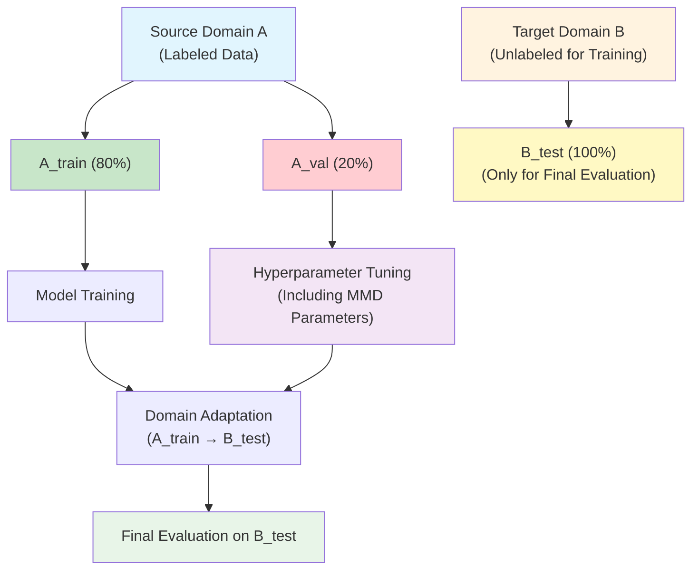

# 标准域适应实验指南

## 问题背景

在域适应研究中，**实验设计的标准性**至关重要。传统的机器学习实验可以使用目标域的验证集进行超参数调优，但在域适应场景下，这种做法是**不被允许的**，因为：

1. **违反了域适应的基本假设**：目标域数据应该是完全未知的
2. **导致数据泄露**：使用目标域数据调参相当于让模型"看到"了目标域的分布
3. **结果不可信**：这种做法会高估模型的真实跨域性能

## 标准域适应实验设计

### 核心原则



### 数据划分策略

1. **源域数据**：
   - 训练集（80%）：用于模型训练
   - 验证集（20%）：用于最终模型选择
   - 交叉验证：在训练集内进行5折CV，用于超参数调优

2. **目标域数据**：
   - 测试集（100%）：仅用于最终评估，**绝不用于调参**

### 参数调优策略

#### 方案1：源域内交叉验证（推荐）

```python
# 在源域训练集内进行5折交叉验证
for fold in cv_folds:
    # 当前fold的训练和验证数据
    X_fold_train, X_fold_val = split_source_data(fold)
    
    # 训练模型
    model.fit(X_fold_train, y_fold_train)
    
    # 如果启用MMD调优，在源域内模拟域适应
    if use_mmd_tuning:
        X_fold_val_adapted = mmd_transform(X_fold_train, X_fold_val, **mmd_params)
        score = evaluate(model, X_fold_val_adapted, y_fold_val)
    else:
        score = evaluate(model, X_fold_val, y_fold_val)
    
    cv_scores.append(score)

# 使用平均CV分数选择最佳参数
best_params = optimize_based_on_cv_scores(cv_scores)
```

#### 方案2：固定MMD参数（保守方案）

如果担心源域内MMD调优不够可靠，可以：

1. 使用文献中的经典MMD参数
2. 只调优模型参数，固定MMD参数
3. 基于理论分析选择MMD参数

## 使用方法

### 基本使用

```bash
# 标准域适应实验（A→B）
python scripts/run_standard_domain_adaptation.py \
    --model-type auto \
    --mmd-method linear \
    --target-domain B

# 指定目标域为C（A→C）
python scripts/run_standard_domain_adaptation.py \
    --model-type auto \
    --mmd-method linear \
    --target-domain C
```

### 高级配置

```bash
# 使用类条件MMD
python scripts/run_standard_domain_adaptation.py \
    --model-type auto \
    --mmd-method linear \
    --use-class-conditional \
    --target-domain B

# 禁用MMD参数调优（只调优模型参数）
python scripts/run_standard_domain_adaptation.py \
    --model-type auto \
    --no-mmd-tuning \
    --target-domain B

# 自定义交叉验证设置
python scripts/run_standard_domain_adaptation.py \
    --model-type auto \
    --mmd-method linear \
    --cv-folds 10 \
    --source-val-split 0.15 \
    --target-domain B
```

### 参数说明

| 参数 | 说明 | 默认值 |
|------|------|--------|
| `--model-type` | 模型类型 (auto/rf/base) | auto |
| `--mmd-method` | MMD方法 (linear/mean_std) | linear |
| `--target-domain` | 目标域 (B/C) | B |
| `--cv-folds` | 交叉验证折数 | 5 |
| `--source-val-split` | 源域验证集比例 | 0.2 |
| `--n-calls` | 贝叶斯优化迭代次数 | 50 |
| `--no-mmd-tuning` | 禁用MMD参数调优 | False |
| `--use-class-conditional` | 使用类条件MMD | False |

## 实验结果解读

### 输出文件

实验完成后会生成以下文件：

```
results_standard_domain_adaptation_auto_linear_best7_target_B/
├── optimization_results.json      # 贝叶斯优化详细结果
├── evaluation_results.json        # 最终模型评估结果
├── experiment_config.json         # 实验配置信息
└── experiment.log                 # 完整实验日志
```

### 关键指标

1. **最佳源域CV AUC**：源域内交叉验证的最佳性能
2. **源域验证集AUC**：在源域验证集上的性能
3. **目标域直接预测AUC**：不进行域适应的跨域性能
4. **目标域域适应后AUC**：进行MMD域适应后的跨域性能
5. **域适应改进**：域适应带来的性能提升

### 性能分析

```python
# 域差距分析
domain_gap = source_auc - target_direct_auc

if domain_gap > 0.1:
    print("存在显著的域差距，域适应很有必要")
elif domain_gap > 0.05:
    print("存在中等的域差距，域适应可能有帮助")
else:
    print("域差距较小，模型具有良好的跨域泛化能力")

# 域适应效果分析
if adapted_auc > direct_auc:
    improvement = (adapted_auc - direct_auc) / direct_auc * 100
    print(f"域适应有效，性能提升 {improvement:.1f}%")
else:
    print("域适应未能提升性能，可能需要调整方法或参数")
```

## 与现有方法的对比

### 当前贝叶斯MMD优化的问题

```python
# 问题：使用目标域验证集进行参数调优
def objective_function(params):
    model.fit(X_source_train, y_source_train)
    
    # ❌ 错误：使用目标域数据调参
    X_target_val_adapted = mmd_transform(X_source_train, X_target_val, **params)
    score = evaluate(model, X_target_val_adapted, y_target_val)
    
    return score
```

### 标准域适应方法

```python
# 正确：只使用源域数据调参
def objective_function(params):
    cv_scores = []
    for fold in cv_folds:
        X_fold_train, X_fold_val = split_source_data(fold)
        model.fit(X_fold_train, y_fold_train)
        
        # ✅ 正确：在源域内模拟域适应
        X_fold_val_adapted = mmd_transform(X_fold_train, X_fold_val, **params)
        score = evaluate(model, X_fold_val_adapted, y_fold_val)
        cv_scores.append(score)
    
    return np.mean(cv_scores)
```

## 理论依据

### 域适应的基本假设

1. **源域有标签，目标域无标签**：这是域适应的基本设定
2. **分布差异**：源域和目标域存在分布差异
3. **目标域不可见**：在训练和调参阶段，目标域数据应该是不可见的

### 为什么源域CV可以指导MMD参数选择

1. **MMD的理论基础**：MMD衡量的是两个分布之间的距离
2. **源域内的分布差异**：即使在源域内，不同子集之间也存在一定的分布差异
3. **参数的泛化性**：在源域内有效的MMD参数往往在跨域场景下也有效
4. **避免过拟合**：通过交叉验证避免对特定数据划分的过拟合

### 文献支持

这种实验设计符合域适应领域的标准实践：

1. **Ben-David et al. (2010)**：域适应理论基础
2. **Ganin & Lempitsky (2015)**：DANN论文的实验设计
3. **Long et al. (2015)**：DAN论文的实验设计
4. **Tzeng et al. (2017)**：ADDA论文的实验设计

## 最佳实践建议

### 1. 实验设计

- ✅ 使用源域交叉验证进行参数调优
- ✅ 目标域数据仅用于最终评估
- ✅ 报告域差距和域适应改进
- ❌ 不要使用目标域数据进行任何形式的调参

### 2. 参数调优

- ✅ 优先调优模型参数，MMD参数可以固定
- ✅ 如果调优MMD参数，使用源域内模拟
- ✅ 使用充分的交叉验证折数（≥5）
- ❌ 不要基于目标域性能选择参数

### 3. 结果报告

- ✅ 报告源域性能作为上界参考
- ✅ 报告直接跨域性能作为基线
- ✅ 报告域适应后的性能
- ✅ 分析域差距和改进幅度

### 4. 方法比较

- ✅ 与无域适应的基线比较
- ✅ 与其他域适应方法比较
- ✅ 在多个源域-目标域对上验证
- ❌ 不要只在单一数据集上验证

## 常见问题

### Q1: 源域CV能否真正反映跨域性能？

**A**: 虽然不完美，但这是目前最标准的做法。源域CV可以：
- 避免数据泄露
- 提供参数选择的相对排序
- 在多数情况下与跨域性能正相关

### Q2: 如果源域CV选择的参数在目标域上效果不好怎么办？

**A**: 这说明：
- 域差距可能很大，需要更强的域适应方法
- 可能需要收集更多源域数据
- 可能需要使用无监督域适应方法

### Q3: 能否使用目标域的无标签数据进行调参？

**A**: 可以，但需要谨慎：
- 可以使用无监督指标（如MMD距离）
- 不能使用有监督指标（如AUC）
- 需要在论文中明确说明使用了目标域无标签数据

### Q4: 这种方法的局限性是什么？

**A**: 主要局限性包括：
- 源域CV可能无法完全反映跨域场景
- 对于域差距很大的情况可能效果有限
- 需要足够的源域数据进行有效的CV

## 总结

标准域适应实验设计的核心是**严格分离训练/调参数据和测试数据**。通过使用源域内交叉验证进行参数调优，我们可以：

1. **避免数据泄露**：确保实验结果的可信度
2. **符合标准**：遵循域适应研究的标准实践
3. **保证公平**：与其他方法在相同条件下比较
4. **提高可重现性**：实验设计清晰，易于重现

这种方法虽然可能不会得到最优的跨域性能，但能够提供**可信、公平、标准**的实验结果，这对于科学研究来说更为重要。 