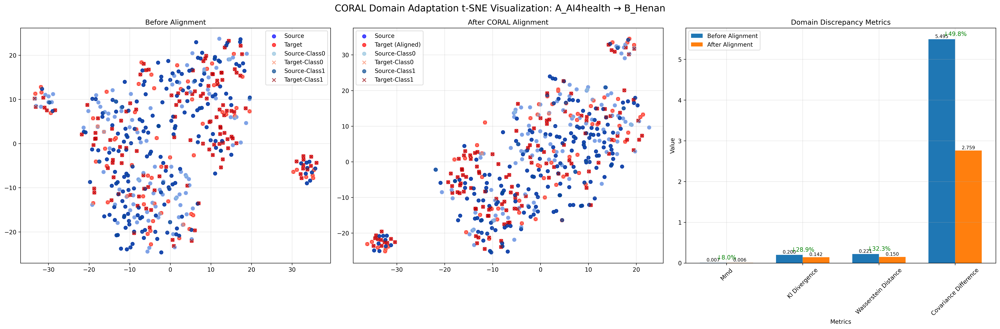
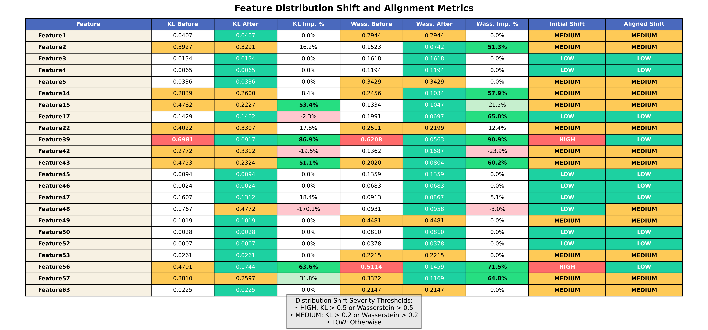
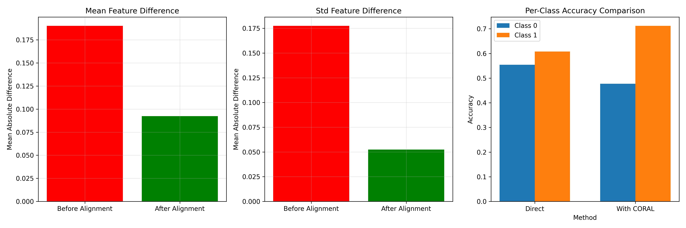
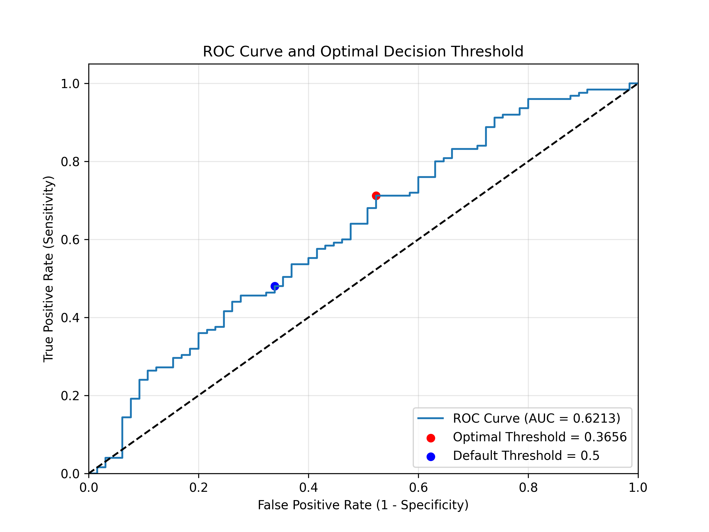

# CORAL域适应方法与实验结果说明文档

## 概述

本文档介绍了两种CORAL（CORrelation ALignment）域适应方法的实现及其相关实验结果分析：

1. **解析版CORAL (Analytical CORAL)**：标准的CORAL域适应方法，通过对齐不同域之间的特征协方差矩阵来减少域差异。
2. **类条件CORAL (Class-Conditional CORAL)**：改进版CORAL，对每个类别分别进行协方差对齐，能更好地保留类别信息。

这些方法用于解决域偏移问题，即将在一个域（源域）上训练的模型应用到另一个域（目标域）时，由于数据分布差异导致的性能下降问题。

## CORAL域适应方法原理

### 标准CORAL原理

标准CORAL（Correlation Alignment）方法的核心思想是通过对齐源域和目标域的二阶统计量（即协方差矩阵）来减少域间差异。其基本步骤如下：

1. 计算源域特征的协方差矩阵 Cs
2. 计算目标域特征的协方差矩阵 Ct
3. 找到一个线性变换，使变换后的目标域特征有与源域相似的协方差结构
4. 变换后的目标域特征可以与源域特征共享同一个分类器

主要公式：
```
Cs = cov(Xs) + λI  # 源域协方差矩阵（加正则化）
Ct = cov(Xt) + λI  # 目标域协方差矩阵（加正则化）

# 计算转换矩阵
A = Ct^(-1/2) · Cs^(1/2)

# 转换目标域特征
Xt_aligned = Xt · A
```

其中λI是小的正则化项，确保矩阵的可逆性。

### 类条件CORAL原理与实现

类条件CORAL是标准CORAL的扩展，它考虑到不同类别可能有不同的域偏移模式，因此对每个类别分别执行CORAL对齐。这种方法能更好地保留类别信息，提高分类性能。

**关键问题：如何获取目标域的类别标签？**

在实际应用中，目标域数据通常没有标签，而类条件CORAL需要知道样本的类别才能进行类别特定的对齐。本实现中采用了两种策略：

1. **伪标签策略**（完全无监督）：
   - 首先使用标准CORAL对目标域特征进行初步对齐
   - 使用在源域训练的模型对对齐后的目标域特征进行预测，获得伪标签
   - 然后基于这些伪标签，对每个类别分别应用CORAL变换

   ```python
   # 伪标签生成过程
   Xt_temp = coral_transform(Xs, Xt)  # 使用普通CORAL先对齐
   model = train_model_on_source(Xs, ys)  # 在源域训练模型
   yt_pseudo = model.predict(Xt_temp)  # 生成伪标签
   ```

2. **部分监督策略**（使用少量真实标签）：
   - 使用目标域中的少量带标签样本（例如10%）
   - 对这些样本使用真实标签，其余样本仍使用伪标签
   - 这种半监督方法通常能获得更好的性能

   ```python
   # 部分监督过程
   n_labeled = int(len(y_target) * target_label_ratio)  # 如10%
   labeled_idx = stratified_sample(X_target, y_target, n_labeled)  # 分层抽样
   
   yt_pseudo = np.zeros_like(y_target) - 1  # 初始化为-1表示未知
   yt_pseudo[labeled_idx] = y_target[labeled_idx]  # 填入已知标签
   
   # 对未标记部分使用普通CORAL预测
   X_target_unlabeled = X_target[yt_pseudo == -1]
   X_target_unlabeled_aligned = coral_transform(X_source, X_target_unlabeled)
   yt_pseudo_unlabeled = model.predict(X_target_unlabeled_aligned)
   yt_pseudo[yt_pseudo == -1] = yt_pseudo_unlabeled  # 合并真实和伪标签
   ```

**类条件CORAL的具体实现步骤：**

1. 获取目标域的伪标签或部分真实标签
2. 对每个类别c分别：
   - 提取源域中属于类别c的样本 Xs_c
   - 提取目标域中属于类别c的样本（根据伪标签）Xt_c
   - 计算这两个子集的协方差矩阵 Cs_c 和 Ct_c
   - 计算类别特定的转换矩阵 A_c = Ct_c^(-1/2) · Cs_c^(1/2)
   - 应用转换到目标域的类别c样本

3. 对所有类别执行完变换后，得到完整的对齐后目标域数据

代码实现：
```python
def class_conditional_coral_transform(Xs, ys, Xt, yt_pseudo, cat_idx=None, alpha=0.1):
    """
    类条件CORAL变换，对每个类别分别进行协方差对齐
    
    参数:
    - Xs: 源域特征
    - ys: 源域标签
    - Xt: 目标域特征
    - yt_pseudo: 目标域伪标签
    - cat_idx: 类别特征的索引
    - alpha: 正则化参数
    """
    # 初始化结果矩阵
    Xt_aligned = Xt.copy()
    
    # 分类别执行CORAL
    for c in np.unique(ys):
        # 获取源域和目标域中类别c的样本
        Xs_c = Xs[ys == c]
        class_mask = (yt_pseudo == c)
        Xt_c = Xt[class_mask]
        
        # 跳过样本过少的类别
        if len(Xt_c) < 2 or len(Xs_c) < 2:
            continue
            
        # 提取连续特征
        Xs_c_cont = Xs_c[:, cont_idx]
        Xt_c_cont = Xt_c[:, cont_idx]
        
        # 对齐均值
        mu_s_c = np.mean(Xs_c_cont, axis=0)
        mu_t_c = np.mean(Xt_c_cont, axis=0)
        Xt_c_cont_centered = Xt_c_cont - mu_t_c + mu_s_c
        
        # 计算协方差矩阵
        Cs_c = np.cov(Xs_c_cont, rowvar=False) + alpha * np.eye(len(cont_idx))
        Ct_c = np.cov(Xt_c_cont_centered, rowvar=False) + alpha * np.eye(len(cont_idx))
        
        # 计算变换矩阵
        Ct_c_inv_sqrt = scipy.linalg.fractional_matrix_power(Ct_c, -0.5)
        Cs_c_sqrt = scipy.linalg.fractional_matrix_power(Cs_c, 0.5)
        A_c = np.dot(Ct_c_inv_sqrt, Cs_c_sqrt)
        
        # 应用变换到目标域类别c样本
        Xt_c_cont_aligned = np.dot(Xt_c_cont_centered, A_c)
        
        # 更新对齐后的特征
        for i, feat_idx in enumerate(cont_idx):
            Xt_aligned[class_mask, feat_idx] = Xt_c_cont_aligned[:, i]
    
    return Xt_aligned
```

与标准CORAL相比，类条件CORAL通常能提供更好的性能，因为它考虑到了不同类别可能有不同的域偏移特性。特别是在目标域中类别分布不平衡的情况下，类条件CORAL能更好地保持每个类别的性能。

## 文件夹内容说明

### 1. `results_analytical_coral` 文件夹

该文件夹包含标准CORAL方法的实验结果：

#### 主要文件类型及其含义

| 文件名模式 | 说明 |
|------------|------|
| `TabPFN-Analytical-CORAL_A_to_B_tsne.png` | A域到B域的t-SNE可视化（基础版本） |
| `TabPFN-Analytical-CORAL_A_to_B_tsne_visual.png` | A域到B域的t-SNE可视化（增强版本，带有更多分析信息） |
| `TabPFN-Analytical-CORAL_A_to_B_histograms.png` | A域到B域特征分布直方图（基础版本） |
| `TabPFN-Analytical-CORAL_A_to_B_histograms_visual.png` | A域到B域特征分布直方图（增强版本，带有更多分析信息） |
| `TabPFN-Analytical-CORAL_A_to_B_histograms_stats_table.png` | A域到B域特征分布统计表格 |
| `TabPFN-Analytical-CORAL_A_to_B_analysis.png` | A域到B域的综合分析结果 |
| `TabPFN-Analytical-CORAL_A_to_B_roc_curve.png` | A域到B域的ROC曲线 |
| `TabPFN-Analytical-CORAL_A_to_B_aligned_features.npz` | A域到B域的对齐后特征（二进制格式） |
| `comparison_A_to_B.png` | A域到B域的性能比较 |
| `all_results.csv` | 所有实验结果的汇总数据 |

> 类似文件名中的`A_to_C`表示从A域（Dataset A）到C域（Dataset C）的域适应结果。

### 2. `results_class_conditional_coral` 文件夹

该文件夹包含类条件CORAL方法的实验结果：

#### 主要文件类型及其含义

| 文件名模式 | 说明 |
|------------|------|
| `TabPFN-ClassCORAL_A_to_B_tsne.png` | 类条件CORAL的t-SNE可视化（基础版本） |
| `TabPFN-ClassCORAL_A_to_B_tsne_visual.png` | 类条件CORAL的t-SNE可视化（增强版本） |
| `TabPFN-ClassCORAL_A_to_B_histograms.png` | 类条件CORAL的特征分布直方图 |
| `TabPFN-ClassCORAL_A_to_B_histograms_visual.png` | 类条件CORAL的特征分布直方图（增强版本） |
| `TabPFN-ClassCORAL_A_to_B_histograms_visual_stats_table.png` | 类条件CORAL的特征分布统计表格 |
| `TabPFN-ClassCORAL_A_to_B_analysis.png` | 类条件CORAL的综合分析结果 |
| `TabPFN-ClassCORAL_A_to_B_aligned_features.npz` | 类条件CORAL的对齐后特征（二进制格式） |
| `TabPFN-ClassCORAL_A_to_B_roc_curve.png` | 类条件CORAL的ROC曲线 |
| `TabPFN-ClassCORAL_A_to_B_class0_histograms.png` | 类条件CORAL对类别0的特征分布直方图 |
| `TabPFN-ClassCORAL_A_to_B_class1_histograms.png` | 类条件CORAL对类别1的特征分布直方图 |
| `TabPFN-ClassCORAL_WithLabels_*` | 使用部分真实标签的类条件CORAL相关结果 |
| `methods_comparison_A_to_B.png` | 不同CORAL方法的性能比较 |
| `class_coral_results.csv` | 类条件CORAL实验结果汇总 |

> `WithLabels`后缀表示使用了10%的真实目标域标签进行对齐，而非纯粹的无监督方法。

## 图像类型详细解释

### 1. t-SNE可视化图



**说明**：t-SNE是一种降维可视化技术，用于在二维空间中显示高维数据的分布情况。

* **左图**：对齐前的数据分布。蓝色点表示源域数据，红色点表示目标域数据。
* **中图**：对齐后的数据分布。蓝色点表示源域数据，红色点表示对齐后的目标域数据。
* **右图**：域差异指标比较，展示了对齐前后各种度量指标的变化。

### 2. 特征分布直方图


**说明**：直方图显示了特征值的分布情况。

* **左列**：对齐前的特征分布。蓝色表示源域，红色表示目标域。
* **右列**：对齐后的特征分布。蓝色表示源域，红色表示对齐后的目标域。
* **文本框**：包含KL散度和Wasserstein距离等统计信息，以及对齐改进率。

### 3. 特征统计表格



**说明**：详细展示了每个特征的分布差异统计和对齐效果。

* **KL Before/After**：KL散度（分布差异度量）在对齐前后的值。
* **Wasserstein Before/After**：Wasserstein距离在对齐前后的值。
* **Initial/Aligned Shift**：初始和对齐后的分布偏移程度（HIGH/MEDIUM/LOW）。
* **颜色编码**：红色表示严重偏移，黄色表示中等偏移，绿色表示轻微偏移。

### 4. 分析结果图



**说明**：综合分析对齐前后的效果。

* **左图（特征均值差异）**：
  - 衡量源域和目标域特征平均值的差异程度
  - 计算方法：对每个特征维度，计算源域均值和目标域均值之间的绝对差值，然后对所有特征取平均
  - 数学表达式：`mean_diff = 1/d * Σ |mean(X_source_i) - mean(X_target_i)|`，其中d是特征维度数
  - 值越小表示两个域的特征中心位置越接近
  - 红色柱表示对齐前，绿色柱表示对齐后的均值差异

* **中图（特征标准差差异）**：
  - 衡量源域和目标域特征分布宽度/变化范围的差异程度
  - 计算方法：对每个特征维度，计算源域标准差和目标域标准差之间的绝对差值，然后对所有特征取平均
  - 数学表达式：`std_diff = 1/d * Σ |std(X_source_i) - std(X_target_i)|`
  - 值越小表示两个域的特征分布形状越相似
  - 红色柱表示对齐前，绿色柱表示对齐后的标准差差异

* **右图**：每个类别的分类准确率对比。左侧为直接预测结果，右侧为使用CORAL对齐后的结果。

成功的域适应应当显著减小这些差异指标，表明源域和目标域的特征分布更加接近，从而使在源域训练的模型能更好地应用于目标域。在代码实现中，这些指标通过以下代码计算：

```python
# 计算均值差异
source_mean = np.mean(X_source_scaled, axis=0)  # 按特征计算源域均值
target_mean = np.mean(X_target_scaled, axis=0)  # 按特征计算目标域均值
mean_diff = np.mean(np.abs(source_mean - target_mean))  # 计算绝对差的平均

# 计算标准差差异
source_std = np.std(X_source_scaled, axis=0)  # 按特征计算源域标准差
target_std = np.std(X_target_scaled, axis=0)  # 按特征计算目标域标准差
std_diff = np.mean(np.abs(source_std - target_std))  # 计算绝对差的平均
```

### 5. ROC曲线



**说明**：展示模型的分类性能。

* **曲线**：显示真阳性率与假阳性率的关系。
* **AUC值**：曲线下面积，值越大表示性能越好。
* **阈值点**：标示了最佳决策阈值和默认阈值(0.5)的位置。

### 6. 方法比较图


**说明**：比较不同CORAL变体的性能。

* **左上**：各方法的准确率比较。
* **右上**：各方法的每类准确率比较。
* **左下**：各方法的AUC值比较。
* **右下**：各方法的F1分数比较。

## 实验设置与数据集

实验中使用了三个数据集：

* **Dataset A**：AI4health数据集
* **Dataset B**：HenanCancerHospital数据集
* **Dataset C**：GuangzhouMedicalHospital数据集

实验主要考虑两种域适应方向：
1. A到B：将在AI4health训练的模型应用到HenanCancerHospital数据上
2. A到C：将在AI4health训练的模型应用到GuangzhouMedicalHospital数据上

## 评估指标

实验使用了多种评估指标来衡量域适应效果：

* **准确率(Accuracy)**：正确分类的样本比例
* **AUC**：ROC曲线下面积
* **F1分数**：精确率与召回率的调和平均
* **每类准确率**：分别计算类别0和类别1的准确率
* **KL散度**：衡量两个分布的差异
* **Wasserstein距离**：另一种分布差异度量
* **MMD**：最大均值差异，衡量两个分布的差异

## 主要结论

1. CORAL域适应方法能有效减少源域和目标域之间的特征分布差异。
2. 类条件CORAL在大多数情况下优于标准CORAL方法，特别是在保持每类分类准确率平衡方面。
3. 使用少量目标域标签（10%）的类条件CORAL能进一步提升性能。
4. 域适应成功与否与特征的初始分布差异程度高度相关。 