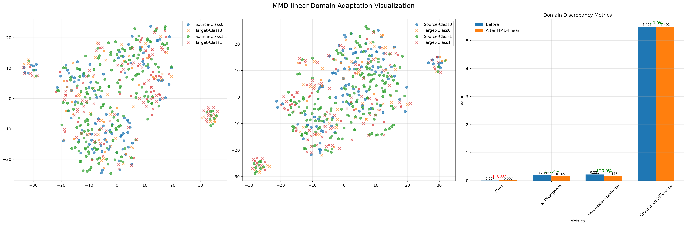
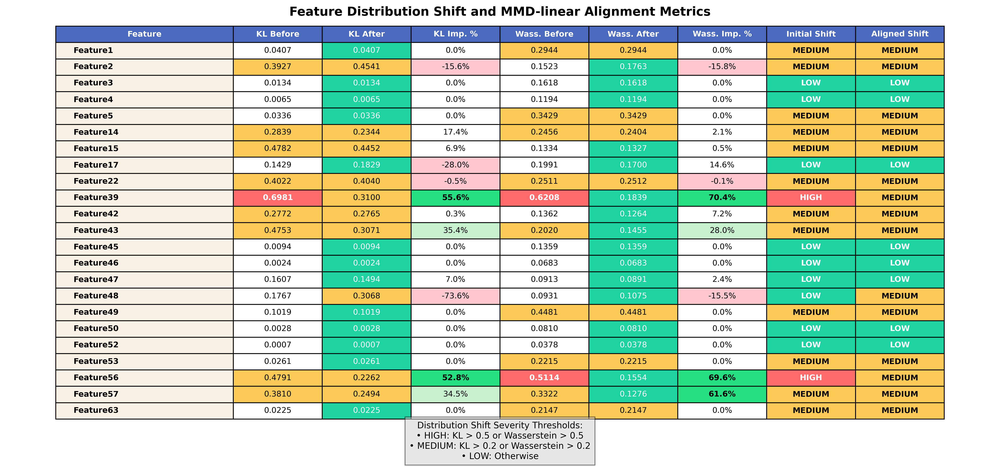
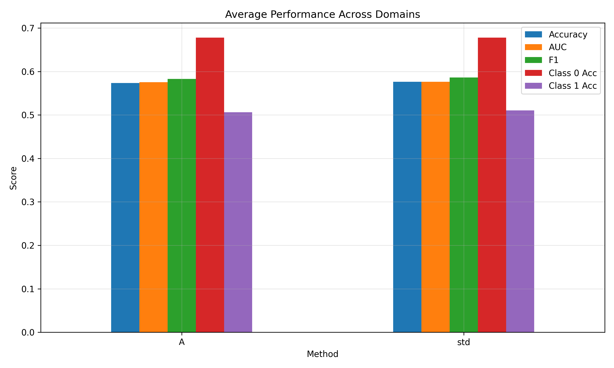

# MMD域适应方法与实验结果说明文档

## 概述

本文档介绍了基于MMD（Maximum Mean Discrepancy）的域适应方法的实现及其相关实验结果分析：

1. **标准MMD域适应**：通过最小化源域和目标域之间的最大均值差异来减少域差异，包含三种变体：
   - **线性变换MMD (Linear MMD)**：使用线性变换最小化MMD
   - **核PCA MMD (Kernel PCA MMD)**：利用核PCA空间进行分布对齐
   - **均值标准差MMD (Mean-Std MMD)**：对齐特征均值和标准差

2. **类条件MMD (Class-Conditional MMD)**：改进版MMD，针对每个类别分别进行MMD最小化，能更好地保留类别信息。

这些方法用于解决域偏移问题，即将在一个域（源域）上训练的模型应用到另一个域（目标域）时，由于数据分布差异导致的性能下降问题。

## MMD域适应方法原理

### MMD (Maximum Mean Discrepancy) 原理

MMD是一种度量两个分布之间差异的方法，它的核心思想是：如果两个分布相同，那么它们在再生核希尔伯特空间(RKHS)中的所有统计量（特别是均值）都应该相同。

MMD的数学定义：
```
MMD^2(P, Q) = ||E_p[φ(x)] - E_q[φ(y)]||^2_H
```

其中φ是特征映射函数，将数据映射到RKHS空间，P和Q分别是源域和目标域分布。

在实际计算中，使用核技巧避免显式计算特征映射：
```
MMD^2(X_s, X_t) = 1/n_s^2 * Σ k(x_i, x_j) + 1/n_t^2 * Σ k(y_i, y_j) - 2/(n_s*n_t) * Σ k(x_i, y_j)
```

其中k(·,·)是核函数（如RBF核），X_s和X_t分别是源域和目标域的样本集。

### 线性变换MMD (Linear MMD)

线性变换MMD通过学习一个线性变换矩阵W，将目标域数据映射到使MMD最小的空间：

1. 定义目标函数：MMD(X_s, W·X_t) + λ·Reg(W)，其中Reg(W)是正则化项
2. 使用梯度下降优化W，减小源域和变换后目标域之间的MMD
3. 最终得到变换矩阵W，使得W·X_t与X_s分布尽可能相似

代码实现核心为梯度下降优化：
```python
# 计算MMD梯度
mmd_loss = compute_mmd_torch(source_batch, target_transformed)
# 添加正则化项，保持变换接近单位矩阵
weights = next(self.model.parameters())
identity_reg = self.lambda_reg * torch.norm(weights - torch.eye(weights.shape[0], weights.shape[1]).to(self.device))
# 总损失
loss = mmd_loss + identity_reg
# 反向传播更新参数
loss.backward()
self.optimizer.step()
```

### 核PCA MMD (Kernel PCA MMD)

核PCA MMD利用核主成分分析在高维空间对齐分布：

1. 对源域和目标域数据应用核PCA变换
2. 在核PCA空间中对齐分布（调整均值和方差）
3. 将对齐后的数据映射回原始空间

主要步骤：
```python
# 合并数据训练核PCA
combined_data = np.vstack((X_s_cont, X_t_cont))
kpca = KernelPCA(n_components=n_components, kernel=kernel, gamma=gamma)
kpca.fit(combined_data)

# 变换数据到核PCA空间
X_s_kpca = kpca.transform(X_s_cont)
X_t_kpca = kpca.transform(X_t_cont)

# 在核PCA空间对齐
X_s_kpca_mean = np.mean(X_s_kpca, axis=0)
X_t_kpca_mean = np.mean(X_t_kpca, axis=0)
X_s_kpca_std = np.std(X_s_kpca, axis=0) + 1e-6
X_t_kpca_std = np.std(X_t_kpca, axis=0) + 1e-6
X_t_kpca_aligned = ((X_t_kpca - X_t_kpca_mean) / X_t_kpca_std) * X_s_kpca_std + X_s_kpca_mean
```

### 均值标准差MMD (Mean-Std MMD)

Mean-Std MMD是一种简单的分布对齐方法，直接对齐特征的一阶和二阶统计量：

1. 计算源域和目标域特征的均值和标准差
2. 将目标域特征标准化，再缩放到与源域相同的分布

实现简洁：
```python
# 仅对连续特征应用对齐
X_s_mean = np.mean(X_s_cont, axis=0)
X_s_std = np.std(X_s_cont, axis=0)
X_t_mean = np.mean(X_t_cont, axis=0)
X_t_std = np.std(X_t_cont, axis=0)

# 对齐均值和标准差
X_t_cont_aligned = (X_t_cont - X_t_mean) / (X_t_std + 1e-8) * X_s_std + X_s_mean
```

### 类条件MMD域适应原理与实现

类条件MMD考虑到不同类别可能有不同的域偏移模式，对每个类别分别应用MMD对齐，从而更好地保留类别信息。

**关键问题：如何获取目标域的类别标签？**

在实际应用中，目标域数据通常没有标签，类条件MMD采用两种策略：

1. **伪标签策略**（完全无监督）：
   - 首先使用标准MMD对目标域特征进行初步对齐
   - 使用在源域训练的模型对对齐后的目标域特征进行预测，获得伪标签
   - 然后基于这些伪标签，对每个类别分别应用MMD变换

   ```python
   # 伪标签生成过程
   X_t_temp, _ = mmd_transform(X_s, X_t, method=method)  # 使用普通MMD先对齐
   knn = KNeighborsClassifier(n_neighbors=5)  # 使用KNN分类器预测
   knn.fit(X_s, y_s)
   yt_pseudo = knn.predict(X_t_temp)  # 生成伪标签
   ```

2. **部分监督策略**（使用少量真实标签）：
   - 使用目标域中的少量带标签样本（例如10%）
   - 对这些样本使用真实标签，其余样本仍使用伪标签
   - 这种半监督方法通常能获得更好的性能

   ```python
   # 部分监督过程
   n_labeled = int(len(y_target) * target_label_ratio)  # 如10%
   # 使用分层抽样确保每个类别都有样本
   sss = StratifiedShuffleSplit(n_splits=1, test_size=1-target_label_ratio, random_state=42)
   for labeled_idx, _ in sss.split(X_target, y_target):
       pass
       
   # 创建伪标签数组
   yt_pseudo = np.zeros_like(y_target) - 1  # 初始化为-1表示未知
   yt_pseudo[labeled_idx] = y_target[labeled_idx]  # 填入已知标签
   
   # 对未标记部分使用标准MMD预测
   X_target_unlabeled = X_target[yt_pseudo == -1]
   X_target_unlabeled_aligned, _ = mmd_transform(X_source, X_target_unlabeled)
   yt_pseudo_unlabeled = model.predict(X_target_unlabeled_aligned)
   yt_pseudo[yt_pseudo == -1] = yt_pseudo_unlabeled  # 合并真实和伪标签
   ```

**类条件MMD的具体实现步骤：**

1. 获取目标域的伪标签或部分真实标签
2. 对每个类别c分别：
   - 提取源域中属于类别c的样本 X_s_c
   - 提取目标域中属于类别c的样本（根据伪标签）X_t_c
   - 对这两个子集分别应用标准MMD对齐方法
   - 将变换后的目标域类别c样本放回到结果数组中

代码实现：
```python
def class_conditional_mmd_transform(X_s, y_s, X_t, yt_pseudo=None, method='linear', cat_idx=None, **kwargs):
    """类别条件MMD变换"""
    # 初始化结果矩阵
    X_t_aligned = np.copy(X_t)
    
    # 获取唯一类别
    classes = np.unique(y_s)
    
    # 对每个类别单独进行MMD对齐
    for c in classes:
        # 获取类别c的源域样本
        X_s_c = X_s[y_s == c]
        
        # 获取类别c的目标域样本（基于伪标签）
        X_t_c = X_t[yt_pseudo == c]
        
        if len(X_t_c) == 0:
            logging.warning(f"目标域中没有类别{c}的样本，跳过")
            continue
            
        # 对当前类别应用MMD对齐
        X_t_c_aligned, mmd_c_info = mmd_transform(X_s_c, X_t_c, method=method, cat_idx=cat_idx, **kwargs)
        
        # 将对齐后的样本放回结果矩阵
        X_t_aligned[yt_pseudo == c] = X_t_c_aligned
    
    return X_t_aligned
```

与标准MMD相比，类条件MMD通常能提供更好的性能，因为它考虑到了不同类别可能有不同的域偏移特性。特别是在目标域中类别分布不平衡的情况下，类条件MMD能更好地保持每个类别的性能。

## 文件夹内容说明

### `results_mmd` 文件夹

该文件夹包含基于MMD的各种域适应方法的实验结果：

#### 主要文件类型及其含义

| 文件名模式 | 说明 |
|------------|------|
| `TabPFN-MMD-linear_A_to_B_analysis.png` | 线性MMD方法的分析结果图 |
| `TabPFN-MMD-linear_A_to_B_roc_curve.png` | 线性MMD方法的ROC曲线 |
| `TabPFN-MMD-linear_A_to_B_aligned_features.npz` | 线性MMD方法对齐后的特征（二进制格式） |
| `TabPFN-MMD-kpca_A_to_B_analysis.png` | 核PCA MMD方法的分析结果图 |
| `TabPFN-MMD-kpca_A_to_B_roc_curve.png` | 核PCA MMD方法的ROC曲线 |
| `TabPFN-MMD-kpca_A_to_B_aligned_features.npz` | 核PCA MMD方法对齐后的特征（二进制格式） |
| `TabPFN-MMD-mean_std_A_to_B_analysis.png` | 均值标准差MMD方法的分析结果图 |
| `TabPFN-MMD-mean_std_A_to_B_roc_curve.png` | 均值标准差MMD方法的ROC曲线 |
| `TabPFN-MMD-mean_std_A_to_B_aligned_features.npz` | 均值标准差MMD方法对齐后的特征（二进制格式） |
| `TabPFN-ClassMMD-*` | 类条件MMD方法的相关结果文件 |
| `TabPFN-ClassMMD-WithLabels-*` | 使用部分真实标签的类条件MMD相关结果 |
| `*_visualizations/` | 包含详细可视化结果的子文件夹 |
| `mmd_methods_comparison.png` | 不同MMD方法的性能比较图 |
| `mmd_methods_comparison.csv` | 不同MMD方法的性能比较数据 |
| `all_results.csv` | 所有实验结果的汇总数据 |

> 类似文件名中的`A_to_B`和`A_to_C`分别表示从Dataset A到Dataset B和从Dataset A到Dataset C的域适应结果。

#### 可视化文件夹结构

每个MMD方法都有一个对应的可视化子文件夹，例如：`TabPFN-MMD-linear_A_to_B_visualizations/`，包含以下内容：

| 子文件夹/文件 | 说明 |
|------------|------|
| `before_after_comparison/` | 对齐前后的比较结果 |
| `comparison/` | 与其他方法的比较结果 |
| `tsne_visualization.png` | t-SNE降维可视化 |
| `feature_histograms.png` | 特征分布直方图 |
| `feature_stats_table.png` | 特征统计表格 |

## 图像类型详细解释

### 1. t-SNE可视化图



**说明**：t-SNE是一种降维可视化技术，用于在二维空间中显示高维数据的分布情况。

* **左图**：对齐前的数据分布。蓝色点表示源域数据，红色点表示目标域数据。
* **中图**：对齐后的数据分布。蓝色点表示源域数据，红色点表示对齐后的目标域数据。
* **右图**：域差异指标比较，展示了对齐前后各种度量指标的变化。

### 2. 特征分布直方图


**说明**：直方图显示了特征值的分布情况。

* **左列**：对齐前的特征分布。蓝色表示源域，红色表示目标域。
* **右列**：对齐后的特征分布。蓝色表示源域，红色表示对齐后的目标域。
* **文本框**：包含KL散度和Wasserstein距离等统计信息，以及对齐改进率。

### 3. 特征统计表格



**说明**：详细展示了每个特征的分布差异统计和对齐效果。

* **KL Before/After**：KL散度（分布差异度量）在对齐前后的值。
* **Wasserstein Before/After**：Wasserstein距离在对齐前后的值。
* **Initial/Aligned Shift**：初始和对齐后的分布偏移程度（HIGH/MEDIUM/LOW）。
* **颜色编码**：红色表示严重偏移，黄色表示中等偏移，绿色表示轻微偏移。

### 4. 分析结果图


**说明**：综合分析对齐前后的效果。

* **左图**：显示不同模型评估指标的比较，包括准确率、AUC和F1分数。

* **中图**：分类准确率比较，按类别（0和1）展示不同方法的性能。

* **右图**：目标域预测分布与真实分布的比较，包括直接预测、MMD对齐后预测和真实分布。

与CORAL方法相似，成功的MMD域适应应当提高这些指标，表明更好地在目标域应用源域模型。MMD值的减少表明两个分布更加接近。

### 5. ROC曲线


**说明**：展示模型的分类性能。

* **曲线**：显示真阳性率与假阳性率的关系。
* **AUC值**：曲线下面积，值越大表示性能越好。
* **阈值点**：标示了最佳决策阈值和默认阈值(0.5)的位置。

### 6. 方法比较图



**说明**：比较不同MMD变体的性能。

* **上图**：每个域适应任务（A到B和A到C）的各种评估指标（准确率、AUC）。
* **下图**：不同MMD方法在所有任务上的平均性能。

## 实验设置与数据集

实验中使用了三个数据集：

* **Dataset A**：AI4health数据集
* **Dataset B**：HenanCancerHospital数据集
* **Dataset C**：GuangzhouMedicalHospital数据集

实验主要考虑两种域适应方向：
1. A到B：将在AI4health训练的模型应用到HenanCancerHospital数据上
2. A到C：将在AI4health训练的模型应用到GuangzhouMedicalHospital数据上

使用的特征包括23个选定特征：

```python
selected_features = [
    'Feature1', 'Feature2', 'Feature3', 'Feature4', 'Feature5',
    'Feature14', 'Feature15', 'Feature17', 'Feature22',
    'Feature39', 'Feature42', 'Feature43', 'Feature45',
    'Feature46', 'Feature47', 'Feature48', 'Feature49',
    'Feature50', 'Feature52', 'Feature53', 'Feature56',
    'Feature57', 'Feature63'
]
```

## 评估指标

实验使用了多种评估指标来衡量域适应效果：

* **准确率(Accuracy)**：正确分类的样本比例
* **AUC**：ROC曲线下面积
* **F1分数**：精确率与召回率的调和平均
* **每类准确率**：分别计算类别0和类别1的准确率
* **MMD**：最大均值差异，直接衡量两个分布的差异
* **KL散度**：衡量两个分布的差异
* **Wasserstein距离**：另一种分布差异度量
* **协方差差异**：衡量分布二阶统计量的差异

## 主要结论

1. MMD域适应方法能有效减少源域和目标域之间的特征分布差异，提高模型在目标域的泛化性能。
2. 不同的MMD变体适用于不同情况：
   - 线性MMD适用于简单的域偏移问题，实现简单，计算效率高。
   - 核PCA MMD能处理更复杂的非线性域偏移，但计算成本较高。
   - 均值标准差MMD是最简单的方法，但在某些情况下仍能提供良好的性能。
3. 类条件MMD通常优于标准MMD方法，尤其是在类别分布不平衡的情况下。
4. 使用少量目标域标签（10%）的类条件MMD能进一步提升性能。
5. MMD域适应的成功与否与初始域差异程度有关，对于初始差异很大的域，可能需要更复杂的对齐方法或结合其他技术。 