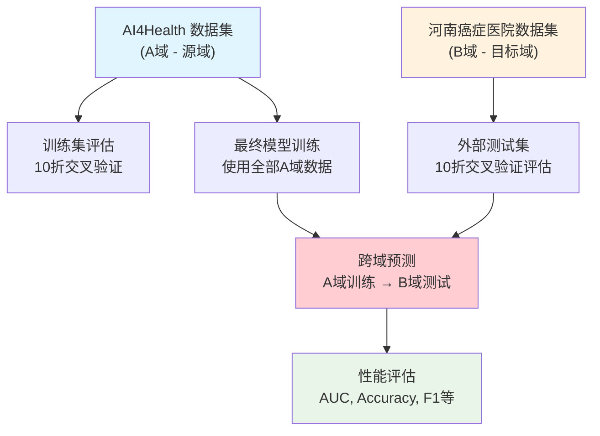
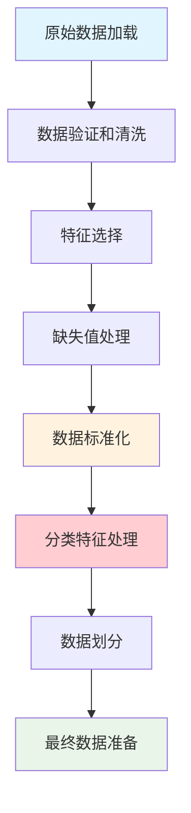

# AutoTabPFN 参数调优实验文档

## 概述

本文档详细说明了 `predict_healthcare_auto_external_adjust_parameter.py` 脚本的实验设计和实现。该实验旨在通过系统性的超参数优化，找到 AutoTabPFN 模型在医疗数据跨域预测任务中的最佳配置，以提升模型在外部数据集上的泛化性能。

## 🎯 实验目标

### 主要目标
- **超参数优化**: 通过贝叶斯优化或随机搜索找到 AutoTabPFN 的最佳参数组合
- **跨域泛化**: 优化模型在 AI4Health → 河南癌症医院数据集的跨域预测性能
- **特征工程**: 评估分类特征处理对模型性能的影响
- **性能基准**: 建立基于最佳7特征的性能基准线

### 评估指标

#### 超参数优化目标函数
- **主要指标**: **B域AUC** (河南癌症医院数据集上的AUC) - 用于超参数优化的目标函数
- **优化目标**: 最大化模型在目标域（B域）上的跨域泛化性能
- **重要性**: 这是实验的核心目标，直接反映模型的实际应用价值

#### 全面性能评估指标
- **A域指标**: 在AI4Health数据上的性能（训练集基线性能）
  - AUC、准确率、F1分数、类别特异性准确率
- **B域指标**: 在河南癌症医院数据上的性能（目标域泛化性能）
  - AUC、准确率、F1分数、类别特异性准确率
- **稳定性指标**: 通过10折交叉验证评估模型在两个域上的性能稳定性

## 📊 实验设计

### 数据集定义和特点

#### 数据集概览
- **数据集A (AI4Health)**：源域训练数据，标准化程度高，数据质量好
- **数据集B (河南癌症医院)**：目标域测试数据，专科医院特色，分布有差异
- **数据集C (广州医科大学)**：备选目标域，教学医院特点，数据规范

| 数据集 | 医院类型 | 数据特点 | 样本规模 | 特征数量 | 文件路径 |
|--------|----------|----------|----------|----------|----------|
| A (AI4Health) | 综合医院 | 标准化程度高，数据质量好 | ~1500 | 63个原始特征 | `data/AI4healthcare.xlsx` |
| B (河南癌症医院) | 专科医院 | 癌症专科特色，分布有差异 | ~800 | 58个原始特征 | `data/HenanCancerHospital_features63_58.xlsx` |
| C (广州医科大学) | 教学医院 | 教学医院特点，数据规范 | ~600 | 58个原始特征 | `data/GuangzhouMedicalHospital_features63_58.xlsx` |

### 数据集划分策略

#### 划分原理
本实验采用**跨域验证**策略，即在源域（A域）上训练模型，在目标域（B域）上测试模型的泛化能力。这种划分方式模拟了真实医疗场景中的跨医院预测需求。

#### 与其他实验方法的数据划分对比

| 实验类型 | 训练数据 | 验证数据 | 测试数据 | 划分目的 |
|----------|----------|----------|----------|----------|
| **参数调优实验** | A域全部 (10折CV) | A域内部验证 | B域全部 (10折CV) | 跨域泛化性能优化 |
| **固定参数域适应** | A域80% | A域20% | B域100% | 快速域适应验证 |
| **标准域适应** | A域80% | B域80% | B域20% | 域适应参数优化 |
| **传统机器学习** | A域80% | A域20% | A域内部 | 单域性能优化 |

#### 数据划分的优势
1. **真实性**: 模拟实际跨医院部署场景
2. **严格性**: 完全独立的测试集，避免数据泄露
3. **稳定性**: 使用交叉验证减少随机性影响
4. **可比性**: 与其他跨域实验保持一致的评估标准

#### 具体划分方案



#### 数据划分实现

```python
def load_and_prepare_data():
    """数据加载和预处理的完整流程"""
    
    # 1. 数据加载
    train_df = pd.read_excel("data/AI4healthcare.xlsx")
    external_df = pd.read_excel("data/HenanCancerHospital_features63_58.xlsx")
    
    # 2. 特征选择 (基于前期RFE分析确定)
    best_features = [
        'Feature63', 'Feature2', 'Feature46', 
        'Feature56', 'Feature42', 'Feature39', 'Feature43'
    ]
    
    # 3. 数据提取
    X_train = train_df[best_features].copy()
    y_train = train_df["Label"].copy()
    X_external = external_df[best_features].copy()
    y_external = external_df["Label"].copy()
    
    # 4. 数据验证
    print(f"训练集形状: {X_train.shape}")
    print(f"外部测试集形状: {X_external.shape}")
    print(f"训练集标签分布:\n{y_train.value_counts()}")
    print(f"外部数据集标签分布:\n{y_external.value_counts()}")
    
    return X_train, y_train, X_external, y_external

# 可选分类特征配置
categorical_features = ['Feature63', 'Feature46']
```

### 数据处理流程

#### 完整数据处理管道



#### 1. 数据加载和验证
```python
def load_and_validate_data():
    """数据加载和基本验证"""
    
    # 加载数据文件
    try:
        train_df = pd.read_excel("data/AI4healthcare.xlsx")
        external_df = pd.read_excel("data/HenanCancerHospital_features63_58.xlsx")
        logging.info("数据文件加载成功")
    except FileNotFoundError as e:
        logging.error(f"数据文件未找到: {e}")
        raise
    
    # 基本数据验证
    assert 'Label' in train_df.columns, "训练数据缺少Label列"
    assert 'Label' in external_df.columns, "外部数据缺少Label列"
    
    # 检查特征完整性
    required_features = get_required_features()
    missing_features_train = set(required_features) - set(train_df.columns)
    missing_features_external = set(required_features) - set(external_df.columns)
    
    if missing_features_train:
        logging.warning(f"训练数据缺少特征: {missing_features_train}")
    if missing_features_external:
        logging.warning(f"外部数据缺少特征: {missing_features_external}")
    
    return train_df, external_df
```

#### 2. 特征选择和工程
```python
def feature_selection_and_engineering(train_df, external_df, feature_type='best7'):
    """特征选择和工程处理"""
    
    if feature_type == 'best7':
        # 使用经过RFE分析确定的最佳7特征
        selected_features = [
            'Feature63', 'Feature2', 'Feature46', 
            'Feature56', 'Feature42', 'Feature39', 'Feature43'
        ]
        logging.info("使用最佳7特征配置")
    else:
        # 使用所有可用特征
        common_features = list(set(train_df.columns) & set(external_df.columns))
        selected_features = [f for f in common_features if f != 'Label']
        logging.info(f"使用全部{len(selected_features)}个特征")
    
    # 提取特征和标签
    X_train = train_df[selected_features].copy()
    y_train = train_df["Label"].copy()
    X_external = external_df[selected_features].copy()
    y_external = external_df["Label"].copy()
    
    return X_train, y_train, X_external, y_external, selected_features
```

#### 3. 缺失值处理
```python
def handle_missing_values(X_train, X_external):
    """缺失值处理策略"""
    
    # 检查缺失值情况
    train_missing = X_train.isnull().sum()
    external_missing = X_external.isnull().sum()
    
    if train_missing.sum() > 0:
        logging.warning(f"训练数据缺失值: {train_missing[train_missing > 0]}")
    if external_missing.sum() > 0:
        logging.warning(f"外部数据缺失值: {external_missing[external_missing > 0]}")
    
    # 缺失值填充策略
    from sklearn.impute import SimpleImputer
    
    # 数值特征用中位数填充
    numeric_features = X_train.select_dtypes(include=[np.number]).columns
    if len(numeric_features) > 0:
        numeric_imputer = SimpleImputer(strategy='median')
        X_train[numeric_features] = numeric_imputer.fit_transform(X_train[numeric_features])
        X_external[numeric_features] = numeric_imputer.transform(X_external[numeric_features])
    
    # 分类特征用众数填充
    categorical_features = X_train.select_dtypes(include=['object']).columns
    if len(categorical_features) > 0:
        categorical_imputer = SimpleImputer(strategy='most_frequent')
        X_train[categorical_features] = categorical_imputer.fit_transform(X_train[categorical_features])
        X_external[categorical_features] = categorical_imputer.transform(X_external[categorical_features])
    
    logging.info("缺失值处理完成")
    return X_train, X_external
```

#### 4. 数据标准化
```python
def apply_standardization(X_train, X_external):
    """数据标准化处理"""
    
    # 使用StandardScaler进行标准化
    # 重要：在训练集上拟合，然后应用到测试集
    scaler = StandardScaler()
    X_train_scaled = scaler.fit_transform(X_train)
    X_external_scaled = scaler.transform(X_external)
    
    logging.info("数据标准化完成")
    logging.info(f"训练集标准化后形状: {X_train_scaled.shape}")
    logging.info(f"外部测试集标准化后形状: {X_external_scaled.shape}")
    
    # 验证标准化效果
    train_mean = np.mean(X_train_scaled, axis=0)
    train_std = np.std(X_train_scaled, axis=0)
    logging.info(f"训练集标准化后均值范围: [{train_mean.min():.6f}, {train_mean.max():.6f}]")
    logging.info(f"训练集标准化后标准差范围: [{train_std.min():.6f}, {train_std.max():.6f}]")
    
    return X_train_scaled, X_external_scaled, scaler
```

#### 5. 分类特征处理
```python
def get_categorical_indices(all_features, categorical_features):
    """获取分类特征在特征列表中的索引位置"""
    indices = []
    for cat_feature in categorical_features:
        if cat_feature in all_features:
            indices.append(all_features.index(cat_feature))
            logging.info(f"分类特征 {cat_feature} 位于索引 {len(indices)-1}")
    
    if indices:
        logging.info(f"共识别到 {len(indices)} 个分类特征: {categorical_features}")
    else:
        logging.info("未使用分类特征")
    
    return indices

def prepare_categorical_features(features, use_categorical=True):
    """准备分类特征配置"""
    
    # 预定义的分类特征
    predefined_categorical = ['Feature63', 'Feature46']
    
    if use_categorical:
        # 只保留实际存在的分类特征
        categorical_features = [f for f in predefined_categorical if f in features]
        categorical_indices = get_categorical_indices(features, categorical_features)
    else:
        categorical_features = []
        categorical_indices = []
    
    return categorical_features, categorical_indices
```

### 交叉验证策略

#### 训练集交叉验证
```python
def perform_cross_validation(X_train_scaled, y_train, n_folds=10):
    """在训练集上进行交叉验证评估"""
    
    kf = KFold(n_splits=n_folds, shuffle=True, random_state=42)
    cv_scores = []
    
    for fold, (train_idx, val_idx) in enumerate(kf.split(X_train_scaled), 1):
        X_fold_train, X_fold_val = X_train_scaled[train_idx], X_train_scaled[val_idx]
        y_fold_train, y_fold_val = y_train.iloc[train_idx], y_train.iloc[val_idx]
        
        # 训练模型
        model = AutoTabPFNClassifier(device='cuda', max_time=2, random_state=42)
        model.fit(X_fold_train, y_fold_train)
        
        # 评估
        y_val_pred = model.predict(X_fold_val)
        y_val_proba = model.predict_proba(X_fold_val)
        
        # 计算指标
        fold_acc = accuracy_score(y_fold_val, y_val_pred)
        fold_auc = roc_auc_score(y_fold_val, y_val_proba[:, 1])
        fold_f1 = f1_score(y_fold_val, y_val_pred)
        
        # 计算混淆矩阵
        conf_matrix = confusion_matrix(y_fold_val, y_val_pred)
        fold_acc_0 = conf_matrix[0, 0] / (conf_matrix[0, 0] + conf_matrix[0, 1])
        fold_acc_1 = conf_matrix[1, 1] / (conf_matrix[1, 0] + conf_matrix[1, 1])
        
        cv_scores.append({
            'fold': fold,
            'accuracy': fold_acc,
            'auc': fold_auc,
            'f1': fold_f1,
            'acc_0': fold_acc_0,
            'acc_1': fold_acc_1
        })
        
        logging.info(f"Fold {fold}: AUC={fold_auc:.4f}, Acc={fold_acc:.4f}")
    
    return cv_scores
```

#### 外部数据集交叉验证
```python
def evaluate_model_on_external(model, X_external, y_external, n_folds=10):
    """使用K折交叉验证评估模型在外部数据集上的性能"""
    
    kf = KFold(n_splits=n_folds, shuffle=True, random_state=42)
    fold_results = []
    all_preds = []
    all_probs = []
    all_true = []
    
    for fold, (_, test_idx) in enumerate(kf.split(X_external), 1):
        X_test_fold = X_external[test_idx]
        y_test_fold = y_external.iloc[test_idx]
        
        # 预测
        y_pred = model.predict(X_test_fold)
        y_proba = model.predict_proba(X_test_fold)
        
        # 保存预测结果
        all_preds.extend(y_pred)
        all_probs.extend(y_proba[:, 1])
        all_true.extend(y_test_fold)
        
        # 计算折级指标
        fold_acc = accuracy_score(y_test_fold, y_pred)
        fold_auc = roc_auc_score(y_test_fold, y_proba[:, 1])
        fold_f1 = f1_score(y_test_fold, y_pred)
        
        fold_results.append({
            'fold': fold,
            'accuracy': fold_acc,
            'auc': fold_auc,
            'f1': fold_f1
        })
    
    # 计算整体指标
    overall_acc = accuracy_score(all_true, all_preds)
    overall_auc = roc_auc_score(all_true, all_probs)
    overall_f1 = f1_score(all_true, all_preds)
    
    return {
        'fold_results': fold_results,
        'overall': {
            'accuracy': overall_acc,
            'auc': overall_auc,
            'f1': overall_f1
        }
    }
```

### 数据质量控制

#### 数据一致性检查
```python
def validate_data_consistency(X_train, X_external, features):
    """验证训练集和外部测试集的数据一致性"""
    
    # 1. 特征名称一致性
    train_features = set(X_train.columns)
    external_features = set(X_external.columns)
    
    if train_features != external_features:
        missing_in_external = train_features - external_features
        missing_in_train = external_features - train_features
        
        if missing_in_external:
            logging.warning(f"外部数据缺少特征: {missing_in_external}")
        if missing_in_train:
            logging.warning(f"训练数据缺少特征: {missing_in_train}")
    
    # 2. 数据类型一致性
    for feature in features:
        if feature in X_train.columns and feature in X_external.columns:
            train_dtype = X_train[feature].dtype
            external_dtype = X_external[feature].dtype
            
            if train_dtype != external_dtype:
                logging.warning(f"特征 {feature} 数据类型不一致: "
                              f"训练集={train_dtype}, 外部={external_dtype}")
    
    # 3. 数值范围检查
    for feature in features:
        if feature in X_train.columns and feature in X_external.columns:
            train_range = (X_train[feature].min(), X_train[feature].max())
            external_range = (X_external[feature].min(), X_external[feature].max())
            
            # 检查是否存在显著的分布差异
            if (external_range[0] < train_range[0] * 0.5 or 
                external_range[1] > train_range[1] * 2.0):
                logging.warning(f"特征 {feature} 数值范围差异较大: "
                              f"训练集={train_range}, 外部={external_range}")
    
    logging.info("数据一致性检查完成")
```

#### 标签分布分析
```python
def analyze_label_distribution(y_train, y_external):
    """分析训练集和外部测试集的标签分布"""
    
    # 计算标签分布
    train_dist = y_train.value_counts(normalize=True).sort_index()
    external_dist = y_external.value_counts(normalize=True).sort_index()
    
    logging.info("标签分布分析:")
    logging.info(f"训练集标签分布: {train_dist.to_dict()}")
    logging.info(f"外部测试集标签分布: {external_dist.to_dict()}")
    
    # 计算分布差异
    if len(train_dist) == len(external_dist):
        distribution_diff = abs(train_dist - external_dist).sum()
        logging.info(f"标签分布差异 (总变差距离): {distribution_diff:.4f}")
        
        if distribution_diff > 0.2:
            logging.warning("训练集和外部测试集标签分布差异较大，可能影响模型性能")
        elif distribution_diff > 0.1:
            logging.info("训练集和外部测试集标签分布存在中等差异")
        else:
            logging.info("训练集和外部测试集标签分布相对一致")
    
    return train_dist, external_dist
```

### 实验流程

#### 1. 数据预处理阶段
```python
def complete_data_preprocessing():
    """完整的数据预处理流程"""
    
    # 1. 数据加载和验证
    train_df, external_df = load_and_validate_data()
    
    # 2. 特征选择和工程
    X_train, y_train, X_external, y_external, features = feature_selection_and_engineering(
        train_df, external_df, feature_type='best7'
    )
    
    # 3. 数据质量控制
    validate_data_consistency(X_train, X_external, features)
    analyze_label_distribution(y_train, y_external)
    
    # 4. 缺失值处理
    X_train, X_external = handle_missing_values(X_train, X_external)
    
    # 5. 数据标准化
    X_train_scaled, X_external_scaled, scaler = apply_standardization(X_train, X_external)
    
    # 6. 分类特征处理
    categorical_features, categorical_indices = prepare_categorical_features(
        features, use_categorical=True
    )
    
    logging.info("数据预处理完成")
    return {
        'X_train_scaled': X_train_scaled,
        'y_train': y_train,
        'X_external_scaled': X_external_scaled,
        'y_external': y_external,
        'features': features,
        'categorical_features': categorical_features,
        'categorical_indices': categorical_indices,
        'scaler': scaler
    }
```

#### 2. 基线性能评估
在进行参数优化前，使用默认参数进行10折交叉验证，建立性能基线：

```python
# 10折交叉验证配置
kf = KFold(n_splits=10, shuffle=True, random_state=42)

# 默认模型配置
model = AutoTabPFNClassifier(device='cuda', max_time=2, random_state=42)
```

#### 3. 超参数优化阶段

##### 贝叶斯优化 (推荐方法)
当 `scikit-optimize` 可用时，使用贝叶斯优化进行智能参数搜索：

```python
# 参数搜索空间 (基于前期实验结果调整)
param_space = {
    'use_categorical': Categorical([True, False]),
    'max_time': Integer(15, 60),              # 训练时间限制
    'preset': Categorical(['default', 'avoid_overfitting']),
    'ges_scoring': Categorical(['f1', 'roc', 'accuracy']),
    'max_models': Categorical([5, 10, 15, 20, 25]),
    'validation_method': Categorical(['holdout', 'cv']),
    'n_repeats': Integer(100, 200),
    'n_folds': Categorical([5, 10]),
    'holdout_fraction': Real(0.3, 0.5),
    'ges_n_iterations': Integer(15, 25),
    'ignore_limits': Categorical([True, False])
}
```

##### 随机搜索 (备选方法)
当贝叶斯优化不可用时，使用随机搜索：

```python
# 参数网格
param_grid = {
    'max_time': [15, 30, 45, 60],
    'preset': ['default', 'avoid_overfitting'],
    'ges_scoring': ['f1', 'roc', 'accuracy'],
    'max_models': [5, 10, 15, 20, 25],
    'validation_method': ['holdout', 'cv'],
    'n_repeats': [100, 150, 200],
    'n_folds': [5, 10],
    'holdout_fraction': [0.3, 0.4, 0.5],
    'ges_n_iterations': [15, 20, 25],
    'ignore_limits': [True, False]
}
```

#### 4. 模型评估策略

##### 训练集评估
- 使用完整训练集训练最终模型
- 计算训练集上的性能指标
- 记录训练时间

##### 外部数据集评估
使用10折交叉验证在外部数据集上评估模型泛化能力：

```python
def evaluate_model_on_external(model, X_external, y_external, n_folds=10):
    kf = KFold(n_splits=n_folds, shuffle=True, random_state=42)
    
    fold_results = []
    for fold, (_, test_idx) in enumerate(kf.split(X_external), 1):
        X_test_fold = X_external[test_idx]
        y_test_fold = y_external.iloc[test_idx]
        
        # 预测和评估
        y_pred = model.predict(X_test_fold)
        y_proba = model.predict_proba(X_test_fold)
        
        # 计算各项指标
        fold_results.append({
            'accuracy': accuracy_score(y_test_fold, y_pred),
            'auc': roc_auc_score(y_test_fold, y_proba[:, 1]),
            'f1': f1_score(y_test_fold, y_pred)
        })
    
    return fold_results
```

## 🔧 核心算法实现

### 参数优化目标函数
```python
def train_and_evaluate_model(X_train, y_train, X_external, y_external, 
                           params, args, use_categorical=True):
    # 1. 配置分类特征索引
    categorical_indices = get_categorical_indices(
        args.features, args.categorical_features
    ) if use_categorical else []
    
    # 2. 创建模型实例
    model = AutoTabPFNClassifier(
        max_time=params.get('max_time', 60),
        preset=params.get('preset', 'default'),
        ges_scoring_string=params.get('ges_scoring', 'roc'),
        device=args.device,
        random_state=args.random_state,
        ignore_pretraining_limits=params.get('ignore_limits', False),
        categorical_feature_indices=categorical_indices,
        phe_init_args=phe_init_args
    )
    
    # 3. 训练模型
    start_time = time.time()
    model.fit(X_train, y_train)
    train_time = time.time() - start_time
    
    # 4. 评估性能
    evaluation_results = evaluate_model_on_external(
        model, X_external, y_external, n_folds=10
    )
    
    return evaluation_results, evaluation_results['overall']['auc']
```

### 贝叶斯优化实现
```python
def optimize_with_bayesian(X_train, y_train, X_external, y_external, args):
    # 定义目标函数
    @use_named_args(dimensions=dimensions)
    def objective(**params):
        use_categorical = params.pop('use_categorical', False)
        
        try:
            _, auc = train_and_evaluate_model(
                X_train, y_train, X_external, y_external, 
                params, args, use_categorical
            )
            return -auc  # 最小化负AUC
        except Exception as e:
            logging.error(f"评估时出错: {str(e)}")
            return 0.0
    
    # 运行贝叶斯优化
    result = gp_minimize(
        objective,
        dimensions=dimensions,
        n_calls=args.n_trials,
        random_state=args.random_state,
        verbose=True
    )
    
    return result
```

## 📋 使用方法

### 命令行参数

#### 基本参数
```bash
# 使用默认配置运行
python predict_healthcare_auto_external_adjust_parameter.py

# 指定输出目录
python predict_healthcare_auto_external_adjust_parameter.py \
    --output_dir ./my_results

# 使用贝叶斯优化
python predict_healthcare_auto_external_adjust_parameter.py \
    --use_bayesian \
    --n_trials 100
```

#### 高级配置
```bash
# 自定义特征和分类特征
python predict_healthcare_auto_external_adjust_parameter.py \
    --features Feature63 Feature2 Feature46 Feature56 \
    --categorical_features Feature63 Feature46 \
    --n_trials 200 \
    --n_cv_folds 5

# 使用CPU设备
python predict_healthcare_auto_external_adjust_parameter.py \
    --device cpu \
    --random_state 123
```

### 完整参数列表
```python
parser.add_argument('--output_dir', type=str, default='./results_hyperopt_best7',
                    help='输出结果的目录')
parser.add_argument('--features', type=str, nargs='+', 
                    default=['Feature63', 'Feature2', 'Feature46', 
                            'Feature56', 'Feature42', 'Feature39', 'Feature43'],
                    help='用于预测的特征列表')
parser.add_argument('--categorical_features', type=str, nargs='+',
                    default=['Feature63', 'Feature46'],
                    help='可选的分类特征列表')
parser.add_argument('--device', type=str, default='cuda', 
                    choices=['cpu', 'cuda'], help='计算设备')
parser.add_argument('--random_state', type=int, default=42,
                    help='随机种子，用于可重复性')
parser.add_argument('--n_trials', type=int, default=300,
                    help='超参数组合尝试次数')
parser.add_argument('--n_cv_folds', type=int, default=10,
                    help='交叉验证折数')
parser.add_argument('--use_bayesian', action='store_true',
                    help='是否使用贝叶斯优化(需要scikit-optimize)')
```

## 📊 输出结果

### 目录结构
```
results_hyperopt_best7/
├── all_trial_results.json              # 所有试验的详细结果
├── best_params.json                    # 最佳参数配置
├── best_result.json                    # 最佳模型的详细评估结果
├── best_model_summary.txt              # 人类可读的结果摘要
└── best_model_confusion_matrix.png     # 混淆矩阵可视化
```

### best_params.json 结构
```json
{
  "model_params": {
    "max_time": 30,
    "preset": "default",
    "ges_scoring": "f1",
    "max_models": 10,
    "validation_method": "holdout",
    "n_repeats": 150,
    "n_folds": 10,
    "holdout_fraction": 0.5,
    "ges_n_iterations": 20,
    "ignore_limits": false
  },
  "use_categorical": true
}
```

### best_result.json 结构
```json
{
  "train_metrics": {
    "accuracy": 0.8234,
    "auc": 0.8567,
    "f1": 0.8123,
    "acc_0": 0.8456,
    "acc_1": 0.8012,
    "confusion_matrix": [[45, 8], [12, 49]]
  },
  "overall": {
    "accuracy": 0.7856,
    "auc": 0.8234,
    "f1": 0.7723,
    "acc_0": 0.8012,
    "acc_1": 0.7645,
    "confusion_matrix": [[123, 23], [34, 145]]
  },
  "means": {
    "accuracy": 0.7856,
    "auc": 0.8234,
    "f1": 0.7723,
    "acc_0": 0.8012,
    "acc_1": 0.7645
  },
  "stds": {
    "accuracy": 0.0234,
    "auc": 0.0156,
    "f1": 0.0198,
    "acc_0": 0.0267,
    "acc_1": 0.0289
  },
  "fold_results": [
    {
      "fold": 1,
      "accuracy": 0.7823,
      "auc": 0.8156,
      "f1": 0.7645,
      "acc_0": 0.7934,
      "acc_1": 0.7712
    }
  ],
  "train_time": 45.67
}
```

### best_model_summary.txt 示例
```
最佳模型参数和结果 (基于外部测试集AUC)
==================================================

数据集特征:
1. Feature63 (分类)
2. Feature2
3. Feature46 (分类)
4. Feature56
5. Feature42
6. Feature39
7. Feature43

最佳参数:
------------------------------
max_time: 30
preset: default
ges_scoring: f1
max_models: 10
validation_method: holdout
n_repeats: 150
n_folds: 10
holdout_fraction: 0.5
ges_n_iterations: 20
ignore_limits: false

使用分类特征处理:
是 - 使用以下特征作为分类特征: ['Feature63', 'Feature46']

训练集性能指标:
------------------------------
准确率: 0.8234
AUC: 0.8567
F1分数: 0.8123
类别0准确率: 0.8456
类别1准确率: 0.8012
训练时间: 45.67 秒

外部测试集性能指标:
------------------------------
准确率: 0.7856 (±0.0234)
AUC: 0.8234 (±0.0156)
F1分数: 0.7723 (±0.0198)
类别0准确率: 0.8012 (±0.0267)
类别1准确率: 0.7645 (±0.0289)

外部测试集混淆矩阵:
[[123  23]
 [ 34 145]]
```

## 🔍 关键技术细节

### 1. 分类特征处理
```python
def get_categorical_indices(all_features, categorical_features):
    """获取分类特征在特征列表中的索引位置"""
    indices = []
    for cat_feature in categorical_features:
        if cat_feature in all_features:
            indices.append(all_features.index(cat_feature))
    return indices
```

### 2. 数据标准化策略
- 在训练集上拟合 StandardScaler
- 将相同的缩放参数应用到外部测试集
- 确保数据分布的一致性

### 3. 交叉验证策略
- 训练集: 10折交叉验证评估模型稳定性
- 外部测试集: 10折交叉验证评估泛化能力
- 使用相同的随机种子确保可重复性

### 4. 错误处理机制
```python
try:
    _, auc = train_and_evaluate_model(...)
    return -auc  # 贝叶斯优化最小化目标
except Exception as e:
    logging.error(f"评估时出错: {str(e)}")
    return 0.0  # 返回最差分数
```

## 📈 实验结果解读

### 性能指标解释

#### A域（训练集）性能指标
- **A域AUC**: 模型在源域上的区分能力，反映模型质量上界
- **A域准确率**: 在训练数据分布上的整体预测正确率
- **A域F1分数**: 在训练数据上的精确率和召回率平衡
- **用途**: 评估模型是否充分学习了源域的模式

#### B域（目标域）性能指标 - **核心评估指标**
- **B域AUC**: **主要优化目标**，反映模型跨域泛化能力
- **B域准确率**: 在目标医院数据上的整体预测正确率
- **B域F1分数**: 在目标域上的精确率和召回率平衡
- **B域类别特异性准确率**: 各类别在目标域上的预测准确率
- **用途**: 评估模型在实际应用场景中的性能

#### 稳定性指标
- **标准差**: 反映模型在10折交叉验证中的性能稳定性
- **变异系数**: 标准差与均值的比值，评估相对稳定性

### 指标优先级和用途总结

| 指标类型 | 数据域 | 指标名称 | 优先级 | 主要用途 |
|----------|--------|----------|--------|----------|
| **优化目标** | B域 | AUC | ⭐⭐⭐⭐⭐ | 超参数优化的目标函数 |
| **核心评估** | B域 | 准确率、F1 | ⭐⭐⭐⭐ | 评估实际应用性能 |
| **基线参考** | A域 | AUC、准确率 | ⭐⭐⭐ | 评估模型学习质量 |
| **稳定性** | A域+B域 | 标准差 | ⭐⭐⭐ | 评估模型可靠性 |
| **细节分析** | B域 | 类别特异性准确率 | ⭐⭐ | 分析各类别性能 |

**关键点**: 
- 🎯 **B域AUC是唯一的优化目标**，所有参数调优都以此为准
- 📊 **A域指标用于参考**，确保模型在源域上学习充分
- 🔄 **稳定性指标**确保结果可靠，避免过拟合到特定数据划分

### 参数重要性分析
根据实验结果，关键参数的影响：
1. **max_time**: 影响模型复杂度和训练质量
2. **ges_scoring**: 影响模型选择策略
3. **max_models**: 影响集成效果
4. **use_categorical**: 影响特征表示质量

### 最佳实践建议
1. **优先使用贝叶斯优化**: 更高效的参数搜索
2. **合理设置试验次数**: 平衡搜索质量和计算成本
3. **关注AUC和稳定性**: 不仅看平均性能，也要看标准差
4. **验证分类特征效果**: 对比使用和不使用分类特征的结果

## 🚀 扩展和改进

### 可能的扩展方向
1. **多目标优化**: 同时优化AUC、F1和稳定性
2. **早停机制**: 基于验证性能的早停策略
3. **集成方法**: 多个最佳模型的集成
4. **特征选择集成**: 将特征选择纳入优化过程

### 性能优化建议
1. **并行化**: 利用多GPU或多进程加速
2. **缓存机制**: 缓存重复的模型训练结果
3. **增量优化**: 基于历史结果的增量搜索
4. **自适应搜索**: 根据搜索历史调整搜索策略

## 📚 相关文档

- [AutoTabPFN 官方文档](https://github.com/automl/TabPFN)
- [scikit-optimize 文档](https://scikit-optimize.github.io/stable/)
- [医疗数据预处理指南](../preprocessing/medical_data_guide.md)
- [跨域验证最佳实践](../evaluation/cross_domain_validation.md)

## 🔗 依赖项

### 必需依赖
```bash
pip install numpy pandas scikit-learn matplotlib
pip install tabpfn-extensions  # AutoTabPFN
```

### 可选依赖 (贝叶斯优化)
```bash
pip install scikit-optimize
```

### 硬件要求
- **GPU**: 推荐使用CUDA兼容GPU加速训练
- **内存**: 至少8GB RAM
- **存储**: 至少2GB可用空间用于结果存储

## 📋 数据处理最佳实践

### 1. 数据预处理检查清单
- [ ] **数据文件完整性**: 确认所有必需的数据文件存在且可读
- [ ] **特征一致性**: 验证训练集和测试集特征名称和数量一致
- [ ] **数据类型**: 检查数值特征和分类特征的数据类型正确
- [ ] **缺失值处理**: 统计并合理处理缺失值
- [ ] **异常值检测**: 识别和处理明显的异常值
- [ ] **标签分布**: 分析标签分布，评估类别不平衡程度

### 2. 跨域数据处理原则
- **标准化顺序**: 始终在源域上拟合标准化器，然后应用到目标域
- **特征选择**: 使用在多个数据集上稳定的特征
- **分类特征**: 谨慎处理分类特征，确保编码方式一致
- **数据泄露防护**: 严格分离训练和测试数据，避免信息泄露

### 3. 质量控制要点
- **分布差异监控**: 定期检查源域和目标域的特征分布差异
- **性能基线**: 建立无域适应情况下的性能基线
- **稳定性验证**: 使用多次随机种子验证结果稳定性
- **可重现性**: 记录所有随机种子和处理参数

### 4. 常见问题和解决方案

#### 问题1: 特征分布差异过大
**症状**: 某些特征在不同数据集间数值范围差异超过2倍
**解决方案**: 
- 使用鲁棒标准化方法（如RobustScaler）
- 考虑特征变换（如对数变换）
- 评估是否需要移除该特征

#### 问题2: 标签分布不平衡
**症状**: 正负样本比例在不同数据集间差异较大
**解决方案**:
- 使用分层采样确保训练集平衡
- 调整模型的class_weight参数
- 考虑使用SMOTE等过采样技术

#### 问题3: 缺失值模式不一致
**症状**: 不同数据集的缺失值模式差异较大
**解决方案**:
- 分析缺失值的原因和模式
- 使用更复杂的插补方法（如KNN插补）
- 考虑将缺失值作为独立的类别处理

#### 问题4: 分类特征编码不一致
**症状**: 同一分类特征在不同数据集中有不同的取值
**解决方案**:
- 建立统一的编码映射表
- 使用目标编码等更鲁棒的编码方法
- 考虑将罕见类别合并为"其他"类别

### 5. 数据处理流程验证
```python
def validate_preprocessing_pipeline():
    """验证数据预处理流程的正确性"""
    
    # 1. 验证数据形状
    assert X_train_scaled.shape[1] == X_external_scaled.shape[1], "特征数量不一致"
    
    # 2. 验证标准化效果
    train_mean = np.mean(X_train_scaled, axis=0)
    train_std = np.std(X_train_scaled, axis=0)
    assert np.allclose(train_mean, 0, atol=1e-10), "训练集标准化后均值不为0"
    assert np.allclose(train_std, 1, atol=1e-10), "训练集标准化后标准差不为1"
    
    # 3. 验证无数据泄露
    assert len(set(y_train.index) & set(y_external.index)) == 0, "训练集和测试集存在重叠"
    
    # 4. 验证分类特征索引
    if categorical_indices:
        assert max(categorical_indices) < X_train_scaled.shape[1], "分类特征索引超出范围"
    
    logging.info("数据预处理流程验证通过")
```

这些最佳实践确保了参数调优实验的数据质量和结果可靠性，为后续的模型训练和评估奠定了坚实的基础。 