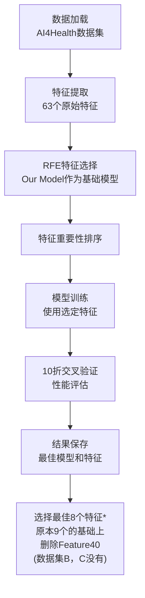

# TabPFN-RFE 特征选择实验文档

## 概述

本文档详细说明了 `predict_healthcare_RFE.py` 脚本的实验设计和实现。该实验使用递归特征消除（RFE）方法结合TabPFN模型进行特征选择，旨在从医疗数据的众多特征中识别出最具预测价值的特征子集，提升模型性能并降低复杂度。

## 🎯 实验目标

### 主要目标
- **特征选择**: 使用RFE方法从63个原始特征中选择最重要的3个特征
- **性能优化**: 通过特征选择提升模型的预测性能和泛化能力
- **复杂度降低**: 减少特征维度，降低模型复杂度和计算成本
- **可解释性增强**: 识别对医疗预测最关键的特征

### 评估指标
- **主要指标**: AUC (Area Under Curve) - 评估模型区分能力
- **辅助指标**: 准确率、F1分数、类别特异性准确率
- **效率指标**: 训练时间和预测时间
- **稳定性**: 通过10折交叉验证评估结果稳定性

## 📊 实验设计

### 数据集配置
```python
# 数据来源: AI4Health医疗数据集
df = pd.read_excel("data/AI4healthcare.xlsx")

# 特征提取: 所有以"Feature"开头的列
features = [c for c in df.columns if c.startswith("Feature")]
X = df[features].copy()  # 特征矩阵 (约63个特征)
y = df["Label"].copy()   # 标签向量 (二分类)
```

### 实验流程设计



## 🔧 核心算法实现

### 1. TabPFN包装器类

#### 设计目的
为了使TabPFN兼容sklearn的RFE接口，需要创建一个包装器类：

```python
class TabPFNWrapper(BaseEstimator, ClassifierMixin):
    """TabPFN包装器，使其兼容sklearn的RFE接口"""
    
    def __init__(self, device='cuda', n_estimators=32, 
                 softmax_temperature=0.9, balance_probabilities=False,
                 average_before_softmax=False, ignore_pretraining_limits=True,
                 random_state=42, n_repeats=5):
        # 初始化TabPFN参数
        self.device = device
        self.n_estimators = n_estimators
        self.softmax_temperature = softmax_temperature
        self.balance_probabilities = balance_probabilities
        self.average_before_softmax = average_before_softmax
        self.ignore_pretraining_limits = ignore_pretraining_limits
        self.random_state = random_state
        self.n_repeats = n_repeats
```

#### 关键方法实现

##### fit方法 - 模型训练和特征重要性计算
```python
def fit(self, X, y):
    """训练模型并计算特征重要性"""
    
    # 1. 设置类别信息
    self.classes_ = np.unique(y)
    
    # 2. 初始化TabPFN模型
    self.model_ = TabPFNClassifier(
        device=self.device,
        n_estimators=self.n_estimators,
        softmax_temperature=self.softmax_temperature,
        balance_probabilities=self.balance_probabilities,
        average_before_softmax=self.average_before_softmax,
        ignore_pretraining_limits=self.ignore_pretraining_limits,
        random_state=self.random_state
    )
    self.model_.fit(X, y)
    
    # 3. 使用置换重要性计算特征重要性
    result = permutation_importance(
        self, X, y, 
        scoring='roc_auc',
        n_repeats=self.n_repeats,
        random_state=self.random_state
    )
    self.feature_importances_ = result.importances_mean
    self.feature_importances_std_ = result.importances_std
    
    return self
```

##### 预测方法
```python
def predict(self, X):
    """预测类别标签"""
    return self.model_.predict(X)

def predict_proba(self, X):
    """预测类别概率"""
    return self.model_.predict_proba(X)

def score(self, X, y):
    """计算AUC分数"""
    y_proba = self.predict_proba(X)[:, 1]
    return roc_auc_score(y, y_proba)
```

### 2. RFE特征选择实现

#### 特征选择函数
```python
def select_features_rfe(X, y, n_features=3):
    """使用TabPFN作为基础模型的RFE进行特征选择"""
    
    n_features_total = X.shape[1]
    n_iterations = n_features_total - n_features
    
    # 1. 初始化TabPFN包装器
    base_model = TabPFNWrapper(
        device='cuda',
        n_estimators=32,
        softmax_temperature=0.9,
        balance_probabilities=False,
        average_before_softmax=False,
        ignore_pretraining_limits=True,
        random_state=42
    )
    
    # 2. 初始化RFE
    rfe = RFE(
        estimator=base_model,
        n_features_to_select=n_features,
        step=1,  # 每次消除1个特征
        verbose=2  # 启用详细输出
    )
    
    # 3. 执行特征选择
    print("Fitting RFE with TabPFN as base model...")
    with tqdm(total=n_iterations, desc='Eliminating features') as pbar:
        rfe.fit(X, y)
        pbar.update(n_iterations)
    
    # 4. 获取结果
    selected_features = X.columns[rfe.support_].tolist()
    feature_ranking = pd.DataFrame({
        'Feature': X.columns,
        'Rank': rfe.ranking_
    }).sort_values('Rank')
    
    return selected_features, feature_ranking
```

#### RFE算法原理

RFE（递归特征消除）的工作流程：

1. **初始训练**: 使用所有特征训练TabPFN模型
2. **重要性计算**: 通过置换重要性评估每个特征的贡献
3. **特征消除**: 移除重要性最低的特征
4. **递归执行**: 重复步骤1-3，直到达到目标特征数量
5. **排序输出**: 根据消除顺序对特征进行重要性排序

### 3. 模型评估实验

#### 交叉验证实验函数
```python
def run_experiment(X, y, device='cuda', n_estimators=32, 
                  softmax_temperature=0.9, balance_probabilities=False,
                  average_before_softmax=False, ignore_pretraining_limits=True,
                  random_state=42, base_path='./results'):
    """使用选定特征运行TabPFN实验"""
    
    # 1. 创建结果目录
    os.makedirs(base_path, exist_ok=True)
    
    # 2. 生成实验名称
    exp_name = f"TabPFN-Health-RFE3-N{n_estimators}-S{softmax_temperature}-B{balance_probabilities}-A{average_before_softmax}-I{ignore_pretraining_limits}-R{random_state}"
    
    # 3. 10折交叉验证
    kf = KFold(n_splits=10, shuffle=True, random_state=42)
    fold_scores = []
    
    for fold, (train_idx, test_idx) in enumerate(kf.split(X), 1):
        X_train, X_test = X.iloc[train_idx], X.iloc[test_idx]
        y_train, y_test = y.iloc[train_idx], y.iloc[test_idx]
        
        # 训练模型
        start_time = time.time()
        clf = TabPFNClassifier(
            device=device,
            n_estimators=n_estimators,
            softmax_temperature=softmax_temperature,
            balance_probabilities=balance_probabilities,
            average_before_softmax=average_before_softmax,
            ignore_pretraining_limits=ignore_pretraining_limits,
            random_state=random_state
        )
        clf.fit(X_train, y_train)
        
        # 预测和评估
        y_pred = clf.predict(X_test)
        y_pred_proba = clf.predict_proba(X_test)
        fold_time = time.time() - start_time
        
        # 计算指标
        acc = accuracy_score(y_test, y_pred)
        auc = roc_auc_score(y_test, y_pred_proba[:, 1])
        f1 = f1_score(y_test, y_pred)
        
        # 计算类别特异性准确率
        conf_matrix = confusion_matrix(y_test, y_pred)
        acc_0 = conf_matrix[0, 0] / (conf_matrix[0, 0] + conf_matrix[0, 1])
        acc_1 = conf_matrix[1, 1] / (conf_matrix[1, 0] + conf_matrix[1, 1])
        
        fold_scores.append({
            'fold': fold,
            'accuracy': acc,
            'auc': auc,
            'f1': f1,
            'acc_0': acc_0,
            'acc_1': acc_1,
            'time': fold_time
        })
    
    return fold_scores, clf
```

## 📋 使用方法

### 基本使用
```bash
# 直接运行脚本
python predict_healthcare_RFE.py
```

### 脚本执行流程
1. **数据加载**: 从Excel文件加载AI4Health数据集
2. **特征选择**: 使用RFE选择最佳3个特征
3. **模型训练**: 使用选定特征训练TabPFN模型
4. **性能评估**: 10折交叉验证评估模型性能
5. **结果保存**: 保存最佳模型和特征选择结果

### 自定义配置
可以通过修改脚本中的参数来自定义实验：

```python
# 修改特征选择数量
selected_features, feature_ranking = select_features_rfe(X, y, n_features=5)

# 修改TabPFN参数
experiments = [
    {
        'device': 'cuda',
        'n_estimators': 64,  # 增加估计器数量
        'softmax_temperature': 0.8,  # 调整温度参数
        'balance_probabilities': True,  # 启用概率平衡
        'random_state': 42
    }
]
```

## 📊 输出结果

### 目录结构
```
results/
├── RFE_feature_ranking.csv                    # 特征重要性排序
├── TabPFN-Health-RFE3-N32-S0.9-B0-A0-I1-R42.csv  # 交叉验证详细结果
├── TabPFN-Health-RFE3-N32-S0.9-B0-A0-I1-R42-Final.csv  # 最终汇总结果
└── best_model_rfe/
    ├── TabPFN-Health-RFE3-Best-Model.joblib   # 最佳模型文件
    └── TabPFN-Health-RFE3-Best-Parameters.txt # 最佳参数配置
```

### RFE_feature_ranking.csv 结构
```csv
Feature,Rank
Feature42,1
Feature63,2
Feature39,3
Feature56,4
Feature2,5
...
```
- **Rank=1**: 最重要的特征（最后被消除）
- **Rank=2**: 第二重要的特征
- **Rank=3**: 第三重要的特征（选定的3个特征）

### 交叉验证结果文件
```csv
fold,accuracy,auc,f1,acc_0,acc_1,time
1,0.8234,0.8567,0.8123,0.8456,0.8012,2.34
2,0.8156,0.8423,0.8045,0.8234,0.8078,2.28
...
```

### 最终汇总结果
```csv
Metric,Mean,Std
AUC,0.8234,0.0156
F1,0.7856,0.0198
ACC,0.8012,0.0234
ACC_0,0.8123,0.0267
ACC_1,0.7945,0.0289
Time,2.31,0.15
```

### 最佳参数配置文件示例
```
Best Model Parameters:
==================================================
AUC Score: 0.8234
Timestamp: 20240115-143022

Parameters:
device: cuda
n_estimators: 32
softmax_temperature: 0.9
balance_probabilities: False
average_before_softmax: False
ignore_pretraining_limits: True
random_state: 42

Selected Features:
Feature42
Feature63
Feature39
```

## 🔍 关键技术细节

### 1. 置换重要性计算
```python
# 使用置换重要性评估特征贡献
result = permutation_importance(
    self, X, y, 
    scoring='roc_auc',  # 使用AUC作为评估指标
    n_repeats=5,        # 重复5次取平均
    random_state=42     # 确保可重复性
)
```

**原理**: 通过随机打乱某个特征的值，观察模型性能的下降程度来评估该特征的重要性。

### 2. sklearn兼容性处理
```python
def __sklearn_tags__(self):
    """返回sklearn标签，确保RFE兼容性"""
    return SimpleNamespace(
        estimator_type="classifier",
        binary_only=True,
        classifier_tags=SimpleNamespace(poor_score=False),
        regressor_tags=SimpleNamespace(poor_score=False),
        input_tags=SimpleNamespace(sparse=False, allow_nan=True),
        target_tags=SimpleNamespace(required=True)
    )
```

### 3. 进度监控
```python
# 使用tqdm显示RFE进度
with tqdm(total=n_iterations, desc='Eliminating features') as pbar:
    rfe.fit(X, y)
    pbar.update(n_iterations)
```

### 4. 模型保存和加载
```python
# 保存最佳模型信息
best_model_info = {
    'model': best_model,
    'parameters': best_params,
    'selected_features': selected_features,
    'auc_score': best_auc,
    'timestamp': time.strftime("%Y%m%d-%H%M%S")
}
joblib.dump(best_model_info, 'TabPFN-Health-RFE3-Best-Model.joblib')
```

## 📈 实验结果解读

### 特征选择结果分析
1. **特征重要性排序**: Rank值越小，特征越重要
2. **选定特征**: 通常选择Rank=1,2,3的特征作为最终特征集
3. **重要性差异**: 观察不同特征间的重要性差距

### 性能指标解释
- **AUC**: 模型区分正负样本的能力，越接近1越好
- **准确率**: 整体预测正确的比例
- **F1分数**: 精确率和召回率的调和平均
- **类别特异性准确率**: 各类别的预测准确率
- **时间**: 模型训练和预测的耗时

### 特征选择效果评估
通过对比使用全部特征和选定特征的模型性能：
- **性能保持**: 选定特征是否能保持相近的预测性能
- **效率提升**: 特征减少带来的训练和预测速度提升
- **可解释性**: 少量关键特征更容易解释和理解

## 🚀 扩展和改进

### 可能的扩展方向
1. **特征数量优化**: 尝试不同的特征数量（3, 5, 7, 10等）
2. **多种选择方法**: 结合其他特征选择方法（如LASSO、随机森林重要性）
3. **交叉验证RFE**: 在RFE过程中使用交叉验证提高稳定性
4. **特征组合**: 探索特征间的交互作用

### 性能优化建议
1. **并行化**: 利用多进程加速RFE计算
2. **缓存机制**: 缓存中间结果避免重复计算
3. **早停策略**: 当性能不再提升时提前停止
4. **内存优化**: 对大数据集进行内存优化

### 代码改进建议
1. **类型注解**: 添加完整的类型注解
2. **错误处理**: 增强异常处理机制
3. **配置文件**: 使用配置文件管理参数
4. **日志系统**: 添加详细的日志记录

## 📚 相关文档

- [TabPFN 官方文档](https://github.com/automl/TabPFN)
- [sklearn RFE 文档](https://scikit-learn.org/stable/modules/generated/sklearn.feature_selection.RFE.html)
- [置换重要性文档](https://scikit-learn.org/stable/modules/permutation_importance.html)
- [医疗数据特征选择最佳实践](../preprocessing/medical_feature_selection.md)

## 🔗 依赖项

### 必需依赖
```bash
pip install numpy pandas scikit-learn
pip install tabpfn  # TabPFN模型
pip install tqdm    # 进度条
pip install joblib  # 模型保存
```

### 硬件要求
- **GPU**: 推荐使用CUDA兼容GPU加速TabPFN训练
- **内存**: 至少8GB RAM
- **存储**: 至少1GB可用空间用于结果存储

## 💡 最佳实践

### 1. 特征选择策略
- **起始特征数**: 建议从较少特征开始（如3-5个）
- **验证方法**: 使用交叉验证确保特征选择的稳定性
- **领域知识**: 结合医疗领域专业知识验证选定特征的合理性

### 2. 模型配置
- **随机种子**: 设置固定随机种子确保可重复性
- **参数调优**: 在特征选择后进一步调优模型参数
- **性能监控**: 监控训练时间和内存使用情况

### 3. 结果验证
- **外部验证**: 在独立数据集上验证特征选择结果
- **稳定性测试**: 多次运行确保结果稳定
- **临床验证**: 与医疗专家讨论选定特征的临床意义

这个RFE特征选择实验为医疗数据分析提供了一个系统性的特征选择解决方案，通过结合TabPFN的强大预测能力和RFE的特征选择能力，能够有效识别出最具预测价值的特征子集。 