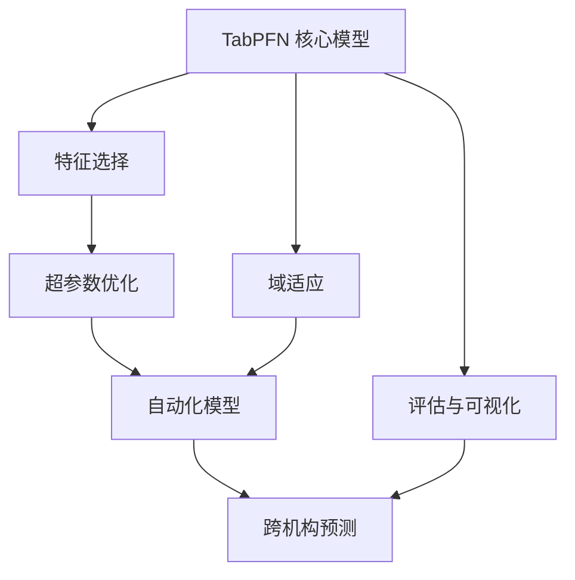
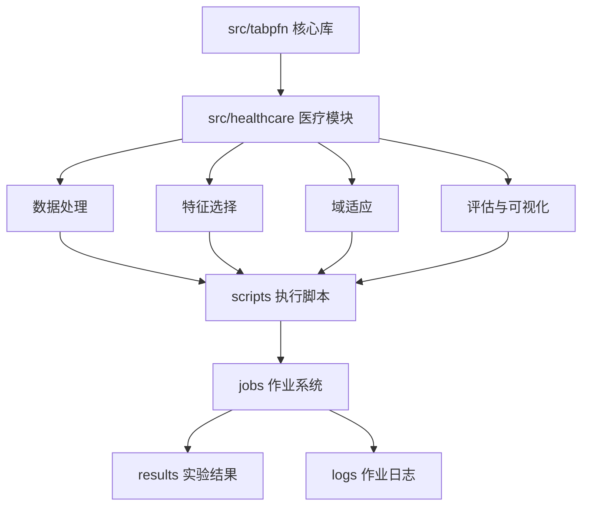

# TabPFN 系统架构

## 当前系统架构

TabPFN 项目目前采用以下模块化架构设计，主要包含以下核心组件：

## 标准化后系统架构

为提高项目可维护性，计划重构为以下系统架构：

## 关键技术决策

1. **预训练模型选择**
   - 采用 TabPFN 作为基础分类器，利用其在小样本表格数据上的优势
   - 模型位于 `src/tabpfn/model` 目录，实现核心推理和训练逻辑

2. **特征选择策略**
   - 实现多种特征选择算法，如递归特征消除（RFE）
   - 支持自动化特征选择流程，减少特征数量同时保持模型性能
   - 相关实现位于 `predict_healthcare_auto_external_RFE.py`

3. **域适应方法**
   - 支持多种域适应技术以解决数据分布偏移问题
   - 实现了 CORAL、MMD 等方法用于跨数据集迁移
   - 相关实现位于 `predict_healthcare_auto_and_otherbaselines_ABC_features23_CORAL.py` 等

4. **模型集成设计**
   - 采用多种集成策略提高模型性能和稳定性
   - 实现了后处理集成预测器（AutoPostHocEnsemblePredictor）
   - 相关实现位于 `predict_healthcare_AutoPostHocEnsemblePredictor_external.py`

5. **可解释性分析**
   - 集成 SHAP 和 ShapIQ 分析工具提供模型决策解释
   - 支持样本级别的解释和特征重要性分析
   - 相关实现位于 `predict_healthcare_auto_shapABC.py` 等

## 标准化架构技术决策

1. **目录结构重组**
   - 将根目录大量.py文件按功能分类到不同模块
   - 创建统一的结果和日志存储结构
   - 分离核心实现和实验脚本

2. **批处理作业系统**
   - 建立标准化的作业提交和管理机制
   - 使用模板化作业脚本，通过配置控制执行流程
   - 集中化日志管理，提高实验追踪能力

3. **模块化代码设计**
   - 将通用功能抽取为可重用模块
   - 建立一致的接口设计，提高代码复用性
   - 减少代码重复，提高维护效率

4. **配置驱动设计**
   - 将硬编码参数替换为配置文件驱动
   - 实验设置和资源配置分离，提高灵活性
   - 统一配置格式，简化实验管理

## 设计模式

1. **工厂模式**
   - 为不同数据集和模型创建统一的接口
   - 根据配置动态创建适当的模型和处理流程

2. **策略模式**
   - 为特征选择和域适应实现可替换的算法
   - 允许在运行时选择不同的策略

3. **观察者模式**
   - 用于模型训练和评估过程的监控
   - 提供训练进度和性能指标的可视化

4. **装饰器模式**
   - 为基础模型添加额外功能，如特征选择、域适应等
   - 保持接口一致性同时扩展功能

5. **命令模式**
   - 标准化的作业提交系统
   - 封装实验请求为统一配置对象 