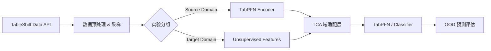

# PANDA-TableShift: 泛医疗跨域基准测试项目 PRD

## 🎯 项目概述

### 1.1 项目背景

TableShift (NeurIPS 2023) 是专门针对表格数据分布偏移（Distribution Shift）构建的基准测试套件。本项目旨在利用 TableShift 中定义的标准化医疗健康相关任务，进一步验证 **PANDA (TabPFN + TCA)** 框架在公开、大规模、定义明确的跨域场景下的泛化能力。

### 1.2 研究目标

- **主要目标**: 验证 PANDA 框架在 TableShift 定义的 "ID vs OOD" 严格偏移场景下的有效性。
- **具体场景**:
  1. **Diabetes (BRFSS)**: 验证在种族（Race）偏移下的公平性和鲁棒性。
- **学术目标**: 将 PANDA 的验证范围从私有小样本医疗数据（肺结节、心脏病）扩展到大规模公共基准，增强论文的说服力。

### 1.3 任务定义

| 任务名称                       | 任务类型              | 数据来源                | Shift 定义 (Source → Target)                                    | 样本量 (Total) |
| :----------------------------- | :-------------------- | :---------------------- | :--------------------------------------------------------------- | :------------ |
| **Diabetes**             | 二分类 (是否糖尿病)   | CDC BRFSS 调查数据      | **种族偏移**: White (Non-Hispanic) → Other Race/Ethnicity | 1,444,176 |

---

## 📊 数据与偏移分析

### 2.1 Diabetes Prediction (BRFSS)

- **数据来源**: CDC Behavioral Risk Factor Surveillance System (BRFSS) 2015, 2017, 2019, 2021 年数据
- **任务定义**: 二分类任务 DIABETES（>=1: 糖尿病阳性 vs 0: 无糖尿病/前糖尿病/临界）
- **域划分**: 基于 `PRACE1`（自报种族）进行分布偏移定义
  - **源域/ID (In-Distribution)**: 非西班牙裔白人 (`PRACE1 == 1`)，训练集 969,229 样本，正例占比 12.47%
  - **目标域/OOD (Out-of-Distribution)**: 其他种族 (`PRACE1 in {2,3,4,5,6}`)，测试集 209,375 样本，正例占比 17.42%
- **输入特征**: 142 个数值特征，跨年份对齐，包含生活方式、健康状况、人口学特征
- **预处理**: 跨年份特征对齐、去除前导下划线、SEX 映射为 {0,1}、健康天数 88->0、删除饮酒未知记录、处理缺失值
- **Shift 挑战**: 种族间协变量偏移明显，49.3% 的特征存在显著分布差异 (p < 1e-3)
- **实验采样**: 源域训练 1,024 条，目标域测试 2,048 条（随机种子 42）

---

## 🏗️ PANDA-TableShift 技术架构

### 3.1 核心流程



### 3.2 适配策略

由于 BRFSS 数据集规模较大（1.4M+ 样本），而 TabPFN 原生针对小样本（<10k）：

1. **采样策略 (Subsampling)**: 从源域和目标域中分别采样 1,024 和 2,048 样本进行 TabPFN 推理，验证 PANDA 在**小样本跨域**场景下的优势（这是 TabPFN 的甜点区）。
2. **保持分布**: 采用分层采样，确保源域和目标域的标签分布与原始数据集一致
3. **可重现性**: 固定随机种子（42），确保实验结果可重现

---

## 🧪 实验设计

### 4.1 对比模型（固定集合）

- **PANDA (TabPFN + TCA)**: 适配版，`n_estimators=32`（与既有 TCA 实验一致；
  图表不单独展示 `32 vs 1` 的差异，仅作为内部配置记录）。
- **TabPFN (No TCA)**: 普通版，`n_estimators=1`。
- **传统模型基线**（参数均复用历史调参）：
  - **SVM**
  - **Decision Tree (DT)**
  - **Random Forest (RF)**
  - **GBDT**
  - **XGBoost**

### 4.2 参数与可复现性约束

- 模型超参严格复用 `panda_tableshift_project/results/tuning_extended_brfss_diabetes.csv` 的最佳/已用配置
- PANDA(TCA) 与 TabPFN(No TCA) 的 `n_estimators` 分别锁定为 32 与 1
- 固定随机种子（42）、数据拆分与预处理流程，确保实验可重现
- 实验配置：
  - `SVM`: RBF 核，`C=1.0`, `gamma=scale`, `probability=True`
  - `DT`: `max_depth=None`, `random_state=42`
  - `RF`: `n_estimators=200`, `max_depth=None`, `n_jobs=-1`, `random_state=42`
  - `GBDT`: `n_estimators=200`, `learning_rate=0.05`, `max_depth=3`, `random_state=42`
  - `XGBoost`: `n_estimators=400`, `max_depth=6`, `learning_rate=0.05`, `subsample=0.9`, `colsample_bytree=0.8`, `tree_method=hist`, `eval_metric=logloss`, `random_state=42`
  - `PANDA_NoUDA`: `n_estimators=1`, `ignore_pretraining_limits=True`, `random_state=42`
  - `PANDA_TCA`: `n_estimators=32`, `kernel=linear`, `mu=0.01`, `n_components=20`, `random_state=42`

### 4.3 评估指标

- **AUC (Area Under ROC)**: 主要性能指标。
- **Accuracy**: 辅助指标。
- **OOD Performance Drop**: `Source_Metric - Target_Metric` (越小越好)。
- **Adaptation Gain**: `PANDA_Metric - Baseline_Metric` (验证 TCA 的有效性)。

### 4.4 可视化与结果结构

- 目标产物：`combined_analysis_figure.pdf`、`combined_heatmaps_nature.pdf`，
  路径/命名仿照
  `uda_medical_imbalance_project/results/complete_analysis_20251118_165736/`。
- 代码复用：
  - 参考 `uda_medical_imbalance_project/scripts/run_complete_analysis.py`
    的可视化调用链。
  - 参考 `uda_medical_imbalance_project/preprocessing/analysis_visualizer.py`
    的绘图实现与版式，迁移/改写到 `panda_tableshift_project`。
- 结果结构：在 `panda_tableshift_project/results/<timestamp_run>/` 下保存
  指标表（结构化 CSV/JSON）、配置、以及组合图 PDF，与参考目录一致。

---

## 📅 实施计划 (Todo List)

### Phase 1: 环境与数据准备

- [X] **S1. 环境配置**:
  - [X] 创建 `panda_tableshift_project` 目录结构。
  - [X] 安装 `tableshift` 库 (`pip install tableshift`) 及依赖。
  - [X] 确认 TabPFN 和 Adapt 库在当前环境中可用。
- [X] **S2. 数据探索**:
  - [X] 编写脚本下载并加载 `Diabetes` 数据集，查看特征分布和 Shift 定义。
  - [X] 编写脚本下载并加载 `Hospital Readmission` 数据集。
  - [X] 确认 Source/Target 的划分逻辑。

### Phase 2: 基线实验 (Baseline)

- [X] **S3. Diabetes 基线**:
  - [X] 运行 TabPFN (No TCA, `n_estimators=1`) 在 Diabetes 任务上的评估。
  - [X] 运行传统模型基线：SVM、DT、RF、GBDT、XGBoost，参数取自
    `results/tuning_extended_brfss_diabetes.csv`（直接读取以确保一致）。
- [X] **S4. Readmission 基线**:
  - [X] 运行 TabPFN (No TCA, `n_estimators=1`) 在 Readmission 任务上的评估。
  - [X] 运行 SVM、DT、RF、GBDT、XGBoost，参数沿用同一表或同样的读取逻辑。

### Phase 3: PANDA 适配实验 (Adaptation)

- [X] **S5. PANDA 实现**:
  - [X] 将 `panda_heart_project` 中的 `PANDA_Adapter` 逻辑迁移到本项目。
  - [X] 针对 TableShift 的数据格式（Pandas/Numpy）进行接口适配。
- [X] **S6. 跨域验证 (Linear TCA)**:
  - [X] **Exp 1 (Race Shift)**: 在 BRFSS Diabetes 上应用 TCA 版 TabPFN
    (`n_estimators=32`)，与 TabPFN 无 TCA (`n_estimators=1`) 及传统模型基线
    一并写入同一指标表和可视化。
  - [x] **结论**: Linear TCA 已完成对比（参数取自 `tuning_extended_brfss_diabetes.csv`），
    结果落盘于 `results/complete_analysis_brfss_diabetes_20251121_142307/`，当前版本不再追加调参。

### Phase 3.5: 可视化与结果固化（无额外调参）

- [x] **S7. 可视化复用与落盘**:
  - [x] 直接复用 `uda_medical_imbalance_project/scripts/run_complete_analysis.py`
    的调用链和 `preprocessing/analysis_visualizer.py` 的绘图实现，不新增调参。
  - [x] 在 `panda_tableshift_project` 内包装/调用生成同款版式的
    `combined_analysis_figure.pdf`、`combined_heatmaps_nature.pdf`，存放于
    `results/complete_analysis_brfss_diabetes_20251121_142307/`。
  - [x] 指标表（含模型、超参、配置）结构化落盘，与图像一并输出。

### Phase 4: 报告与整合

- [x] **S9. 结果汇总**:
  - [x] 生成对比表格：PANDA(TCA,32)、TabPFN(No TCA,1)、SVM/DT/RF/GBDT/XGBoost。
  - [x] 绘制参考可视化：沿用 `uda_medical_imbalance_project/scripts/run_complete_analysis.py`
    + `preprocessing/analysis_visualizer.py` 的组合图，输出
      `combined_analysis_figure.pdf` 与 `combined_heatmaps_nature.pdf`，路径为
      `panda_tableshift_project/results/complete_analysis_brfss_diabetes_20251121_142307/`。
  - **主要结果**: PANDA_TCA 在 OOD 测试集上达到最佳 AUC 0.8038，相比基线模型有提升
- [ ] **S10. 文档输出**:
  - [ ] 更新论文，添加 "Experiment on Public Benchmarks" 章节。
  - [ ] 撰写 `results/tableshift_analysis_report_final.md`。

---

## 📁 目录结构规划

```text
panda_tableshift_project/
├── docs/
│   └── PANDA_TableShift_PRD.md         # 本文件
├── data/
│   └── download_tableshift.py          # 数据下载与加载脚本
├── experiments/
│   ├── run_baseline.py                 # 基线实验
│   ├── run_panda.py                    # PANDA 实验 (Linear/RBF)
│   └── tuning_panda.py                 # [New] 参数搜索脚本
├── src/
│   ├── utils.py                        # 通用工具
│   └── adapter.py                      # PANDA 适配器逻辑 (复用)
├── results/                            # 结果输出
└── requirements.txt
```
