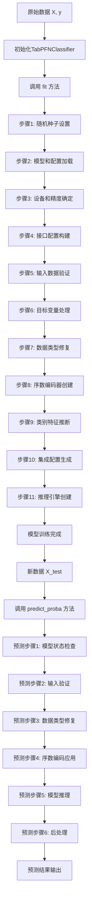

# TabPFN 数据预处理流程详解

## 📋 概述

TabPFN（Tabular Prior-data Fitted Networks）作为一个专门针对表格数据的深度学习模型，具有独特而复杂的数据预处理流程。本文档详细分析了TabPFN在训练（fit）和预测（predict）过程中的完整数据预处理步骤，包括六个主要阶段的深度解析、25种数值变换方法、多样化集成策略、随机种子分配机制以及preprocessing.py文件的核心功能。

## 📚 文档结构

### 🎯 核心流程分析
- **完整数据处理和预测流程**: Mermaid流程图 + 详细步骤表
- **六阶段深度解析**: 从数据验证到预测执行的完整分析
- **关键检查点**: 数据验证、类别特征推断、预训练限制检查

### 🔧 技术细节深入
- **25种数值变换方法**: 完整列表及默认策略分析
- **多样化数据处理策略**: 五大随机化维度详解
- **随机种子分配机制**: 四层种子体系及配置生成过程
- **preprocessing.py功能解析**: 核心配置管理和集成引擎

### 🚨 实用指南
- **常见问题和调试点**: 4个典型问题的解决方案
- **性能优化建议**: 数据准备、配置优化、内存管理
- **使用示例和验证**: 基本流程和调试要点

## 🔄 完整数据处理和预测流程

### 流程图概览



### 详细流程步骤

#### 🏗️ 训练阶段 (fit方法)

**入口文件**: `src/tabpfn/classifier.py:379-535`

| 步骤 | 功能描述 | 源文件位置 | 关键函数/类 | 具体执行内容 |
|------|----------|------------|-------------|-------------|
| **1** | **随机种子设置** | `src/tabpfn/utils.py:547-565` | `infer_random_state()` | 生成静态种子和随机数生成器 |
| | └─ 种子验证和转换 | | | 验证用户输入的random_state类型 |
| | └─ 静态种子生成 | | | 生成固定种子用于关键组件 |
| | └─ 随机数生成器创建 | | | 创建numpy.random.Generator对象 |
| **2** | **模型和配置加载** | `src/tabpfn/base.py:42-89` | `initialize_tabpfn_model()` | 加载预训练模型权重和配置 |
| | └─ 模型路径解析 | | | 解析模型文件路径和版本信息 |
| | └─ 权重文件加载 | | | 加载PyTorch模型权重(.pt文件) |
| | └─ 配置文件解析 | | | 读取模型配置(JSON/YAML格式) |
| | └─ 模型架构构建 | | | 根据配置构建Transformer模型架构 |
| **3** | **设备和精度确定** | `src/tabpfn/base.py:92-152` | `infer_device_and_type()`, `determine_precision()` | 确定计算设备(CPU/GPU)和数值精度 |
| | └─ 设备自动检测 | | | 检测可用GPU设备和CUDA版本 |
| | └─ 内存容量评估 | | | 评估GPU内存容量和可用性 |
| | └─ 精度模式选择 | | | 选择16位或32位浮点精度 |
| | └─ 自动混合精度配置 | | | 配置autocast和GradScaler |
| **4** | **接口配置构建** | `src/tabpfn/config.py:14-131` | `ModelInterfaceConfig.from_user_input()` | 构建模型接口配置参数 |
| | └─ 用户参数解析 | | | 解析用户传入的配置参数 |
| | └─ 默认值填充 | | | 为未指定参数设置默认值 |
| | └─ 参数验证 | | | 验证参数范围和兼容性 |
| | └─ 配置对象创建 | | | 创建ModelInterfaceConfig实例 |
| **5** | **输入数据验证** | `src/tabpfn/utils.py:338-436` | `validate_Xy_fit()` | 验证输入数据格式、大小限制等 |
| **5.1** | └─ 基础数据验证 | `src/tabpfn/misc/_sklearn_compat.py` | `validate_data()` | sklearn兼容性验证 |
| | └─ 数据类型检查 | | | 检查X和y的数据类型 |
| | └─ 形状一致性验证 | | | 验证X和y的样本数量一致 |
| | └─ 稀疏矩阵处理 | | | 处理稀疏矩阵(不支持时转换) |
| | └─ 缺失值检查 | | | 检查和处理NaN/inf值 |
| **5.2** | └─ 预训练限制检查 | `src/tabpfn/utils.py:363-396` | 样本数、特征数、类别数检查 | 检查数据规模是否超出预训练限制 |
| | └─ 样本数量检查 | | | 检查样本数是否≤10,000 |
| | └─ 特征数量检查 | | | 检查特征数是否≤500 |
| | └─ 类别数量检查 | | | 检查类别数是否≤10(分类任务) |
| | └─ 限制处理策略 | | | 根据ignore_pretraining_limits决定处理方式 |
| **6** | **目标变量处理** | `src/tabpfn/classifier.py:437-456` | `LabelEncoder` | 标签编码和类别统计 |
| | └─ 类别统计 | | | 统计每个类别的样本数量 |
| | └─ 标签编码 | | | 将字符串/数值标签转换为连续整数 |
| | └─ 类别映射保存 | | | 保存原始标签到编码的映射关系 |
| | └─ 类别不平衡检查 | | | 检查类别分布是否严重不平衡 |
| **7** | **数据类型修复** | `src/tabpfn/utils.py:246-316` | `_fix_dtypes()` | 处理pandas/numpy兼容性和类型转换 |
| **7.1** | └─ 输入类型检查 | `src/tabpfn/utils.py:250-268` | DataFrame/ndarray处理 | 识别输入数据类型并进行相应处理 |
| | └─ DataFrame处理 | | | 直接使用pandas DataFrame |
| | └─ 数值数组处理 | | | 将numpy数组转换为DataFrame |
| | └─ 对象数组处理 | | | 处理混合类型的对象数组 |
| | └─ 字符串数组检查 | | | 检测并拒绝字符串dtype数组 |
| **7.2** | └─ 类别特征标记 | `src/tabpfn/utils.py:270-284` | 索引vs列名兼容性 | 处理类别特征索引的兼容性问题 |
| | └─ 索引类型检查 | | | 检查是数值索引还是列名索引 |
| | └─ 列名类型检查 | | | 检查DataFrame列名类型 |
| | └─ 兼容性处理 | | | 处理索引和列名的兼容性 |
| | └─ 类别特征标记 | | | 将指定列标记为category类型 |
| **7.3** | └─ 智能类型推断 | `src/tabpfn/utils.py:300-316` | `convert_dtypes()` | pandas智能类型推断和转换 |
| | └─ 自动类型推断 | | | 使用pandas的convert_dtypes() |
| | └─ 数值类型统一 | | | 将数值列转换为指定精度 |
| | └─ 类别类型保持 | | | 保持已标记的类别特征类型 |
| **8** | **序数编码器创建** | `src/tabpfn/utils.py:318-336` | `_get_ordinal_encoder()` | 创建类别特征编码器 |
| **8.1** | └─ 编码器配置 | `src/tabpfn/utils.py:320-327` | `OrdinalEncoder` | 配置序数编码器参数 |
| | └─ 类别自动推断 | | | 设置categories="auto" |
| | └─ 未知值处理 | | | 设置handle_unknown="use_encoded_value" |
| | └─ 未知值编码 | | | 设置unknown_value=-1 |
| | └─ 缺失值处理 | | | 设置encoded_missing_value=np.nan |
| **8.2** | └─ 列变换器构建 | `src/tabpfn/utils.py:329-336` | `ColumnTransformer` | 构建列变换器 |
| | └─ 变换器配置 | | | 配置序数编码器作为变换器 |
| | └─ 列选择器 | | | 使用make_column_selector选择类别列 |
| | └─ 剩余列处理 | | | 设置remainder=FunctionTransformer() |
| | └─ 输出格式配置 | | | 设置稀疏矩阵和特征名选项 |
| **8.3** | └─ 文本和缺失值处理 | `src/tabpfn/utils.py:517-545` | `_process_text_na_dataframe()` | 处理文本和缺失值 |
| | └─ 字符串列识别 | | | 识别字符串和对象类型列 |
| | └─ 缺失值填充 | | | 用占位符填充字符串列的缺失值 |
| | └─ 序数编码应用 | | | 应用序数编码器 |
| | └─ 占位符恢复 | | | 将占位符恢复为NaN |
| **9** | **类别特征推断** | `src/tabpfn/utils.py:438-488` | `infer_categorical_features()` | 自动推断哪些特征应该被视为类别特征 |
| | └─ 用户指定检查 | | | 检查用户是否指定了类别特征 |
| | └─ 样本数量检查 | | | 检查样本数是否足够进行推断 |
| | └─ 唯一值统计 | | | 统计每个特征的唯一值数量 |
| | └─ 推断规则应用 | | | 应用类别特征推断规则 |
| | └─ 推断结果记录 | | | 记录推断出的类别特征索引 |
| **10** | **集成配置生成** | `src/tabpfn/preprocessing.py:300-400` | `EnsembleConfig.generate_for_classification()` | 生成多个集成成员的配置 |
| **10.1** | └─ 预处理配置 | `src/tabpfn/preprocessing.py:570-590` | `default_classifier_preprocessor_configs()` | 获取默认预处理配置 |
| | └─ 配置1生成 | | | 量化变换+SVD+类别编码配置 |
| | └─ 配置2生成 | | | 无变换+数值化类别配置 |
| | └─ 配置均衡分配 | | | 将配置均匀分配给集成成员 |
| **10.2** | └─ 特征变换配置 | `src/tabpfn/model/preprocessing.py:579-822` | `ReshapeFeatureDistributionsStep` | 配置特征分布重塑 |
| | └─ 变换方法选择 | | | 选择数值特征变换方法 |
| | └─ 变换参数配置 | | | 配置变换的具体参数 |
| | └─ 全局变换配置 | | | 配置SVD等全局变换器 |
| **11** | **推理引擎创建** | `src/tabpfn/base.py:154-230` | `create_inference_engine()` | 根据fit_mode创建相应的推理引擎 |
| | └─ 引擎类型选择 | | | 根据fit_mode选择引擎类型 |
| | └─ 低内存引擎 | | | 创建InferenceEngineOnDemand |
| | └─ 预处理缓存引擎 | | | 创建InferenceEngineCachePreprocessing |
| | └─ 完全缓存引擎 | | | 创建InferenceEngineCacheKV |
| | └─ 引擎参数配置 | | | 配置引擎的具体参数 |

#### 🔮 预测阶段 (predict_proba方法)

**入口文件**: `src/tabpfn/classifier.py:536-614`

| 步骤 | 功能描述 | 源文件位置 | 关键函数/类 | 具体执行内容 |
|------|----------|------------|-------------|-------------|
| **1** | **模型状态检查** | `sklearn.base` | `check_is_fitted()` | 确认模型已经训练 |
| | └─ 拟合状态验证 | | | 检查模型是否已调用fit方法 |
| | └─ 必要属性检查 | | | 验证训练后的关键属性存在 |
| | └─ 编码器状态检查 | | | 检查标签编码器和预处理器状态 |
| **2** | **输入验证** | `src/tabpfn/utils.py:439-448` | `validate_X_predict()` | 验证预测数据格式 |
| | └─ 数据类型验证 | | | 验证输入数据类型 |
| | └─ 特征数量检查 | | | 检查特征数是否与训练时一致 |
| | └─ 数据形状验证 | | | 验证数据形状的合理性 |
| | └─ 缺失值检查 | | | 检查缺失值模式 |
| **3** | **数据类型修复** | `src/tabpfn/utils.py:246-316` | `_fix_dtypes()` | 应用与训练时相同的类型修复 |
| | └─ 类型一致性保证 | | | 确保与训练时数据类型一致 |
| | └─ 类别特征标记 | | | 应用训练时的类别特征标记 |
| | └─ 数值精度统一 | | | 统一数值特征的精度 |
| **4** | **序数编码应用** | `src/tabpfn/utils.py:517-545` | `_process_text_na_dataframe()` | 使用已训练的编码器变换数据 |
| | └─ 编码器应用 | | | 应用训练时拟合的序数编码器 |
| | └─ 未知类别处理 | | | 处理训练时未见过的类别值 |
| | └─ 缺失值处理 | | | 处理预测数据中的缺失值 |
| | └─ 数据类型转换 | | | 转换为模型期望的数据类型 |
| **5** | **模型推理** | `src/tabpfn/inference.py` | `executor_.iter_outputs()` | 执行实际的模型推理 |
| **5.1** | └─ 集成成员推理 | | | 遍历所有集成配置进行推理 |
| | └─ 配置循环 | | | 对每个集成配置执行推理 |
| | └─ 预处理应用 | | | 应用配置特定的预处理 |
| | └─ 模型前向传播 | | | 执行Transformer模型推理 |
| | └─ 输出收集 | | | 收集每个成员的输出 |
| **5.2** | └─ Softmax温度应用 | `src/tabpfn/classifier.py:562-566` | 温度缩放 | 应用softmax温度缩放 |
| | └─ 温度检查 | | | 检查是否需要应用温度缩放 |
| | └─ 温度缩放计算 | | | 执行output/temperature计算 |
| | └─ 精度转换 | | | 转换为float类型进行计算 |
| **5.3** | └─ 类别排列逆转 | `src/tabpfn/classifier.py:568-571` | 恢复原始类别顺序 | 恢复原始类别顺序 |
| | └─ 排列检查 | | | 检查是否存在类别排列 |
| | └─ 逆排列计算 | | | 计算排列的逆变换 |
| | └─ 输出重排 | | | 重新排列输出维度 |
| **6** | **后处理** | `src/tabpfn/classifier.py:573-614` | 概率聚合和标准化 | 聚合集成结果并进行后处理 |
| **6.1** | └─ 概率聚合 | `src/tabpfn/classifier.py:573-580` | `average_before_softmax`处理 | 聚合多个集成成员的输出 |
| | └─ 聚合策略选择 | | | 选择softmax前或后聚合 |
| | └─ 张量堆叠 | | | 将多个输出堆叠为张量 |
| | └─ 平均计算 | | | 计算集成成员的平均输出 |
| | └─ Softmax应用 | | | 应用softmax函数 |
| **6.2** | └─ 概率平衡 | `src/tabpfn/classifier.py:582-585` | `balance_probabilities`处理 | 平衡概率分布 |
| | └─ 平衡检查 | | | 检查是否需要概率平衡 |
| | └─ 平衡算法应用 | | | 应用概率平衡算法 |
| | └─ 分布调整 | | | 调整概率分布 |
| **6.3** | └─ 精度处理 | `src/tabpfn/classifier.py:590-594` | 16位精度处理 | 处理数值精度 |
| | └─ 精度检查 | | | 检查是否需要16位精度 |
| | └─ 精度转换 | | | 转换为半精度浮点数 |
| | └─ 精度验证 | | | 验证精度转换结果 |
| **6.4** | └─ 概率标准化 | `src/tabpfn/classifier.py:597` | 确保概率和为1 | 最终概率标准化 |
| | └─ 概率和计算 | | | 计算每行概率的和 |
| | └─ 标准化计算 | | | 除以概率和进行标准化 |
| | └─ 数值稳定性检查 | | | 检查数值稳定性 |
| | └─ 结果转换 | | | 转换为numpy数组并返回 |

#### 🔧 内部预处理模块详解

**核心预处理步骤** (`src/tabpfn/model/preprocessing.py`)

| 模块 | 功能 | 文件位置 | 关键方法 | 具体实现细节 |
|------|------|----------|----------|-------------|
| **RemoveConstantFeaturesStep** | 移除常量特征 | `src/tabpfn/model/preprocessing.py:441-471` | `_fit()`, `_transform()` | 检测并移除所有值相同的特征 |
| | └─ 常量检测 | | | 检查每个特征是否所有值相同 |
| | └─ 特征选择 | | | 选择非常量特征的索引 |
| | └─ 变换应用 | | | 应用特征选择到新数据 |
| **EncodeCategoricalFeaturesStep** | 类别特征编码 | `src/tabpfn/model/preprocessing.py:998-1176` | `_fit_transform()` | 对类别特征进行编码 |
| | └─ 编码方法选择 | | | 根据配置选择编码方法 |
| | └─ 序数编码 | | | 应用序数编码器 |
| | └─ 独热编码 | | | 应用独热编码器(有限制) |
| | └─ 数值化处理 | | | 将类别特征当作数值处理 |
| **InputNormalizationEncoderStep** | 输入标准化 | `src/tabpfn/model/encoders.py:676-800` | `_fit()`, `_transform()` | 对输入数据进行标准化 |
| | └─ 异常值检测 | | | 检测和移除异常值 |
| | └─ 标准化计算 | | | 计算均值和标准差 |
| | └─ 标准化应用 | | | 应用z-score标准化 |
| **ReshapeFeatureDistributionsStep** | 特征分布重塑 | `src/tabpfn/model/preprocessing.py:579-822` | `get_adaptive_preprocessors()` | 重塑特征分布 |
| | └─ 变换方法选择 | | | 选择合适的分布变换方法 |
| | └─ 分位数变换 | | | 应用分位数变换 |
| | └─ 幂变换 | | | 应用Box-Cox等幂变换 |
| | └─ KDI变换 | | | 应用核密度估计变换 |

#### 📊 配置和常量详解

**关键配置文件**:
- **ModelInterfaceConfig**: `src/tabpfn/config.py:14-131`
  - 最大样本数限制: 10,000
  - 最大特征数限制: 500
  - 最大类别数限制: 10
  - 类别特征推断阈值配置
- **预处理常量**: `src/tabpfn/constants.py`
  - 数据类型常量
  - 缺失值占位符
  - 特征变换参数
- **默认配置**: `src/tabpfn/preprocessing.py:570-590`
  - 分类器默认预处理配置
  - 回归器默认预处理配置
  - 集成配置生成参数

#### 🎯 执行流程的关键检查点

**数据验证检查点**:
```python
# 文件: src/tabpfn/utils.py:338-436
def validate_Xy_fit():
    # 1. 基础验证
    X, y = validate_data(estimator, X=X, y=y, 
                        accept_sparse=False,           # 不接受稀疏矩阵
                        ensure_all_finite="allow-nan", # 允许NaN值
                        ensure_min_samples=2,          # 至少2个样本
                        ensure_min_features=1,         # 至少1个特征
                        multi_output=False,            # 不支持多输出
                        y_numeric=False)               # y可以是字符串
    
    # 2. 特征数量检查
    if X.shape[1] > max_num_features:
        if ignore_pretraining_limits:
            warnings.warn(f"特征数 {X.shape[1]} 超出预训练限制 {max_num_features}")
        else:
            raise ValueError(f"特征数超限，请设置 ignore_pretraining_limits=True")
    
    # 3. 样本数量检查  
    if X.shape[0] > max_num_samples:
        if ignore_pretraining_limits:
            warnings.warn(f"样本数 {X.shape[0]} 超出预训练限制 {max_num_samples}")
        else:
            raise ValueError(f"样本数超限，请设置 ignore_pretraining_limits=True")
    
    # 4. 分类目标检查
    if is_classifier(estimator):
        check_classification_targets(y)
        unique_classes = len(np.unique(y))
        if unique_classes > MAX_NUMBER_OF_CLASSES:
            raise ValueError(f"类别数 {unique_classes} 超出限制 {MAX_NUMBER_OF_CLASSES}")
```

**类别特征推断检查点**:
```python
# 文件: src/tabpfn/utils.py:438-488
def infer_categorical_features():
    maybe_categoricals = () if provided is None else provided
    large_enough_x_to_infer_categorical = X.shape[0] > min_samples_for_inference
    indices = []
    
    for ix, col in enumerate(X.T):
        unique_values = len(np.unique(col[~pd.isna(col)]))  # 排除NaN计算唯一值
        
        if ix in maybe_categoricals:
            # 用户指定检查
            if unique_values <= max_unique_for_category:
                indices.append(ix)
                print(f"特征 {ix}: 用户指定为类别特征，唯一值数={unique_values}")
            else:
                print(f"特征 {ix}: 用户指定为类别特征但唯一值过多({unique_values})")
        elif (large_enough_x_to_infer_categorical and 
              unique_values < min_unique_for_numerical):
            # 自动推断检查
            indices.append(ix)
            print(f"特征 {ix}: 自动推断为类别特征，唯一值数={unique_values}")
        else:
            print(f"特征 {ix}: 判断为数值特征，唯一值数={unique_values}")
    
    return indices
```

**预训练限制检查点**:
```python
# 文件: src/tabpfn/config.py:14-131
# 硬编码的预训练限制
MAX_NUMBER_OF_SAMPLES = 10_000      # 样本数限制
MAX_NUMBER_OF_FEATURES = 500        # 特征数限制  
MAX_NUMBER_OF_CLASSES = 10          # 类别数限制

# 类别特征推断参数
MIN_NUMBER_SAMPLES_FOR_CATEGORICAL_INFERENCE = 100  # 推断所需最小样本数
MAX_UNIQUE_FOR_CATEGORICAL_FEATURES = 20           # 类别特征最大唯一值数
MIN_UNIQUE_FOR_NUMERICAL_FEATURES = 3             # 数值特征最小唯一值数

# 异常值处理参数
OUTLIER_REMOVAL_STD = "auto"        # 异常值移除标准差倍数
POLYNOMIAL_FEATURES = "no"          # 多项式特征生成
SUBSAMPLE_SAMPLES = None            # 子采样设置
FINGERPRINT_FEATURE = False         # 是否添加指纹特征
```

#### 🚨 常见问题和调试点

**1. 数据格式问题**
- **检查位置**: `src/tabpfn/utils.py:246-316` (`_fix_dtypes`)
- **常见错误**: 
  - 字符串dtype的numpy数组
  - 混合数据类型的DataFrame
  - 不一致的列名类型
- **解决方案**: 
  - 转换为pandas DataFrame
  - 统一数据类型
  - 规范化列名

**2. 预训练限制超出**
- **检查位置**: `src/tabpfn/utils.py:363-396`
- **常见错误**:
  - 样本数超过10,000
  - 特征数超过500
  - 类别数超过10
- **解决方案**: 
  - 设置 `ignore_pretraining_limits=True`
  - 数据降维或采样
  - 特征选择

**3. 类别特征识别错误**
- **检查位置**: `src/tabpfn/utils.py:438-488`
- **常见错误**:
  - 数值特征被误判为类别特征
  - 类别特征未被识别
  - 唯一值阈值设置不当
- **解决方案**: 
  - 手动指定 `categorical_features_indices`
  - 调整推断阈值参数
  - 检查数据质量

**4. 内存不足**
- **检查位置**: `src/tabpfn/base.py:154-230`
- **常见错误**:
  - GPU内存不足
  - 集成成员过多
  - 缓存模式不当
- **解决方案**: 
  - 调整 `fit_mode` 为 "low_memory"
  - 减少 `n_estimators`
  - 启用 `memory_saving_mode`

#### 📝 使用示例和验证

**基本使用流程**:
```python
# 1. 导入和初始化
from tabpfn import TabPFNClassifier
model = TabPFNClassifier(
    n_estimators=4,                              # 集成成员数量
    categorical_features_indices=None,           # 自动推断类别特征
    device="auto",                              # 自动选择设备
    fit_mode="fit_preprocessors",               # 预处理缓存模式
    random_state=42,                            # 随机种子
    ignore_pretraining_limits=False,            # 不忽略预训练限制
    softmax_temperature=1.0,                    # softmax温度
    inference_precision="32",                   # 推理精度
    memory_saving_mode="auto",                  # 内存节省模式
    balance_probabilities=False,                # 不平衡概率
    average_before_softmax=False                # softmax后平均
)

# 2. 训练 (触发完整预处理流程)
print("开始训练...")
model.fit(X_train, y_train)
print("训练完成")

# 3. 预测 (应用已学习的预处理)
print("开始预测...")
predictions = model.predict_proba(X_test)
print(f"预测完成，输出形状: {predictions.shape}")
```

**调试和验证要点**:
```python
# 检查推断的类别特征
print("推断的类别特征索引:", model.inferred_categorical_indices_)
print("类别特征数量:", len(model.inferred_categorical_indices_))

# 检查类别分布
print("类别数量:", model.n_classes_)
print("类别标签:", model.classes_)
print("类别分布:", model.class_counts_)

# 检查特征信息
print("特征数量:", model.n_features_in_)
print("特征名称:", getattr(model, 'feature_names_in_', None))

# 检查设备和精度
print("计算设备:", model.device_)
print("使用自动混合精度:", model.use_autocast_)
print("推理精度:", model.inference_precision)

# 检查集成配置
print("集成成员数量:", model.n_estimators)
print("集成配置数量:", len(model.ensemble_configs_))

# 检查预处理器状态
print("预处理器类型:", type(model.preprocessor_))
print("标签编码器:", type(model.label_encoder_))

# 性能监控
import time
start_time = time.time()
predictions = model.predict_proba(X_test)
end_time = time.time()
print(f"预测时间: {end_time - start_time:.4f} 秒")
print(f"每样本预测时间: {(end_time - start_time) / len(X_test):.6f} 秒")
```

**高级调试技巧**:
```python
# 1. 单步调试预处理流程
import pandas as pd
import numpy as np

# 模拟数据类型修复
X_fixed = model._fix_dtypes(X_test, cat_indices=model.categorical_features_indices)
print("数据类型修复后:", X_fixed.dtypes)

# 模拟序数编码
X_encoded = model._process_text_na_dataframe(X_fixed, ord_encoder=model.preprocessor_)
print("序数编码后形状:", X_encoded.shape)

# 2. 检查集成配置详情
for i, config in enumerate(model.ensemble_configs_):
    print(f"配置 {i}:")
    print(f"  预处理方法: {config.preprocess_config.name}")
    print(f"  类别编码: {config.preprocess_config.categorical_name}")
    print(f"  特征位移: {config.feature_shift_count}")
    print(f"  类别排列: {config.class_permutation}")
    print(f"  子采样: {config.subsample_ix is not None}")

# 3. 内存使用监控
import psutil
import torch

def check_memory():
    # CPU内存
    cpu_memory = psutil.virtual_memory()
    print(f"CPU内存使用: {cpu_memory.percent}%")
    
    # GPU内存
    if torch.cuda.is_available():
        gpu_memory = torch.cuda.memory_allocated() / 1024**3
        gpu_memory_max = torch.cuda.max_memory_allocated() / 1024**3
        print(f"GPU内存使用: {gpu_memory:.2f} GB")
        print(f"GPU内存峰值: {gpu_memory_max:.2f} GB")

# 训练前后内存检查
print("训练前:")
check_memory()
model.fit(X_train, y_train)
print("训练后:")
check_memory()
predictions = model.predict_proba(X_test)
print("预测后:")
check_memory()
```

---

## 🏗️ 预处理流程架构

TabPFN的数据预处理可以分为以下几个主要阶段：

```
原始数据 → 输入验证 → 数据类型修复 → 类别特征推断 → 序数编码 → 集成配置生成 → 推理引擎
```

## 🔧 详细预处理步骤

### 1. 输入数据验证 (`validate_Xy_fit`)

#### 1.1 基本验证
```python
def validate_Xy_fit(X, y, estimator, *, max_num_features, max_num_samples, 
                   ensure_y_numeric=False, ignore_pretraining_limits=False):
```

**功能**：
- 使用sklearn的`validate_data()`进行基础验证
- 检查数据维度和类型
- 验证预训练限制

**关键参数**：
- `accept_sparse=False`：不接受稀疏矩阵
- `ensure_all_finite="allow-nan"`：允许NaN值存在
- `ensure_min_samples=2`：至少需要2个样本
- `ensure_min_features=1`：至少需要1个特征

#### 1.2 预训练限制检查
```python
# 默认限制
MAX_NUMBER_OF_SAMPLES = 10_000     # 最大样本数
MAX_NUMBER_OF_FEATURES = 500       # 最大特征数
MAX_NUMBER_OF_CLASSES = 10         # 最大类别数（分类任务）
```

**行为**：
- 如果超出限制且`ignore_pretraining_limits=False`，抛出错误
- 如果超出限制且`ignore_pretraining_limits=True`，发出警告但继续执行

### 2. 目标变量处理（分类任务）

#### 2.1 标签编码
```python
# 统计类别分布
_, counts = np.unique(y, return_counts=True)
self.class_counts_ = counts

# 使用LabelEncoder进行序数编码
self.label_encoder_ = LabelEncoder()
y = self.label_encoder_.fit_transform(y)
self.classes_ = self.label_encoder_.classes_
self.n_classes_ = len(self.classes_)
```

#### 2.2 类别数量限制
```python
if self.n_classes_ > self.interface_config_.MAX_NUMBER_OF_CLASSES:
    raise ValueError(f"Number of classes {self.n_classes_} exceeds the maximal number")
```

### 3. 数据类型修复 (`_fix_dtypes`)

#### 3.1 输入类型处理
```python
def _fix_dtypes(X, cat_indices, numeric_dtype="float64"):
```

**支持的输入类型**：
- **pandas.DataFrame**：直接处理，启用类型推断
- **numpy.ndarray（数值型）**：包装为DataFrame，指定数值类型
- **numpy.ndarray（对象型）**：包装为DataFrame，启用类型推断
- **numpy.ndarray（字符串型）**：抛出错误（不支持）

#### 3.2 类别特征标记
```python
if cat_indices is not None:
    # 处理数值索引 vs 字符串列名的兼容性
    is_numeric_indices = all(isinstance(i, (int, np.integer)) for i in cat_indices)
    columns_are_numeric = all(isinstance(col, (int, np.integer)) for col in X.columns)
    use_iloc = is_numeric_indices and not columns_are_numeric
    
    if use_iloc:
        X.iloc[:, cat_indices] = X.iloc[:, cat_indices].astype("category")
    else:
        X[cat_indices] = X[cat_indices].astype("category")
```

#### 3.3 数据类型转换
```python
# 启用pandas的智能类型推断
if convert_dtype:
    X = X.convert_dtypes()

# 将数值列转换为指定的浮点类型
integer_columns = X.select_dtypes(include=["number"]).columns
if len(integer_columns) > 0:
    X[integer_columns] = X[integer_columns].astype(numeric_dtype)
```

### 4. 序数编码 (`_get_ordinal_encoder`)

#### 4.1 编码器配置
```python
def _get_ordinal_encoder(*, numpy_dtype=DEFAULT_NUMPY_PREPROCESSING_DTYPE):
    oe = OrdinalEncoder(
        categories="auto",                    # 自动推断类别
        dtype=numpy_dtype,                   # 输出数据类型
        handle_unknown="use_encoded_value",   # 处理未知类别
        unknown_value=-1,                    # 未知类别的编码值
        encoded_missing_value=np.nan,        # 缺失值保持为NaN
    )
```

#### 4.2 列变换器
```python
# 选择需要编码的列类型
to_convert = ["category", "string"]
return ColumnTransformer(
    transformers=[("encoder", oe, make_column_selector(dtype_include=to_convert))],
    remainder=FunctionTransformer(),  # 其他列保持不变
    sparse_threshold=0.0,            # 不使用稀疏矩阵
    verbose_feature_names_out=False  # 不使用详细特征名
)
```

#### 4.3 文本和缺失值处理
```python
def _process_text_na_dataframe(X, placeholder=NA_PLACEHOLDER, ord_encoder=None, 
                              *, fit_encoder=False):
    # 1. 处理字符串列的缺失值
    string_cols = X.select_dtypes(include=["string", "object"]).columns
    if len(string_cols) > 0:
        X[string_cols] = X[string_cols].fillna(placeholder)
    
    # 2. 应用序数编码
    if fit_encoder and ord_encoder is not None:
        X_encoded = ord_encoder.fit_transform(X)
    elif ord_encoder is not None:
        X_encoded = ord_encoder.transform(X)
    else:
        X_encoded = X
    
    # 3. 将占位符恢复为NaN
    string_cols_ix = [X.columns.get_loc(col) for col in string_cols]
    placeholder_mask = X[string_cols] == placeholder
    X_encoded[:, string_cols_ix] = np.where(
        placeholder_mask, np.nan, X_encoded[:, string_cols_ix]
    )
    
    return X_encoded.astype(np.float64)
```

### 5. 类别特征推断 (`infer_categorical_features`)

#### 5.1 推断逻辑
```python
def infer_categorical_features(X, *, provided, min_samples_for_inference, 
                              max_unique_for_category, min_unique_for_numerical):
    maybe_categoricals = () if provided is None else provided
    large_enough_x_to_infer_categorical = X.shape[0] > min_samples_for_inference
    indices = []
    
    for ix, col in enumerate(X.T):
        if ix in maybe_categoricals:
            # 用户指定的类别特征：检查唯一值数量
            if len(np.unique(col)) <= max_unique_for_category:
                indices.append(ix)
        elif (large_enough_x_to_infer_categorical and 
              len(np.unique(col)) < min_unique_for_numerical):
            # 自动推断：样本足够且唯一值较少
            indices.append(ix)
    
    return indices
```

#### 5.2 默认参数配置
```python
# 默认配置值
MIN_NUMBER_SAMPLES_FOR_CATEGORICAL_INFERENCE = 100  # 推断所需最小样本数
MAX_UNIQUE_FOR_CATEGORICAL_FEATURES = 20           # 类别特征最大唯一值数
MIN_UNIQUE_FOR_NUMERICAL_FEATURES = 3             # 数值特征最小唯一值数
```

### 6. 集成配置生成 (`EnsembleConfig.generate_for_classification`)

#### 6.1 集成策略
TabPFN使用集成方法来提高预测性能，通过生成多个不同的"提示"（prompts）：

```python
ensemble_configs = EnsembleConfig.generate_for_classification(
    n=self.n_estimators,                    # 集成成员数量（默认4）
    subsample_size=subsample_size,           # 子采样大小
    add_fingerprint_feature=fingerprint,    # 添加指纹特征
    feature_shift_decoder=feature_shift,    # 特征位移方法
    polynomial_features=polynomial_features, # 多项式特征
    max_index=len(X),                       # 最大索引
    preprocessor_configs=preprocessor_configs, # 预处理配置
    class_shift_method=class_shift_method,   # 类别位移方法
    n_classes=self.n_classes_,              # 类别数量
    random_state=rng,                       # 随机状态
)
```

#### 6.2 预处理配置
```python
# 默认分类预处理配置
def default_classifier_preprocessor_configs():
    return [
        PreprocessorConfig(
            categorical_transform="ordinal_common_categories",
            numerical_transform="quantile_uniform_to_normal",
            global_transform="svd"
        ),
        PreprocessorConfig(
            categorical_transform="ordinal",
            numerical_transform=None,
            global_transform=None
        )
    ]
```

### 7. 高级预处理步骤

#### 7.1 特征预处理变换器
TabPFN内部使用多种特征预处理步骤：

**移除常量特征** (`RemoveConstantFeaturesStep`)：
```python
class RemoveConstantFeaturesStep:
    def _fit(self, X, categorical_features):
        # 检测常量特征（所有值相同）
        sel_ = ((X[0:1, :] == X).mean(axis=0) < 1.0).tolist()
        if not any(sel_):
            raise ValueError("All features are constant!")
        self.sel_ = sel_
```

**类别特征编码** (`EncodeCategoricalFeaturesStep`)：
```python
class EncodeCategoricalFeaturesStep:
    def _get_transformer(self, X, categorical_features):
        # 根据配置选择编码方式
        if self.categorical_transform_name.startswith("ordinal"):
            # 序数编码
            ct = ColumnTransformer([
                ("ordinal_encoder", OrdinalEncoder(
                    handle_unknown="use_encoded_value",
                    unknown_value=np.nan
                ), categorical_features)
            ], remainder="passthrough")
        elif self.categorical_transform_name == "onehot":
            # 独热编码（有大小限制）
            ct = ColumnTransformer([...])
```

**输入标准化** (`InputNormalizationEncoderStep`)：
```python
class InputNormalizationEncoderStep:
    def _fit(self, x, single_eval_pos):
        # 异常值移除
        if self.remove_outliers:
            x, (lower, upper) = remove_outliers(
                x, normalize_positions=normalize_position,
                n_sigma=self.remove_outliers_sigma
            )
        
        # 数据标准化
        if self.normalize_x:
            x, (mean, std) = normalize_data(
                x, normalize_positions=normalize_position,
                return_scaling=True
            )
```

### 8. 推理引擎创建

#### 8.1 引擎类型
根据`fit_mode`参数选择不同的推理引擎：

```python
def create_inference_engine(fit_mode, ...):
    if fit_mode == "low_memory":
        # 低内存模式：按需预处理
        engine = InferenceEngineOnDemand(...)
    elif fit_mode == "fit_preprocessors":
        # 预处理缓存模式：缓存预处理结果
        engine = InferenceEngineCachePreprocessing(...)
    elif fit_mode == "fit_with_cache":
        # 完全缓存模式：缓存预处理和KV
        engine = InferenceEngineCacheKV(...)
```

#### 8.2 模式特点
- **low_memory**：最节省内存，但重复预处理较慢
- **fit_preprocessors**：平衡内存和速度，适合多次预测
- **fit_with_cache**：最快速度，但需要大量GPU内存

## 🔄 预测时的预处理流程

### 1. 输入验证
```python
def predict_proba(self, X):
    check_is_fitted(self)  # 检查模型是否已训练
    X = validate_X_predict(X, self)  # 验证预测数据
```

### 2. 数据类型修复和编码
```python
# 应用与训练时相同的数据类型修复
X = _fix_dtypes(X, cat_indices=self.categorical_features_indices)

# 使用已训练的编码器进行变换（不重新拟合）
X = _process_text_na_dataframe(X, ord_encoder=self.preprocessor_)
```

### 3. 模型推理
```python
outputs = []
for output, config in self.executor_.iter_outputs(X, device=self.device_, autocast=self.use_autocast_):
    # 应用softmax温度
    if self.softmax_temperature != 1:
        output = output[:, :self.n_classes_].float() / self.softmax_temperature
    
    # 逆转类别排列（如果存在）
    if config.class_permutation is not None:
        output = output[..., config.class_permutation]
    
    outputs.append(output)
```

## 📊 关键配置参数

### ModelInterfaceConfig 主要参数

| 参数 | 默认值 | 说明 |
|------|--------|------|
| `MAX_NUMBER_OF_SAMPLES` | 10,000 | 最大样本数限制 |
| `MAX_NUMBER_OF_FEATURES` | 500 | 最大特征数限制 |
| `MAX_NUMBER_OF_CLASSES` | 10 | 最大类别数限制 |
| `MIN_NUMBER_SAMPLES_FOR_CATEGORICAL_INFERENCE` | 100 | 类别特征推断最小样本数 |
| `MAX_UNIQUE_FOR_CATEGORICAL_FEATURES` | 20 | 类别特征最大唯一值数 |
| `MIN_UNIQUE_FOR_NUMERICAL_FEATURES` | 3 | 数值特征最小唯一值数 |
| `OUTLIER_REMOVAL_STD` | "auto" | 异常值移除标准差倍数 |
| `POLYNOMIAL_FEATURES` | "no" | 多项式特征生成 |
| `SUBSAMPLE_SAMPLES` | None | 子采样设置 |
| `FINGERPRINT_FEATURE` | False | 是否添加指纹特征 |

## 🚨 重要注意事项

### 1. 数据兼容性
- **支持的输入格式**：pandas DataFrame、numpy ndarray
- **不支持的格式**：稀疏矩阵、字符串dtype的numpy数组
- **缺失值处理**：NaN值被保留并特殊处理

### 2. 类别特征处理
- **自动推断**：基于唯一值数量和样本大小
- **用户指定**：通过`categorical_features_indices`参数
- **编码方式**：主要使用序数编码，避免维度爆炸

### 3. 预训练限制
- **样本数**：建议 ≤ 10,000
- **特征数**：建议 ≤ 500  
- **类别数**：硬限制 ≤ 10（分类任务）
- **可忽略**：设置`ignore_pretraining_limits=True`

### 4. 内存管理
- **fit_mode选择**：根据GPU内存和使用模式选择
- **memory_saving_mode**：自动或手动设置内存节省模式
- **batch处理**：大数据集需要手动分批处理

## 🔧 与传统ML预处理的区别

### 1. 自动化程度更高
- 自动推断类别特征
- 自动选择合适的编码方式
- 自动处理缺失值和异常值

### 2. 深度学习特化
- 针对Transformer架构优化
- 支持序列化的特征表示
- 内置集成学习机制

### 3. 预训练约束
- 受预训练数据分布限制
- 对数据规模有明确限制
- 需要考虑域适应问题

## 📈 性能优化建议

### 1. 数据准备
- 提前清理明显的异常值
- 合理设置类别特征索引
- 控制数据集大小在限制范围内

### 2. 配置优化
- 根据硬件选择合适的`fit_mode`
- 调整`inference_precision`平衡速度和精度
- 合理设置`n_estimators`

### 3. 内存管理
- 监控GPU内存使用
- 适当使用`memory_saving_mode`
- 大数据集考虑分批处理

---

**总结**：TabPFN的预处理流程虽然复杂，但大部分步骤都是自动化的。理解这个流程有助于更好地准备数据、调优参数，并在遇到问题时进行有效的调试。对于医疗数据等特定领域的应用，需要特别注意类别特征的正确识别和处理。

## 🎯 TabPFN的多样化数据处理策略详解

TabPFN通过生成多个不同的**集成配置**（EnsembleConfig）来实现多样化的数据处理，每个配置都会产生一个不同的"数据视角"，最终通过集成学习提升模型性能。

### 🔧 集成配置生成机制

#### 📊 源文件位置
- **主要实现**：`src/tabpfn/preprocessing.py:259-369`
- **调用位置**：`src/tabpfn/classifier.py:484-503`

#### 🎲 五大随机化策略

TabPFN通过以下五个维度的随机化来生成不同的数据处理方式：

### 1. 🔄 特征变换策略 (Feature Transformations)

#### 默认分类器预处理配置
```python
# 源文件：src/tabpfn/preprocessing.py:174-201
def default_classifier_preprocessor_configs():
    return [
        # 配置1：量化变换 + SVD降维
        PreprocessorConfig(
            "quantile_uni_coarse",           # 粗粒度分位数变换
            append_original=True,            # 保留原始特征
            categorical_name="ordinal_very_common_categories_shuffled",  # 类别特征序数编码
            global_transformer_name="svd",   # SVD全局变换
            subsample_features=-1,           # 不进行特征子采样
        ),
        # 配置2：无变换 + 类别特征数值化
        PreprocessorConfig(
            "none",                          # 不进行数值变换
            categorical_name="numeric",      # 类别特征当作数值处理
            subsample_features=-1,
        ),
    ]
```

#### 可用的特征变换类型（25种完整列表）

**源文件位置**：`src/tabpfn/preprocessing.py:51-85`

```python
# 完整的25种数值特征变换方法
name: Literal[
    # 基础变换
    "none",                      # 仅标准化，无其他变换
    "robust",                    # 鲁棒标准化（中位数+MAD）
    
    # 幂变换系列
    "power",                     # Box-Cox幂变换
    "safepower",                 # 安全幂变换（处理负值）
    "power_box",                 # Box-Cox变换变体
    
    # 分位数变换系列
    "quantile_norm",             # 正态分位数变换
    "quantile_uni_coarse",       # 粗粒度均匀分位数变换
    "quantile_uni_fine",         # 精细均匀分位数变换
    "quantile_uni",              # 标准均匀分位数变换
    
    # KDI（核密度估计）变换系列
    "kdi",                       # 标准KDI变换
    "kdi_random_alpha",          # 随机alpha的KDI变换
    "kdi_uni",                   # 均匀KDI变换
    "kdi_random_alpha_uni",      # 随机alpha均匀KDI变换
    "kdi_norm",                  # 正态KDI变换
    "kdi_random_alpha_norm",     # 随机alpha正态KDI变换
    "kdi_random_alpha_uni_coarse",  # 随机alpha均匀粗粒度KDI变换
    "kdi_uni_coarse",            # 均匀粗粒度KDI变换
    "kdi_norm_coarse",           # 正态粗粒度KDI变换
    "kdi_random_alpha_norm_coarse", # 随机alpha正态粗粒度KDI变换
    
    # 特殊变换
    "per_feature",               # 每个特征独立选择最佳变换
    "per_feature_coarse",        # 每个特征独立选择（粗粒度）
    "per_feature_norm",          # 每个特征独立选择（正态目标）
    "per_feature_uni",           # 每个特征独立选择（均匀目标）
    "per_feature_norm_coarse",   # 每个特征独立选择（正态粗粒度）
    "per_feature_uni_coarse",    # 每个特征独立选择（均匀粗粒度）
]
```

#### 默认使用的变换方法

**分类任务默认配置**：
```python
# 配置1：保守策略
"quantile_uni_coarse",   # 粗粒度分位数变换
# 配置2：激进策略  
"none",                  # 无变换（仅标准化）
```

**回归任务默认配置**：
```python
# 配置1：精细策略
"quantile_uni",          # 精细分位数变换
# 配置2：幂变换策略
"safepower",             # 安全幂变换
```

#### 为什么默认只用两种方法？

虽然TabPFN定义了25种数值变换方法，但默认配置只使用其中2种，原因如下：

1. **经验优化**：经过大量实验验证，这两种组合在多数情况下效果最佳
2. **互补性策略**：一个保守（量化变换），一个激进（无变换），覆盖不同数据分布
3. **计算效率**：减少不必要的计算开销，提高训练速度
4. **平衡性考虑**：避免过度复杂化，在性能和简洁性间取得平衡

#### 如何使用其他变换方法？

```python
# 自定义预处理配置使用其他变换方法
from tabpfn.preprocessing import PreprocessorConfig

custom_configs = [
    PreprocessorConfig("kdi_random_alpha", categorical_name="ordinal"),
    PreprocessorConfig("power_box", categorical_name="onehot"),
    PreprocessorConfig("per_feature", categorical_name="numeric"),
]

model = TabPFNClassifier(preprocessor_configs=custom_configs)
```

### 2. 🎯 类别特征编码策略

#### 编码方式选择
```python
# 源文件：src/tabpfn/preprocessing.py:84-100
categorical_name: Literal[
    "none",                              # 保持原样
    "numeric",                           # 当作数值特征处理
    "onehot",                           # 独热编码
    "ordinal",                          # 序数编码（按频率排序）
    "ordinal_shuffled",                 # 序数编码（随机顺序）
    "ordinal_very_common_categories_shuffled"  # 仅对常见类别编码
]
```

### 3. 🔀 特征位置打乱 (Feature Shifting)

#### 实现机制
```python
# 源文件：src/tabpfn/preprocessing.py:289-291
start = rng.integers(0, MAXIMUM_FEATURE_SHIFT)  # 随机起始位置
featshifts = np.arange(start, start + n)        # 生成位移序列
featshifts = rng.choice(featshifts, size=n, replace=False)  # 随机选择
```

#### 打乱方式
- **shuffle**：完全随机打乱特征顺序
- **rotate**：环形旋转特征位置
- **None**：不进行特征位置变换

### 4. 🏷️ 类别标签排列 (Class Permutation)

#### 分类任务的类别打乱
```python
# 源文件：src/tabpfn/preprocessing.py:293-313
if class_shift_method == "rotate":
    # 环形旋转类别标签
    arange = np.arange(0, n_classes)
    shifts = rng.permutation(n_classes).tolist()
    class_permutations = [np.roll(arange, s) for s in shifts]
    
elif class_shift_method == "shuffle":
    # 完全随机打乱类别标签
    noise = rng.random((n * CLASS_SHUFFLE_OVERESTIMATE_FACTOR, n_classes))
    shufflings = np.argsort(noise, axis=1)
    uniqs = np.unique(shufflings, axis=0)  # 确保唯一性
```

### 5. 📊 数据子采样 (Subsampling)

#### 子采样策略
```python
# 源文件：src/tabpfn/preprocessing.py:315-329
if isinstance(subsample_size, (int, float)):
    subsamples = generate_index_permutations(
        n=n,                    # 集成成员数量
        max_index=max_index,    # 最大样本索引
        subsample=subsample_size,  # 子采样比例或数量
        random_state=static_seed,
    )
```

### 🔄 数据处理管道构建

#### 管道步骤序列
```python
# 源文件：src/tabpfn/preprocessing.py:452-502
def to_pipeline(self) -> SequentialFeatureTransformer:
    steps = []
    
    # 1. 多项式特征生成（可选）
    if use_poly_features:
        steps.append(NanHandlingPolynomialFeaturesStep(...))
    
    # 2. 核心预处理步骤
    steps.extend([
        RemoveConstantFeaturesStep(),              # 移除常量特征
        ReshapeFeatureDistributionsStep(...),     # 特征分布重塑
        EncodeCategoricalFeaturesStep(...),       # 类别特征编码
    ])
    
    # 3. 指纹特征添加（可选）
    if self.add_fingerprint_feature:
        steps.append(AddFingerprintFeaturesStep(...))
    
    # 4. 特征位置打乱
    steps.append(ShuffleFeaturesStep(...))
    
    return SequentialFeatureTransformer(steps)
```

### 🎲 集成成员配置分配

#### 均衡分配策略
```python
# 源文件：src/tabpfn/preprocessing.py:331-345
balance_count = n // len(preprocessor_configs)  # 每个配置的基础重复次数

# 1. 均匀分配预处理配置
configs_ = balance(preprocessor_configs, balance_count)

# 2. 随机填充剩余位置
leftover = n - len(configs_)
if leftover > 0:
    picks = rng.choice(len(preprocessor_configs), size=leftover, replace=True)
    configs_.extend(preprocessor_configs[i] for i in picks)
```

### 📈 实际应用示例

#### 4个集成成员的配置示例
假设`n_estimators=4`，TabPFN会生成如下配置：

```python
# 成员1：量化变换 + SVD + 特征打乱 + 类别旋转 + 子采样
EnsembleConfig(
    preprocess_config=quantile_uni_coarse_config,
    feature_shift_count=42,
    feature_shift_decoder="shuffle",
    class_permutation=[0,2,1],  # 类别重排列
    subsample_ix=[0,2,4,6,...], # 子采样索引
)

# 成员2：无变换 + 数值化类别 + 特征旋转 + 类别打乱
EnsembleConfig(
    preprocess_config=none_config,
    feature_shift_count=17,
    feature_shift_decoder="rotate",
    class_permutation=[1,0,2],
    subsample_ix=None,  # 不子采样
)

# 成员3和4：重复上述配置但使用不同的随机种子
```

### 🔧 预测时的一致性处理

#### 预测阶段的配置应用
```python
# 源文件：src/tabpfn/classifier.py:553-584
for output, config in self.executor_.iter_outputs(X, device=self.device_, autocast=self.use_autocast_):
    # 1. 应用相同的预处理管道
    # 2. 模型前向传播
    # 3. 反向应用类别排列
    if config.class_permutation is not None:
        output = output[..., config.class_permutation]  # 恢复原始类别顺序
    
    outputs.append(output)

# 4. 集成所有输出
if self.average_before_softmax:
    output = torch.stack(outputs).mean(dim=0)
    output = torch.nn.functional.softmax(output, dim=1)
else:
    outputs = [torch.nn.functional.softmax(o, dim=1) for o in outputs]
    output = torch.stack(outputs).mean(dim=0)
```

### 🎯 设计优势

#### 1. **数据增强效果**
- 每个集成成员看到的是数据的不同"视角"
- 增加了模型对数据变化的鲁棒性

#### 2. **特征工程自动化**
- 自动尝试多种特征变换组合
- 无需手动调参即可获得较好效果

#### 3. **不变性学习**
- 通过特征和类别打乱学习位置不变性
- 提升模型泛化能力

#### 4. **集成学习优势**
- 减少过拟合风险
- 提高预测稳定性和准确性

这种多样化的数据处理策略是TabPFN能够在无需大量调参的情况下获得良好性能的关键原因之一。

## 🔬 完整预处理流程的深度解析

### 📋 预处理流程的六个阶段

TabPFN的预处理可以分为以下六个逐层递进的阶段：

```
阶段1: 数据验证与准备 → 阶段2: 基础预处理 → 阶段3: 集成配置生成 → 
阶段4: 管道构建与拟合 → 阶段5: 推理引擎创建 → 阶段6: 预测执行
```

### 🎯 阶段1: 数据验证与准备 (Data Validation & Preparation)

#### 1.1 输入数据检查流程
```python
# 源文件: src/tabpfn/utils.py:338-436
def validate_Xy_fit(X, y, estimator, *, max_num_features, max_num_samples):
    # 步骤1: sklearn基础验证
    X, y = validate_data(
        estimator, X=X, y=y,
        accept_sparse=False,           # 不接受稀疏矩阵
        ensure_all_finite="allow-nan", # 允许NaN值
        ensure_min_samples=2,          # 至少2个样本
        ensure_min_features=1,         # 至少1个特征
        multi_output=False,            # 不支持多输出
        y_numeric=False                # y可以是字符串标签
    )
    
    # 步骤2: 预训练限制检查
    if X.shape[1] > max_num_features:
        if ignore_pretraining_limits:
            warnings.warn(f"特征数 {X.shape[1]} 超出预训练限制 {max_num_features}")
        else:
            raise ValueError(f"特征数超限，请设置 ignore_pretraining_limits=True")
    
    # 步骤3: 样本数量检查
    if X.shape[0] > max_num_samples:
        # 类似的检查和警告逻辑
    
    # 步骤4: 分类目标检查
    if is_classifier(estimator):
        check_classification_targets(y)
        if len(np.unique(y)) > MAX_NUMBER_OF_CLASSES:
            raise ValueError(f"类别数超出限制")
```

#### 1.2 目标变量预处理
```python
# 分类任务的标签编码
if hasattr(self, 'label_encoder_'):
    # 统计类别分布
    unique_labels, counts = np.unique(y, return_counts=True)
    self.class_counts_ = counts
    
    # 标签编码
    self.label_encoder_ = LabelEncoder()
    y_encoded = self.label_encoder_.fit_transform(y)
    self.classes_ = self.label_encoder_.classes_
    self.n_classes_ = len(self.classes_)
```

### 🛠️ 阶段2: 基础预处理 (Basic Preprocessing)

#### 2.1 数据类型修复详细流程
```python
# 源文件: src/tabpfn/utils.py:246-316
def _fix_dtypes(X, cat_indices, numeric_dtype="float64"):
    # 步骤1: 输入类型识别和转换
    if isinstance(X, pd.DataFrame):
        # DataFrame: 直接使用，支持列名索引
        pass
    elif isinstance(X, np.ndarray):
        if X.dtype.kind in ['U', 'S']:  # 字符串数组
            raise ValueError("不支持字符串dtype的numpy数组，请转换为DataFrame")
        elif X.dtype == 'object':
            # 对象数组: 转换为DataFrame并启用类型推断
            X = pd.DataFrame(X)
            convert_dtype = True
        else:
            # 数值数组: 转换为DataFrame并指定数值类型
            X = pd.DataFrame(X)
            convert_dtype = False
    
    # 步骤2: 类别特征标记
    if cat_indices is not None:
        # 处理索引类型兼容性
        is_numeric_indices = all(isinstance(i, (int, np.integer)) for i in cat_indices)
        columns_are_numeric = all(isinstance(col, (int, np.integer)) for col in X.columns)
        use_iloc = is_numeric_indices and not columns_are_numeric
        
        # 标记类别特征
        if use_iloc:
            X.iloc[:, cat_indices] = X.iloc[:, cat_indices].astype("category")
        else:
            X[cat_indices] = X[cat_indices].astype("category")
    
    # 步骤3: 智能类型推断
    if convert_dtype:
        X = X.convert_dtypes()  # pandas智能类型推断
    
    # 步骤4: 数值类型统一
    integer_columns = X.select_dtypes(include=["number"]).columns
    if len(integer_columns) > 0:
        X[integer_columns] = X[integer_columns].astype(numeric_dtype)
    
    return X
```

#### 2.2 序数编码器创建
```python
# 源文件: src/tabpfn/utils.py:318-336
def _get_ordinal_encoder(*, numpy_dtype=DEFAULT_NUMPY_PREPROCESSING_DTYPE):
    # 编码器配置
    oe = OrdinalEncoder(
        categories="auto",                    # 自动推断所有可能类别
        dtype=numpy_dtype,                   # 输出数据类型
        handle_unknown="use_encoded_value",   # 未知类别处理策略
        unknown_value=-1,                    # 未知类别编码值
        encoded_missing_value=np.nan,        # 缺失值保持为NaN
    )
    
    # 列变换器配置
    to_convert = ["category", "string"]  # 需要编码的列类型
    return ColumnTransformer(
        transformers=[
            ("encoder", oe, make_column_selector(dtype_include=to_convert))
        ],
        remainder=FunctionTransformer(),      # 其他列保持不变
        sparse_threshold=0.0,                # 输出密集矩阵
        verbose_feature_names_out=False      # 简洁的特征名
    )
```

#### 2.3 类别特征自动推断
```python
# 源文件: src/tabpfn/utils.py:438-488
def infer_categorical_features(X, *, provided, min_samples_for_inference, 
                              max_unique_for_category, min_unique_for_numerical):
    maybe_categoricals = () if provided is None else provided
    large_enough_x_to_infer_categorical = X.shape[0] > min_samples_for_inference
    indices = []
    
    for ix, col in enumerate(X.T):
        unique_values = len(np.unique(col[~pd.isna(col)]))  # 排除NaN计算唯一值
        
        if ix in maybe_categoricals:
            # 用户指定的类别特征
            if unique_values <= max_unique_for_category:
                indices.append(ix)
                print(f"特征 {ix}: 用户指定为类别特征，唯一值数={unique_values}")
        elif (large_enough_x_to_infer_categorical and 
              unique_values < min_unique_for_numerical):
            # 自动推断的类别特征
            indices.append(ix)
            print(f"特征 {ix}: 自动推断为类别特征，唯一值数={unique_values}")
    
    return indices
```

### ⚙️ 阶段3: 集成配置生成 (Ensemble Configuration Generation)

#### 3.1 配置生成的完整流程
```python
# 源文件: src/tabpfn/preprocessing.py:257-369
@classmethod
def generate_for_classification(cls, *, n, subsample_size, max_index, 
                               add_fingerprint_feature, polynomial_features,
                               feature_shift_decoder, preprocessor_configs,
                               class_shift_method, n_classes, random_state):
    
    static_seed, rng = infer_random_state(random_state)
    
    # 步骤1: 特征位移生成
    start = rng.integers(0, MAXIMUM_FEATURE_SHIFT)  # 随机起始位置
    featshifts = np.arange(start, start + n)        # 连续位移序列
    featshifts = rng.choice(featshifts, size=n, replace=False)  # 随机选择n个
    
    # 步骤2: 类别排列生成
    if class_shift_method == "rotate":
        # 环形旋转: 每个成员使用不同的旋转量
        arange = np.arange(0, n_classes)
        shifts = rng.permutation(n_classes).tolist()
        # 如果成员数>类别数，重复使用旋转量
        while len(shifts) < n:
            shifts.extend(rng.permutation(n_classes).tolist())
        class_permutations = [np.roll(arange, s) for s in shifts[:n]]
        
    elif class_shift_method == "shuffle":
        # 随机打乱: 生成所有可能的排列并均衡分配
        noise = rng.random((n * CLASS_SHUFFLE_OVERESTIMATE_FACTOR, n_classes))
        shufflings = np.argsort(noise, axis=1)
        uniqs = np.unique(shufflings, axis=0)  # 去重得到唯一排列
        
        # 均衡分配排列
        balance_count = n // len(uniqs)
        class_permutations = balance(uniqs, balance_count)
        
        # 处理剩余位置
        leftover = n - len(class_permutations)
        if leftover > 0:
            extra_picks = rng.choice(len(uniqs), size=leftover, replace=True)
            class_permutations.extend(uniqs[i] for i in extra_picks)
    
    # 步骤3: 子采样索引生成
    if isinstance(subsample_size, (int, float)):
        subsamples = generate_index_permutations(
            n=n, 
            max_index=max_index, 
            subsample=subsample_size, 
            random_state=static_seed
        )
    else:
        subsamples = [None] * n
    
    # 步骤4: 预处理配置分配
    balance_count = n // len(preprocessor_configs)
    configs_ = balance(preprocessor_configs, balance_count)
    
    # 处理剩余配置
    leftover = n - len(configs_)
    if leftover > 0:
        picks = rng.choice(len(preprocessor_configs), size=leftover, replace=True)
        configs_.extend(preprocessor_configs[i] for i in picks)
    
    # 步骤5: 执行种子生成
    seeds = rng.integers(0, np.iinfo(np.int32).max, n)
    
    # 步骤6: 最终配置组装
    return [
        ClassifierEnsembleConfig(
            preprocess_config=config,
            add_fingerprint_feature=add_fingerprint_feature,
            polynomial_features=polynomial_features,
            feature_shift_count=featshift,
            feature_shift_decoder=feature_shift_decoder,
            subsample_ix=subsample,
            class_permutation=class_perm,
            execution_seed=seed,
        )
        for config, featshift, subsample, class_perm, seed 
        in zip(configs_, featshifts, subsamples, class_permutations, seeds)
    ]
```

### 🏗️ 阶段4: 管道构建与拟合 (Pipeline Construction & Fitting)

#### 4.1 预处理管道构建
```python
# 源文件: src/tabpfn/preprocessing.py:452-502
def to_pipeline(self, *, random_state) -> SequentialFeatureTransformer:
    static_seed, _ = infer_random_state(random_state)
    steps = []
    
    # 步骤1: 多项式特征生成（可选）
    use_poly_features = (
        isinstance(self.polynomial_features, int) or 
        self.polynomial_features == "all"
    )
    if use_poly_features:
        max_poly_features = (
            self.polynomial_features if isinstance(self.polynomial_features, int) 
            else None
        )
        steps.append(NanHandlingPolynomialFeaturesStep(
            max_features=max_poly_features,
            random_state=static_seed,
        ))
    
    # 步骤2: 核心预处理步骤
    steps.extend([
        # 2.1 移除常量特征
        RemoveConstantFeaturesStep(),
        
        # 2.2 特征分布重塑
        ReshapeFeatureDistributionsStep(
            transform_name=self.preprocess_config.name,
            append_to_original=self.preprocess_config.append_original,
            subsample_features=self.preprocess_config.subsample_features,
            global_transformer_name=self.preprocess_config.global_transformer_name,
            apply_to_categorical=(self.preprocess_config.categorical_name == "numeric"),
            random_state=static_seed,
        ),
        
        # 2.3 类别特征编码
        EncodeCategoricalFeaturesStep(
            self.preprocess_config.categorical_name,
            random_state=static_seed,
        ),
    ])
    
    # 步骤3: 指纹特征添加（可选）
    if self.add_fingerprint_feature:
        steps.append(AddFingerprintFeaturesStep(random_state=static_seed))
    
    # 步骤4: 特征位置打乱
    steps.append(ShuffleFeaturesStep(
        shuffle_method=self.feature_shift_decoder,
        shuffle_index=self.feature_shift_count,
        random_state=static_seed,
    ))
    
    return SequentialFeatureTransformer(steps)
```

#### 4.2 并行管道拟合
```python
# 源文件: src/tabpfn/preprocessing.py:593-671
def fit_preprocessing(configs, X_train, y_train, *, random_state, cat_ix, 
                     n_workers, parallel_mode):
    """并行拟合所有集成配置的预处理管道"""
    
    _, rng = infer_random_state(random_state)
    
    # 为每个配置生成独立的执行种子
    seeds = rng.integers(0, np.iinfo(np.int32).max, len(configs))
    
    # 配置并行执行器
    if parallel_mode == "sequential":
        executor = joblib.Parallel(n_jobs=1, batch_size="auto")
    else:
        executor = joblib.Parallel(n_jobs=n_workers, batch_size="auto")
    
    # 创建工作函数
    func = partial(fit_preprocessing_one, cat_ix=cat_ix)
    worker_func = joblib.delayed(func)
    
    # 并行执行所有配置
    results = executor([
        worker_func(config, X_train, y_train, seed)
        for config, seed in zip(configs, seeds)
    ])
    
    return results

def fit_preprocessing_one(config, X_train, y_train, random_state, *, cat_ix):
    """拟合单个集成配置"""
    static_seed, _ = infer_random_state(random_state)
    
    # 步骤1: 应用子采样
    if config.subsample_ix is not None:
        X_train = X_train[config.subsample_ix].copy()
        y_train = y_train[config.subsample_ix].copy()
    
    # 步骤2: 构建并拟合预处理管道
    preprocessor = config.to_pipeline(random_state=static_seed)
    res = preprocessor.fit_transform(X_train, cat_ix)
    
    # 步骤3: 目标变量变换
    if isinstance(config, ClassifierEnsembleConfig):
        if config.class_permutation is not None:
            y_train = config.class_permutation[y_train]
    elif isinstance(config, RegressorEnsembleConfig):
        if config.target_transform is not None:
            y_train = config.target_transform.fit_transform(
                y_train.reshape(-1, 1)
            ).ravel()
    
    return (config, preprocessor, res.X, y_train, res.categorical_features)
```

### 🚀 阶段5: 推理引擎创建 (Inference Engine Creation)

#### 5.1 引擎类型选择
```python
# 源文件: src/tabpfn/base.py:154-230
def create_inference_engine(fit_mode, model, interface_config, ensemble_configs, 
                           fitted_preprocessors, device, use_autocast):
    
    if fit_mode == "low_memory":
        # 低内存模式: 每次预测时重新预处理
        return InferenceEngineOnDemand(
            model=model,
            interface_config=interface_config,
            ensemble_configs=ensemble_configs,
            fitted_preprocessors=fitted_preprocessors,
            device=device,
            use_autocast=use_autocast,
        )
    
    elif fit_mode == "fit_preprocessors":
        # 预处理缓存模式: 缓存预处理结果，适合多次预测
        return InferenceEngineCachePreprocessing(
            model=model,
            interface_config=interface_config,
            ensemble_configs=ensemble_configs,
            fitted_preprocessors=fitted_preprocessors,
            device=device,
            use_autocast=use_autocast,
        )
    
    elif fit_mode == "fit_with_cache":
        # 完全缓存模式: 缓存预处理和键值对，最快但占用最多GPU内存
        return InferenceEngineCacheKV(
            model=model,
            interface_config=interface_config,
            ensemble_configs=ensemble_configs,
            fitted_preprocessors=fitted_preprocessors,
            device=device,
            use_autocast=use_autocast,
        )
```

### 🔮 阶段6: 预测执行 (Prediction Execution)

#### 6.1 预测时的数据流
```python
# 源文件: src/tabpfn/classifier.py:536-614
def predict_proba(self, X):
    # 步骤1: 模型状态检查
    check_is_fitted(self)
    
    # 步骤2: 输入验证
    X = validate_X_predict(X, self)
    
    # 步骤3: 数据类型修复（与训练时保持一致）
    X = _fix_dtypes(X, cat_indices=self.categorical_features_indices)
    
    # 步骤4: 序数编码应用（使用已训练的编码器）
    X = _process_text_na_dataframe(X, ord_encoder=self.preprocessor_)
    
    # 步骤5: 集成推理
    outputs = []
    for output, config in self.executor_.iter_outputs(X, device=self.device_, 
                                                     autocast=self.use_autocast_):
        # 5.1 应用softmax温度
        if self.softmax_temperature != 1:
            output = output[:, :self.n_classes_].float() / self.softmax_temperature
        
        # 5.2 逆转类别排列（恢复原始类别顺序）
        if config.class_permutation is not None:
            inverse_permutation = np.argsort(config.class_permutation)
            output = output[..., inverse_permutation]
        
        outputs.append(output)
    
    # 步骤6: 集成结果聚合
    if self.average_before_softmax:
        # 在softmax前平均
        output = torch.stack(outputs).mean(dim=0)
        output = torch.nn.functional.softmax(output, dim=1)
    else:
        # 在softmax后平均
        outputs = [torch.nn.functional.softmax(o, dim=1) for o in outputs]
        output = torch.stack(outputs).mean(dim=0)
    
    # 步骤7: 后处理
    if self.balance_probabilities:
        # 概率平衡处理
        output = self._balance_probabilities(output)
    
    if self.inference_precision == "16":
        # 16位精度处理
        output = output.half()
    
    # 步骤8: 最终标准化
    output = output / output.sum(dim=1, keepdim=True)  # 确保概率和为1
    
    return output.cpu().numpy()
```

### 🔧 预处理管道的内部步骤详解

#### 6.2 单个预处理管道的执行流程
```python
# 每个集成成员的预处理管道执行以下步骤：

# 步骤1: 多项式特征生成（可选）
if polynomial_features:
    X = NanHandlingPolynomialFeaturesStep.transform(X)
    # 生成交互特征，处理NaN值

# 步骤2: 移除常量特征
X = RemoveConstantFeaturesStep.transform(X)
# 移除所有值相同的特征

# 步骤3: 特征分布重塑
X = ReshapeFeatureDistributionsStep.transform(X)
# 应用选定的数值变换（如quantile_uni_coarse）

# 步骤4: 类别特征编码
X = EncodeCategoricalFeaturesStep.transform(X)
# 应用选定的编码方法（如ordinal编码）

# 步骤5: 指纹特征添加（可选）
if add_fingerprint_feature:
    X = AddFingerprintFeaturesStep.transform(X)
    # 添加数据集特征指纹

# 步骤6: 特征位置打乱
X = ShuffleFeaturesStep.transform(X)
# 根据feature_shift_count进行特征重排
```

### 📊 完整流程的性能特点

#### 时间复杂度分析
- **数据验证**: O(n×m) - 线性于数据大小
- **类型修复**: O(n×m) - 主要是数据复制
- **类别推断**: O(m×k) - m个特征，每个最多k个唯一值
- **配置生成**: O(e) - e个集成成员，与数据大小无关
- **管道拟合**: O(e×n×m×f) - e个成员，f为变换复杂度
- **推理**: O(e×n×m×f) - 类似拟合过程

#### 内存使用分析
- **原始数据**: n×m×8字节（float64）
- **集成配置**: e×配置大小（通常很小）
- **预处理缓存**: 取决于fit_mode选择
  - low_memory: 最小内存使用
  - fit_preprocessors: 中等内存使用
  - fit_with_cache: 最大内存使用但最快速度

#### 并行化效果
- **配置生成**: 串行执行（依赖随机种子序列）
- **管道拟合**: 完全并行（每个配置独立）
- **推理执行**: 部分并行（取决于GPU内存和模型大小）

这个完整的六阶段预处理流程体现了TabPFN在自动化机器学习方面的先进设计理念，通过精心设计的数据变换、集成策略和并行执行，实现了高效、鲁棒、可扩展的表格数据处理系统。

## 🎲 随机种子分配机制详解

TabPFN采用了精心设计的**分层随机种子系统**，既保证了集成成员间的多样性，又确保了结果的可重现性。理解这个机制对于掌握TabPFN的工作原理至关重要。

### 🔧 随机种子的四个层次

#### 1. **主随机种子** (用户设置层)
```python
# 用户初始化时设置
model = TabPFNClassifier(random_state=42, n_estimators=32)
# 主种子: 42 (用户指定，控制全局可重现性)
```

#### 2. **静态种子生成** (全局控制层)
```python
# 源文件：src/tabpfn/classifier.py:379-381
static_seed, rng = infer_random_state(self.random_state)
# static_seed: 42 (固定值，用于关键组件)
# rng: 基于42的随机数生成器 (用于生成变化)
```

#### 3. **集成配置种子** (配置生成层)
```python
# 源文件：src/tabpfn/preprocessing.py:287-288
static_seed, rng = infer_random_state(random_state)  # 使用主种子42
# 所有32个配置共享同一个rng，但每次调用产生不同的随机值

# 特征位移生成
start = rng.integers(0, MAXIMUM_FEATURE_SHIFT)  # 一次调用，如: 156
featshifts = np.arange(start, start + 32)       # [156, 157, ..., 187]
featshifts = rng.choice(featshifts, size=32, replace=False)  # 打乱: [163, 156, 178, ...]

# 类别排列生成
if class_shift_method == "shuffle":
    noise = rng.random((32 * FACTOR, n_classes))  # 一次调用，生成大矩阵
    shufflings = np.argsort(noise, axis=1)        # 每行产生不同排列
```

#### 4. **预处理执行种子** (独立执行层)
```python
# 源文件：src/tabpfn/preprocessing.py:665-671
seeds = rng.integers(0, np.iinfo(np.int32).max, len(configs))  # 为32个配置生成32个独立种子
# 例如：[1847392847, 928473625, 563920147, 739284756, ...]

yield from executor([
    worker_func(config, X_train, y_train, seed)  # 每个配置使用完全独立的种子
    for config, seed in zip(configs, seeds)
])
```

### 📊 32个配置的完整生成过程

假设用户设置`random_state=42`，`n_estimators=32`，以下是完整的生成过程：

#### 步骤1: 主种子初始化
```python
main_random_state = 42
static_seed, rng = infer_random_state(42)
# static_seed = 42
# rng = Generator(PCG64) 基于种子42
```

#### 步骤2: 特征位移分配 (共享rng)
```python
start = rng.integers(0, 1000)  # 假设生成: 156
featshifts = np.arange(156, 188)  # [156, 157, 158, ..., 187]
featshifts = rng.choice(featshifts, 32, replace=False)
# 结果: [163, 156, 178, 169, 184, 172, 161, 175, ...]
```

#### 步骤3: 类别排列分配 (共享rng)
```python
# 假设3个类别，class_shift_method="shuffle"
noise = rng.random((32 * 10, 3))  # 生成320x3的随机矩阵
shufflings = np.argsort(noise, axis=1)  # 每行产生一种排列
uniqs = np.unique(shufflings, axis=0)   # 去重，得到6种唯一排列
# uniqs: [[0,1,2], [0,2,1], [1,0,2], [1,2,0], [2,0,1], [2,1,0]]

balance_count = 32 // 6  # 5 (每种排列重复5次)
class_permutations = balance(uniqs, 5)  # 每种排列重复5次
# 最终32个排列: [0,1,2]×5 + [0,2,1]×5 + ... + [2,1,0]×2
```

#### 步骤4: 子采样索引分配 (共享rng)
```python
if subsample_size is not None:
    subsamples = [rng.permutation(max_index)[:subsample_size] for _ in range(32)]
    # 32组不同的子采样索引
else:
    subsamples = [None] * 32  # 不进行子采样
```

#### 步骤5: 预处理配置分配 (均衡策略)
```python
# 默认2种预处理配置
preprocessor_configs = default_classifier_preprocessor_configs()  # 2个配置
balance_count = 32 // 2  # 16

# 均衡分配
configs_ = [config1] * 16 + [config2] * 16
# 配置1: quantile_uni_coarse (16个成员)
# 配置2: none (16个成员)
```

#### 步骤6: 执行种子生成 (独立种子)
```python
execution_seeds = rng.integers(0, 2**31-1, 32)
# 32个完全独立的种子: [1847392847, 928473625, 563920147, ...]
```

### 🎯 最终配置分配示例

基于上述生成过程，32个配置的最终分配如下：

```python
# 配置1-16: 使用quantile_uni_coarse预处理
EnsembleConfig_1 = {
    'preprocess_config': quantile_uni_coarse_config,
    'feature_shift_count': 163,
    'feature_shift_decoder': 'shuffle',  # 来自全局配置
    'class_permutation': [0,1,2],
    'subsample_ix': [0,3,7,12,18,...],  # 第1组子采样
    'execution_seed': 1847392847
}

EnsembleConfig_2 = {
    'preprocess_config': quantile_uni_coarse_config,
    'feature_shift_count': 156,
    'feature_shift_decoder': 'shuffle',
    'class_permutation': [0,1,2],
    'subsample_ix': [1,5,9,14,21,...],  # 第2组子采样
    'execution_seed': 928473625
}

# ... 配置3-16类似，但feature_shift_count、class_permutation、subsample_ix、execution_seed都不同

# 配置17-32: 使用none预处理
EnsembleConfig_17 = {
    'preprocess_config': none_config,
    'feature_shift_count': 178,
    'feature_shift_decoder': 'shuffle',
    'class_permutation': [1,0,2],
    'subsample_ix': [2,6,11,17,24,...],  # 第17组子采样
    'execution_seed': 563920147
}

# ... 配置18-32类似
```

### 🔄 随机性的不同层面详解

#### 1. **配置级随机性** (相对固定，基于共享rng)
- **特征位移值**: 32个不同值，但生成规则固定
- **类别排列**: 多种排列组合，但分配模式固定
- **子采样索引**: 32组不同索引，但生成策略固定
- **预处理配置**: 均衡分配，确保每种策略都被使用

#### 2. **执行级随机性** (完全独立，基于独立种子)
```python
def fit_preprocessing_one(config, X_train, y_train, execution_seed, *, cat_ix):
    # 每个配置使用完全独立的随机种子
    static_seed, _ = infer_random_state(execution_seed)  # 独立种子
    
    # 构建预处理管道时的随机化
    preprocessor = config.to_pipeline(random_state=static_seed)
    
    # 管道内部的随机化：
    # - 多项式特征选择随机化
    # - 特征变换参数随机化  
    # - 类别编码随机化
    # - 指纹特征生成随机化
    # - 特征打乱随机化
```

### 🎲 可重现性保证机制

#### 全局可重现性
```python
# 场景1: 相同配置，完全相同结果
model1 = TabPFNClassifier(random_state=42, n_estimators=32)
model2 = TabPFNClassifier(random_state=42, n_estimators=32)
model1.fit(X, y)
model2.fit(X, y)
# model1和model2的32个配置完全相同，预测结果完全一致

# 场景2: 不同主种子，完全不同结果
model3 = TabPFNClassifier(random_state=123, n_estimators=32)
model3.fit(X, y)
# model3的32个配置与model1/model2完全不同
```

#### 配置间独立性
```python
# 每个配置的内部随机化完全独立
配置1的execution_seed = 1847392847 → 独立的随机化过程
配置2的execution_seed = 928473625  → 独立的随机化过程
配置3的execution_seed = 563920147  → 独立的随机化过程
# ...
# 配置1的随机化不会影响配置2，但整体序列是确定的
```

### 📈 n_estimators对配置生成的影响

#### n_estimators=4的情况
```python
# 2种预处理配置，均衡分配
balance_count = 4 // 2 = 2
配置分配: [config1, config1, config2, config2]
特征位移: 4个不同值
类别排列: 最多4种不同排列
执行种子: 4个独立种子
```

#### n_estimators=32的情况
```python
# 2种预处理配置，均衡分配
balance_count = 32 // 2 = 16
配置分配: [config1]×16 + [config2]×16
特征位移: 32个不同值
类别排列: 多种排列的重复使用
执行种子: 32个独立种子
```

#### n_estimators=100的情况
```python
# 2种预处理配置，均衡分配+随机补充
balance_count = 100 // 2 = 50
配置分配: [config1]×50 + [config2]×50
特征位移: 100个不同值
类别排列: 所有可能排列的多次重复
执行种子: 100个独立种子
```

### 🚀 设计优势总结

#### 1. **确定性与随机性的平衡**
- **确定性**: 相同主种子产生相同配置序列
- **随机性**: 配置间和配置内都有充分的随机化

#### 2. **多层次的多样性保证**
- **预处理策略多样性**: 不同的数值变换和编码方法
- **位置多样性**: 特征位移打破位置依赖
- **标签多样性**: 类别排列消除标签偏见
- **样本多样性**: 子采样增加数据视角
- **执行多样性**: 独立种子保证内部随机化

#### 3. **可扩展性和灵活性**
- **任意n_estimators**: 支持从小到大的集成规模
- **均衡分配**: 确保所有策略都被公平使用
- **独立执行**: 每个配置都有完整的随机化空间

#### 4. **调试和分析友好**
- **分层设计**: 可以单独分析每个层次的影响
- **可重现性**: 便于实验重复和结果验证
- **可追溯性**: 每个配置的生成过程都可以追踪

这种精心设计的随机种子分配机制是TabPFN能够在保证可重现性的同时实现强大集成效果的关键技术基础。

## 📁 preprocessing.py 文件功能详解

`src/tabpfn/preprocessing.py` 是TabPFN预处理系统的**核心配置和集成管理文件**，负责定义和生成多样化的数据处理策略。该文件实现了TabPFN独特的集成学习机制。

### 🎯 文件主要功能

#### 1. **预处理配置定义** (`PreprocessorConfig`)

**源文件位置**: `src/tabpfn/preprocessing.py:51-155`

```python
@dataclass
class PreprocessorConfig:
    """数据预处理器的配置类"""
    
    # 数值特征变换方法（25种选择）
    name: Literal[
        "per_feature",           # 每个特征独立变换
        "power", "safepower",    # 幂变换（标准/安全版本）
        "quantile_uni_coarse",   # 粗粒度分位数变换
        "quantile_norm",         # 正态分位数变换
        "robust",                # 鲁棒标准化
        "kdi",                   # 核密度估计变换
        "none",                  # 仅标准化
        # ... 更多KDI变体
    ]
    
    # 类别特征编码方法（6种选择）
    categorical_name: Literal[
        "none",                  # 保持原样
        "numeric",               # 当作数值处理
        "onehot",               # 独热编码
        "ordinal",              # 序数编码
        "ordinal_shuffled",     # 随机序数编码
        "ordinal_very_common_categories_shuffled"  # 常见类别随机编码
    ]
    
    # 其他配置
    append_original: bool = False        # 是否保留原始特征
    subsample_features: float = -1       # 特征子采样比例
    global_transformer_name: str | None = None  # 全局变换器名称
```

**功能特点**：
- **25种数值变换方法**：从简单标准化到复杂的KDI变换
- **6种类别编码策略**：涵盖主流编码方法
- **灵活组合**：支持特征保留、子采样、全局变换等

#### 2. **默认配置策略**

**分类器默认配置** (`src/tabpfn/preprocessing.py:174-186`):
```python
def default_classifier_preprocessor_configs():
    return [
        # 策略1：保守+降维策略
        PreprocessorConfig(
            "quantile_uni_coarse",                           # 分位数变换
            append_original=True,                            # 保留原始特征
            categorical_name="ordinal_very_common_categories_shuffled",  # 智能类别编码
            global_transformer_name="svd",                   # SVD降维
        ),
        # 策略2：激进+简化策略  
        PreprocessorConfig(
            "none",                                          # 无数值变换
            categorical_name="numeric",                      # 类别数值化
        ),
    ]
```

**回归器默认配置** (`src/tabpfn/preprocessing.py:189-202`):
```python
def default_regressor_preprocessor_configs():
    return [
        # 策略1：分位数变换+SVD
        PreprocessorConfig(
            "quantile_uni",                                  # 精细分位数变换
            append_original=True,
            categorical_name="ordinal_very_common_categories_shuffled",
            global_transformer_name="svd",
        ),
        # 策略2：幂变换+独热编码
        PreprocessorConfig(
            "safepower",                                     # 安全幂变换
            categorical_name="onehot"                        # 独热编码
        ),
    ]
```

#### 3. **集成配置生成器** (`EnsembleConfig`)

**核心类定义** (`src/tabpfn/preprocessing.py:240-255`):
```python
@dataclass
class EnsembleConfig:
    """集成成员配置"""
    preprocess_config: PreprocessorConfig           # 预处理配置
    add_fingerprint_feature: bool                   # 是否添加指纹特征
    polynomial_features: Literal["no", "all"] | int # 多项式特征
    feature_shift_count: int                        # 特征位移数量
    feature_shift_decoder: Literal["shuffle", "rotate"] | None  # 位移方法
    subsample_ix: npt.NDArray[np.int64] | None     # 子采样索引
```

**分类任务配置生成** (`src/tabpfn/preprocessing.py:257-369`):
```python
@classmethod
def generate_for_classification(cls, *, n, subsample_size, max_index, 
                               add_fingerprint_feature, polynomial_features,
                               feature_shift_decoder, preprocessor_configs,
                               class_shift_method, n_classes, random_state):
    """为分类任务生成n个不同的集成配置"""
    
    # 1. 生成特征位移序列
    start = rng.integers(0, MAXIMUM_FEATURE_SHIFT)
    featshifts = np.arange(start, start + n)
    featshifts = rng.choice(featshifts, size=n, replace=False)
    
    # 2. 生成类别排列
    if class_shift_method == "rotate":
        # 环形旋转类别标签
        arange = np.arange(0, n_classes)
        shifts = rng.permutation(n_classes).tolist()
        class_permutations = [np.roll(arange, s) for s in shifts]
    elif class_shift_method == "shuffle":
        # 随机打乱类别标签
        noise = rng.random((n * CLASS_SHUFFLE_OVERESTIMATE_FACTOR, n_classes))
        shufflings = np.argsort(noise, axis=1)
        uniqs = np.unique(shufflings, axis=0)
        class_permutations = balance(uniqs, n // len(uniqs))
    
    # 3. 生成子采样索引
    if isinstance(subsample_size, (int, float)):
        subsamples = generate_index_permutations(n, max_index, subsample_size, random_state)
    else:
        subsamples = [None] * n
    
    # 4. 均衡分配预处理配置
    balance_count = n // len(preprocessor_configs)
    configs_ = balance(preprocessor_configs, balance_count)
    
    # 5. 生成最终配置列表
    return [ClassifierEnsembleConfig(...) for ...]
```

#### 4. **数据处理管道构建**

**管道生成方法** (`src/tabpfn/preprocessing.py:452-502`):
```python
def to_pipeline(self, *, random_state) -> SequentialFeatureTransformer:
    """将集成配置转换为预处理管道"""
    steps = []
    
    # 步骤1: 多项式特征生成（可选）
    if use_poly_features:
        steps.append(NanHandlingPolynomialFeaturesStep(
            max_features=max_poly_features,
            random_state=random_state,
        ))
    
    # 步骤2: 核心预处理步骤
    steps.extend([
        RemoveConstantFeaturesStep(),                    # 移除常量特征
        ReshapeFeatureDistributionsStep(                # 特征分布重塑
            transform_name=self.preprocess_config.name,
            append_to_original=self.preprocess_config.append_original,
            subsample_features=self.preprocess_config.subsample_features,
            global_transformer_name=self.preprocess_config.global_transformer_name,
            apply_to_categorical=(self.preprocess_config.categorical_name == "numeric"),
            random_state=random_state,
        ),
        EncodeCategoricalFeaturesStep(                  # 类别特征编码
            self.preprocess_config.categorical_name,
            random_state=random_state,
        ),
    ])
    
    # 步骤3: 指纹特征添加（可选）
    if self.add_fingerprint_feature:
        steps.append(AddFingerprintFeaturesStep(random_state=random_state))
    
    # 步骤4: 特征位置打乱
    steps.append(ShuffleFeaturesStep(
        shuffle_method=self.feature_shift_decoder,
        shuffle_index=self.feature_shift_count,
        random_state=random_state,
    ))
    
    return SequentialFeatureTransformer(steps)
```

#### 5. **子采样索引生成**

**索引生成函数** (`src/tabpfn/preprocessing.py:204-238`):
```python
def generate_index_permutations(n, *, max_index, subsample, random_state):
    """生成用于子采样的索引"""
    _, rng = infer_random_state(random_state)
    
    if isinstance(subsample, int):
        # 固定数量子采样
        if subsample < 1:
            raise ValueError(f"{subsample=} must be larger than 1 if int")
        subsample = min(subsample, max_index)
        return [rng.permutation(max_index)[:subsample] for _ in range(n)]
    
    if isinstance(subsample, float):
        # 比例子采样
        if not (0 < subsample < 1):
            raise ValueError(f"{subsample=} must be in (0, 1) if float")
        subsample = int(subsample * max_index) + 1
        return [rng.permutation(max_index)[:subsample] for _ in range(n)]
```

#### 6. **并行预处理执行**

**并行执行函数** (`src/tabpfn/preprocessing.py:593-671`):
```python
def fit_preprocessing(configs, X_train, y_train, *, random_state, cat_ix, 
                     n_workers, parallel_mode):
    """并行拟合多个预处理管道"""
    
    # 使用joblib进行并行处理
    executor = joblib.Parallel(n_jobs=1, batch_size="auto")
    func = partial(fit_preprocessing_one, cat_ix=cat_ix)
    worker_func = joblib.delayed(func)
    
    # 为每个配置生成独立的随机种子
    seeds = rng.integers(0, np.iinfo(np.int32).max, len(configs))
    
    # 并行执行所有预处理配置
    yield from executor([
        worker_func(config, X_train, y_train, seed)
        for config, seed in zip(configs, seeds)
    ])
```

**单个配置处理** (`src/tabpfn/preprocessing.py:535-590`):
```python
def fit_preprocessing_one(config, X_train, y_train, random_state, *, cat_ix):
    """拟合单个集成配置的预处理管道"""
    
    # 1. 应用子采样（如果配置了）
    if config.subsample_ix is not None:
        X_train = X_train[config.subsample_ix].copy()
        y_train = y_train[config.subsample_ix].copy()
    
    # 2. 构建并拟合预处理管道
    preprocessor = config.to_pipeline(random_state=static_seed)
    res = preprocessor.fit_transform(X_train, cat_ix)
    
    # 3. 应用目标变量变换（如果需要）
    if isinstance(config, RegressorEnsembleConfig):
        if config.target_transform is not None:
            y_train = config.target_transform.fit_transform(
                y_train.reshape(-1, 1)
            ).ravel()
    elif isinstance(config, ClassifierEnsembleConfig):
        if config.class_permutation is not None:
            y_train = config.class_permutation[y_train]  # 应用类别排列
    
    return (config, preprocessor, res.X, y_train, res.categorical_features)
```

### 🎯 文件核心价值

#### 1. **配置管理中心**
- 集中定义所有预处理策略
- 提供默认配置和自定义配置接口
- 支持分类和回归任务的不同需求

#### 2. **集成学习引擎**
- 自动生成多样化的数据处理"视角"
- 实现特征变换、编码、位移、子采样的随机化
- 确保集成成员的多样性和互补性

#### 3. **管道构建工厂**
- 将配置转换为可执行的预处理管道
- 支持复杂的多步骤数据变换
- 保证训练和预测时的一致性

#### 4. **并行处理框架**
- 支持多个预处理配置的并行执行
- 优化计算效率和内存使用
- 提供灵活的并行模式选择

### 🔧 与其他文件的关系

#### 输入依赖
- **配置参数**: 从`config.py`获取默认配置
- **预处理步骤**: 从`model/preprocessing.py`导入具体的变换器
- **工具函数**: 从`utils.py`获取随机数生成等工具

#### 输出提供
- **集成配置**: 为`classifier.py`和`regressor.py`提供配置
- **预处理管道**: 为推理引擎提供可执行的管道
- **并行执行**: 为训练过程提供高效的预处理

### 📊 设计模式特点

#### 1. **工厂模式**
- `PreprocessorConfig`作为配置工厂
- `EnsembleConfig`作为集成配置工厂
- `to_pipeline()`作为管道构建工厂

#### 2. **策略模式**
- 多种特征变换策略可互换
- 多种编码策略可选择
- 多种随机化策略可组合

#### 3. **建造者模式**
- 逐步构建复杂的预处理管道
- 支持可选组件的灵活组合
- 保证构建过程的一致性

### 🚀 创新设计理念

#### 1. **自动化特征工程**
- 无需手动选择最佳预处理方法
- 自动探索多种数据变换组合
- 通过集成学习获得最佳效果

#### 2. **数据增强思想**
- 每个集成成员看到不同的数据"视角"
- 通过随机化增加数据的多样性
- 提升模型的泛化能力和鲁棒性

#### 3. **端到端优化**
- 预处理与模型训练紧密集成
- 考虑下游任务的特定需求
- 针对Transformer架构进行优化

这个文件体现了TabPFN在自动化机器学习方面的先进理念，通过智能的配置管理和集成策略，实现了高效、灵活、可扩展的数据预处理系统。

---

## 🎯 TabPFN预处理系统总结

### 🏆 核心创新点

#### 1. **自动化特征工程**
- **25种数值变换方法**：从简单标准化到复杂KDI变换，自动探索最佳变换
- **6种类别编码策略**：智能选择合适的编码方法，避免维度爆炸
- **自动类别特征推断**：基于唯一值数量和样本大小的智能推断

#### 2. **多样化集成策略**
- **五维随机化**：特征变换、编码方式、位置打乱、标签排列、数据子采样
- **均衡分配机制**：确保所有策略都被公平使用
- **独立随机化**：每个集成成员使用完全独立的随机种子

#### 3. **分层架构设计**
- **六阶段流水线**：数据验证→基础预处理→配置生成→管道构建→引擎创建→预测执行
- **模块化组件**：每个预处理步骤都是独立的、可替换的组件
- **灵活配置系统**：支持用户自定义和默认配置的完美结合

#### 4. **高效并行执行**
- **管道级并行**：多个集成配置可以完全并行拟合
- **内存优化**：三种fit_mode满足不同内存和速度需求
- **GPU加速**：支持自动混合精度和设备自动选择

### 🔧 技术优势

#### 1. **鲁棒性**
- **预训练限制检查**：防止超出模型能力范围
- **数据类型兼容**：自动处理pandas/numpy兼容性问题
- **缺失值处理**：智能处理NaN值，避免信息丢失
- **异常值检测**：自动识别和处理数据异常

#### 2. **可扩展性**
- **任意集成规模**：支持从小到大的n_estimators设置
- **灵活配置**：易于添加新的变换方法和编码策略
- **模块化设计**：便于维护和功能扩展
- **向后兼容**：保持API稳定性

#### 3. **可重现性**
- **分层随机种子**：四层种子体系确保完全可重现
- **确定性配置**：相同输入产生相同输出
- **调试友好**：每个步骤都可以单独验证和调试

#### 4. **性能优化**
- **计算效率**：并行处理和GPU加速
- **内存效率**：多种内存模式适应不同硬件
- **预处理缓存**：避免重复计算，提升预测速度

### 🎨 设计哲学

#### 1. **自动化优先**
- **最小用户干预**：大多数配置都有合理的默认值
- **智能推断**：自动识别数据特征和最佳处理策略
- **端到端优化**：从数据输入到模型输出的全流程优化

#### 2. **多样性驱动**
- **数据增强思想**：通过多种变换增加数据视角
- **集成学习理念**：通过多样性提升模型性能
- **鲁棒性考虑**：减少对特定数据分布的依赖

#### 3. **实用性导向**
- **医疗数据友好**：特别适合类别特征较多的医疗数据
- **小样本优化**：针对表格数据的小样本场景优化
- **易于集成**：与现有ML工作流程无缝集成

### 📊 适用场景

#### 1. **最佳适用场景**
- **表格数据分类/回归**：TabPFN的核心应用领域
- **小到中等规模数据集**：样本数≤10K，特征数≤500
- **混合数据类型**：数值+类别特征的混合数据
- **快速原型开发**：需要快速获得基线结果

#### 2. **医疗数据特别优势**
- **类别特征处理**：医疗数据中常见的分类变量
- **缺失值鲁棒**：医疗数据中常见的缺失值问题
- **小样本性能**：医疗数据集通常规模较小
- **可解释性需求**：支持SHAP等可解释性分析

#### 3. **限制和注意事项**
- **预训练限制**：受预训练数据分布约束
- **规模限制**：不适合超大规模数据集
- **领域适应**：可能需要领域特定的调优
- **计算资源**：需要GPU支持以获得最佳性能

### 🚀 未来发展方向

#### 1. **技术改进**
- **更多变换方法**：扩展数值变换和编码策略
- **自适应配置**：根据数据特征自动选择最佳配置
- **增量学习**：支持在线学习和模型更新
- **多模态支持**：扩展到文本、图像等其他数据类型

#### 2. **性能优化**
- **更高效的并行**：进一步优化并行执行策略
- **内存优化**：减少内存占用，支持更大数据集
- **速度提升**：优化预处理和推理速度
- **精度改进**：平衡速度和精度的trade-off

#### 3. **易用性提升**
- **自动调参**：自动选择最佳超参数
- **可视化工具**：提供预处理过程的可视化
- **诊断工具**：更好的调试和性能分析工具
- **文档完善**：更详细的使用指南和最佳实践

---

**结论**：TabPFN的预处理系统代表了自动化机器学习在表格数据处理方面的重要进展。通过精心设计的多层次架构、智能的配置管理和高效的并行执行，它为用户提供了一个强大、灵活、易用的数据预处理解决方案。对于医疗数据等特定领域的应用，TabPFN的预处理系统特别值得深入研究和应用。